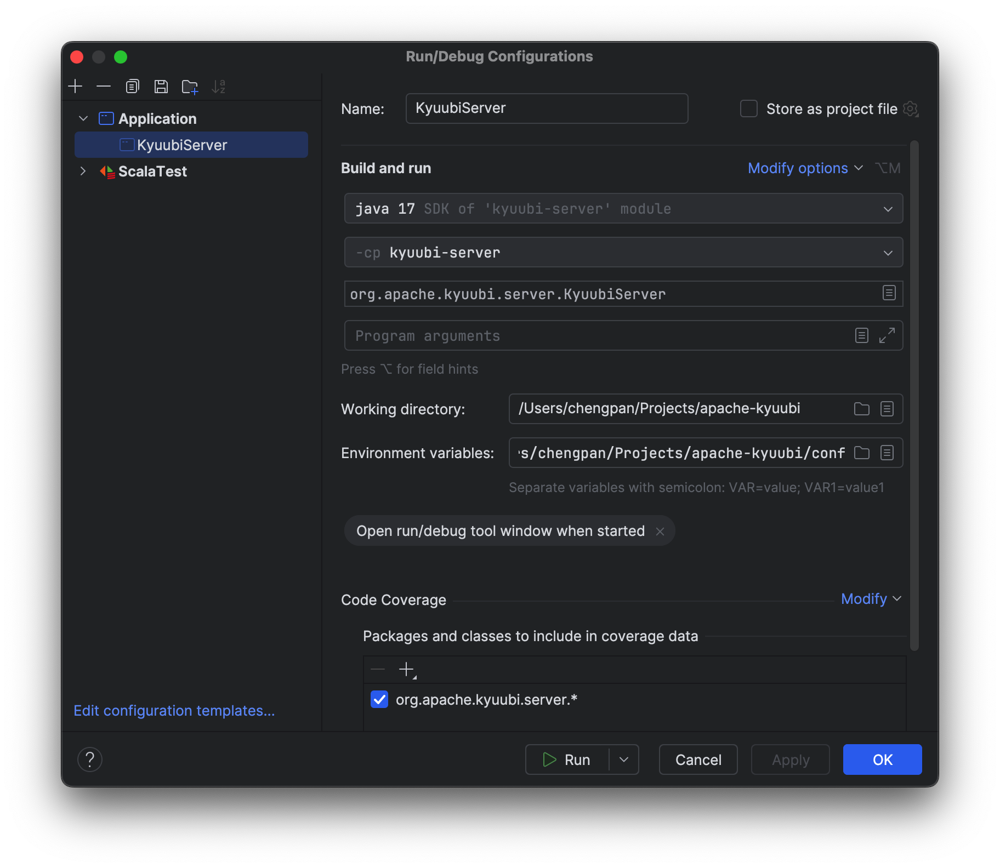

<!--
- Licensed to the Apache Software Foundation (ASF) under one or more
- contributor license agreements.  See the NOTICE file distributed with
- this work for additional information regarding copyright ownership.
- The ASF licenses this file to You under the Apache License, Version 2.0
- (the "License"); you may not use this file except in compliance with
- the License.  You may obtain a copy of the License at
-
-   http://www.apache.org/licenses/LICENSE-2.0
-
- Unless required by applicable law or agreed to in writing, software
- distributed under the License is distributed on an "AS IS" BASIS,
- WITHOUT WARRANTIES OR CONDITIONS OF ANY KIND, either express or implied.
- See the License for the specific language governing permissions and
- limitations under the License.
-->

Kyuubi Connect
==============

### Source Code under development

```
git clone https://github.com/pan3793/kyuubi.git -b kyuubi-next kyuubi-next
```

### Requirements

- `JAVA_HOME` points to Java 17
- `SPARK_HOME` points to `/path/of/spark-4.0.0-preview2-bin-hadoop3`

### Run

#### Run within IDEA

- Run `build/mvn clean install -DskipTests` to build the project and produce the Spark engine jar
- Run `kyuubi-server/src/main/scala/org/apache/kyuubi/server/KyuubiServer.scala` using IDEA

You can set `SPARK_HOME`, `KYUUBI_CONF_DIR` in the Run/Debug Configuration Dialog



#### Run within Terminal

```
build/dist
cd dist
bin/kyuubi run --conf kyuubi.frontend.grpc.bind.port=10999
```

The gRPC service listens 10999 by default.

### Connect to Kyuubi Connect

Spark Connect Scala client (Requires: Java 17, Spark 4.0.0-preview2)
```
cd /path/of/spark-4.0.0-preview2-bin-hadoop3
bin/spark-shell --remote sc://H27212-MAC-01.local:10999 --user_id chengpan --user_name chengpan
```

PySpark Connect client (Requires: Python >=3.9)
```
pip install pyspark-connect==4.0.0.dev2
pyspark --remote sc://H27212-MAC-01.local:10999 --user_id chengpan --user_name chengpan
```

Run examples
```
Welcome to
      ____              __
     / __/__  ___ _____/ /__
    _\ \/ _ \/ _ `/ __/  '_/
   /___/ .__/\_,_/_/ /_/\_\   version 4.0.0-preview2
      /_/

Type in expressions to have them evaluated.
Spark session available as 'spark'.

scala> spark.sql("select 1").show()
+---+
|  1|
+---+
|  1|
+---+
```
