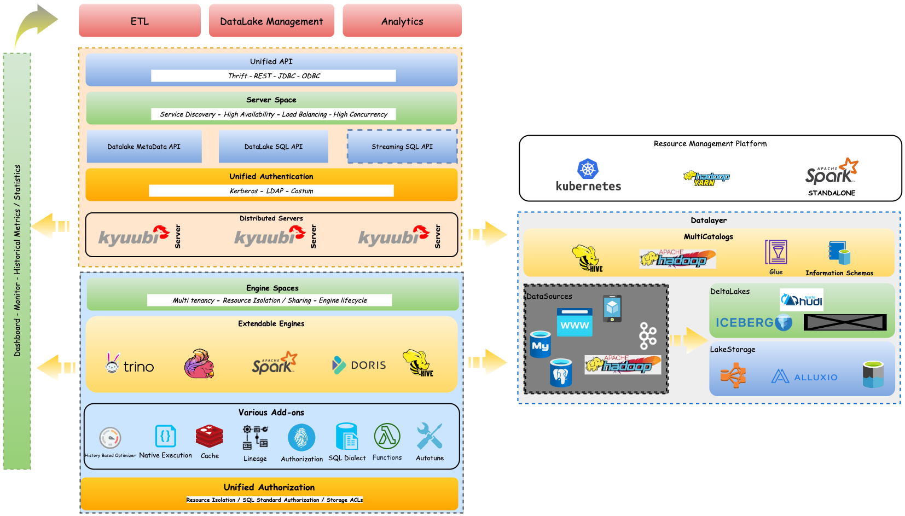

<!--
- Licensed to the Apache Software Foundation (ASF) under one or more
- contributor license agreements.  See the NOTICE file distributed with
- this work for additional information regarding copyright ownership.
- The ASF licenses this file to You under the Apache License, Version 2.0
- (the "License"); you may not use this file except in compliance with
- the License.  You may obtain a copy of the License at
-
-   http://www.apache.org/licenses/LICENSE-2.0
-
- Unless required by applicable law or agreed to in writing, software
- distributed under the License is distributed on an "AS IS" BASIS,
- WITHOUT WARRANTIES OR CONDITIONS OF ANY KIND, either express or implied.
- See the License for the specific language governing permissions and
- limitations under the License.
-->

  

  
  
  
  
  

        <a href="https://kyuubi.apache.org/">Project</a>
        -
        <a href="https://kyuubi.readthedocs.io/">Documentation</a>
        -
        <a href="https://kyuubi.apache.org/powered_by.html">Who's using</a>

# Apache Kyuubi

Apache Kyuubi™ is a distributed and multi-tenant gateway to provide serverless
SQL on data warehouses and lakehouses.

## What is Kyuubi?

Kyuubi provides a pure SQL gateway through Thrift JDBC/ODBC interface for end-users to manipulate large-scale data with pre-programmed and extensible Spark SQL engines. This "out-of-the-box" model minimizes the barriers and costs for end-users to use Spark at the client side. At the server-side, Kyuubi server and engines' multi-tenant architecture provides the administrators a way to achieve computing resource isolation, data security, high availability, high client concurrency, etc.

- [x] A HiveServer2-like API
- [x] Multi-tenant Spark Support
- [x] Running Spark in a serverless way

### Target Users

Kyuubi's goal is to make it easy and efficient for `anyone` to use Spark(maybe other engines soon) and facilitate users to handle big data like ordinary data. Here, `anyone` means that users do not need to have a Spark technical background but a human language, SQL only. Sometimes, SQL skills are unnecessary when integrating Kyuubi with Apache Superset, which supports rich visualizations and dashboards.

In typical big data production environments with Kyuubi, there should be system administrators and end-users.

- System administrators: A small group consists of Spark experts responsible for Kyuubi deployment, configuration, and tuning.
- End-users: Focus on business data of their own, not where it stores, how it computes.

Additionally, the Kyuubi community will continuously optimize the whole system with various features, such as History-Based Optimizer, Auto-tuning, Materialized View, SQL Dialects, Functions, e.t.c.

### Usage scenarios

#### Port workloads from HiveServer2 to Spark SQL

In typical big data production environments, especially secured ones, all bundled services manage access control lists to restricting access to authorized users. For example, Hadoop YARN divides compute resources into queues. With Queue ACLs, it can identify and control which users/groups can take actions on particular queues. Similarly, HDFS ACLs control access of HDFS files by providing a way to set different permissions for specific users/groups.

Apache Spark is a unified analytics engine for large-scale data processing. It provides a Distributed SQL Engine, a.k.a, the Spark Thrift Server(STS), designed to be seamlessly compatible with HiveServer2 and get even better performance.

HiveServer2 can identify and authenticate a caller, and then if the caller also has permissions for the YARN queue and HDFS files, it succeeds. Otherwise, it fails. However, on the one hand, STS is a single Spark application. The user and queue to which STS belongs are uniquely determined at startup. Consequently, STS cannot leverage cluster managers such as YARN and Kubernetes for resource isolation and sharing or control the access for callers by the single user inside the whole system. On the other hand, the Thrift Server is coupled in the Spark driver's JVM process. This coupled architecture puts a high risk on server stability and makes it unable to handle high client concurrency or apply high availability such as load balancing as it is stateful.

Kyuubi extends the use of STS in a multi-tenant model based on a unified interface and relies on the concept of multi-tenancy to interact with cluster managers to finally gain the ability of resources sharing/isolation and data security. The loosely coupled architecture of the Kyuubi server and engine dramatically improves the client concurrency and service stability of the service itself.

#### DataLake/Lakehouse Support

The vision of Kyuubi is to unify the portal and become an easy-to-use data lake management platform. Different kinds of workloads, such as ETL processing and BI analytics, can be supported by one platform, using one copy of data, with one SQL interface.

- Logical View support via Kyuubi DataLake Metadata APIs
- Multiple Catalogs support
- SQL Standard Authorization support for DataLake(coming)

#### Cloud Native Support

Kyuubi can deploy its engines on different kinds of Cluster Managers, such as, Hadoop YARN, Kubernetes, etc.

### The Kyuubi Ecosystem(present and future)

The figure below shows our vision for the Kyuubi Ecosystem. Some of them have been realized, some in development,
and others would not be possible without your help.

## Online Documentation 

## Quick Start

Ready? [Getting Started](https://kyuubi.readthedocs.io/en/master/quick_start/) with Kyuubi.

## [Contributing](./CONTRIBUTING.md)

## Project & Community Status

  
  
  
  
  
  
  
  
  

  

## Aside

The project took its name from a character of a popular Japanese manga - `Naruto`.
The character is named `Kyuubi Kitsune/Kurama`, which is a nine-tailed fox in mythology.
`Kyuubi` spread the power and spirit of fire, which is used here to represent the powerful [Apache Spark](http://spark.apache.org).
Its nine tails stand for end-to-end multi-tenancy support of this project.
