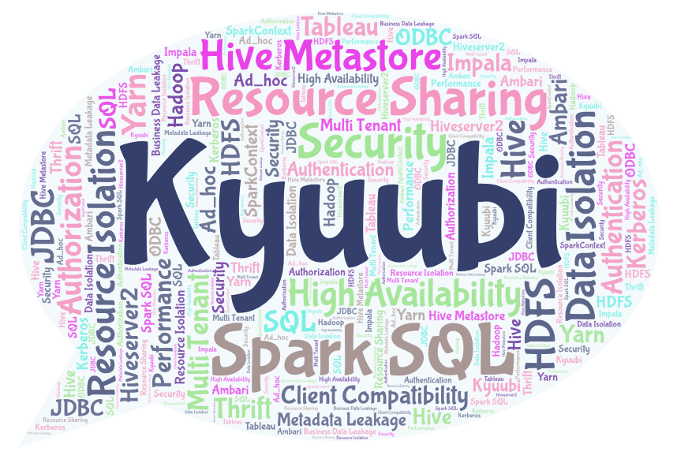

# Kyuubi
[](https://www.apache.org/licenses/LICENSE-2.0.html)
[](https://github.com/yaooqinn/kyuubi)
[](https://github.com/yaooqinn/kyuubi/releases)
[](https://codecov.io/gh/yaooqinn/kyuubi)
[](https://travis-ci.org/yaooqinn/kyuubi)
[](http://hits.dwyl.io/yaooqinn/kyuubi)
[](https://depshield.github.io)
[](https://kyuubi.readthedocs.io/en/latest/?badge=latest)
[](https://gitter.im/kyuubi-on-spark/Lobby?utm_source=badge&utm_medium=badge&utm_campaign=pr-badge)

 

Kyuubi is an enhanced edition of the [Apache Spark](http://spark.apache.org)'s primordial
 [Thrift JDBC/ODBC Server](http://spark.apache.org/docs/latest/sql-programming-guide.html#running-the-thrift-jdbcodbc-server). It is mainly designed for directly running SQL towards a cluster with all components including HDFS, YARN, Hive MetaStore, and itself secured. Kyuubi is a Spark SQL thrift service with end-to-end multi tenant guaranteed. Please go to [Kyuubi Architecture](https://yaooqinn.github.io/kyuubi/docs/architecture.html) to learn more if you are interested.

Basically, the Thrift JDBC/ODBC Server as a similar ad-hoc SQL query service of [Apache Hive](https://hive.apache.org)'s [HiveServer2](https://cwiki.apache.org/confluence/display/Hive/HiveServer2+Overview) for Spark SQL, acts as a distributed query engine using its JDBC/ODBC or command-line interface.
In this mode, end-users or applications can interact with Spark SQL directly to run SQL queries, without the need to write any code. We can make pretty business reports with massive data using some BI tools which supported JDBC/ODBC connections, such as [Tableau](https://www.tableau.com), [NetEase YouData](https://youdata.163.com) and so on. Profiting from Apache Spark's capability, we can archive much more performance improvement than Apache Hive as a SQL on Hadoop service.    

But unfortunately, due to the limitations of Spark's own architecture，to be used as an enterprise-class product, there are a number of problems compared with HiveServer2，such as multi-tenant isolation, authentication/authorization, high concurrency, high availability, and so on. And the Apache Spark community's support for this module has been in a state of prolonged stagnation.         

Kyuubi has enhanced the Thrift JDBC/ODBC Server in some ways for solving these existing problems, as shown in the following table.

Features|Spark Thrift Server|Kyuubi|Comments
 ---|---|---|---
 multiple SparkContext | ✘ | ✔ | [User tagged SparkContext](https://yaooqinn.github.io/kyuubi/docs/architecture.html#1.2.2)
 lazy SparkContext| ✘ | ✔ |[Session level SparkContext](https://yaooqinn.github.io/kyuubi/docs/architecture.html#1.2.1)
 SparkContext cache| ✘ | ✔ | [SparkContext Cache Management](https://yaooqinn.github.io/kyuubi/docs/architecture.html#1.2.2)
 dynamic queue | ✘ | ✔ | Kyuubi identifies `spark.yarn.queue` in the connection string.|
 session level configurations|`spark.sql.*`| ✔ |[Dynamic Resource Requesting](https://yaooqinn.github.io/kyuubi/docs/architecture.html#1.2.1) 
 authentication| ✔ | ✔ |[Authentication/Security Guide](https://yaooqinn.github.io/kyuubi/docs/authentication.html) |
 authorization| ✘ | ✔ |[Kyuubi ACL Management Guide](https://yaooqinn.github.io/kyuubi/docs/authorization.html)|
 impersonation| ✘ | ✔ |Kyuubi fully supports `hive.server2.proxy.user` and `hive.server2.doAs`|
 multi tenancy| ✘ | ✔ |Based on the above features，Kyuubi is able to run as a multi-tenant server on a LCE supported Yarn cluster.|
 operation log| ✘ | ✔ |Kyuubi redirect sql operation log to local file which has an interface for the client to fetch.|
 high availability| ✘ | ✔ |[ZooKeeper Dynamic Service Discovery](https://yaooqinn.github.io/kyuubi/docs/architecture.html#1.4) |
 containerization| ✘ | ✔ | [Kyuubi Containerization Guide](https://yaooqinn.github.io/kyuubi/docs/containerization.html)|
 type mapping| ✘ | ✔ |Kyuubi support Spark result/schema to be directly converted to Thrift result/schemas bypassing Hive format results|
 
## Getting Started

### Packaging

Please refer to the [Building Kyuubi](https://yaooqinn.github.io/kyuubi/docs/building.html) in the online documentation for an overview on how to build Kyuubi.

### Start Kyuubi

We can start Kyuubi with the built-in startup script `bin/start-kyuubi.sh`.
First of all, export `SPARK_HOME` in `$KYUUBI_HOME/bin/kyuubi-env.sh`

```bash
export SPARK_HOME=/the/path/to/a/runable/spark/binary/dir
```

And then the last, start Kyuubi with  `bin/start-kyuubi.sh`
```bash
$ bin/start-kyuubi.sh \ 
    --master yarn \
    --deploy-mode client \
    --driver-memory 10g \
    --conf spark.kyuubi.frontend.bind.port=10009
```

### Run Spark SQL on Kyuubi

Now you can use [beeline](https://cwiki.apache.org/confluence/display/Hive/HiveServer2+Clients), [Tableau](https://www.tableau.com/zh-cn) or Thrift API based programs to connect to Kyuubi server.

### Stop Kyuubi

```bash
bin/stop-kyuubi.sh
```

## Multi Tenancy Support

### Prerequisites

Kyuubi may work well with different deployments such as non-secured Yarn, Standalone, Mesos or even local mode, but it is mainly designed for a secured HDFS/Yarn Cluster on which Kyuubi will play well with multi tenant and secure features.

Suppose that you already have a secured HDFS cluster for deploying Spark, Hive or other applications.

#### Configure Yarn

-  YARN Secure Containers     
      +  To configure the NodeManager to use the [LinuxExecutorCantainer](https://hadoop.apache.org/docs/r2.7.2/hadoop-yarn/hadoop-yarn-site/SecureContainer.html)
      + Queues(Optional), please refer to [Capacity Scheduler](https://hadoop.apache.org/docs/r2.7.2/hadoop-yarn/hadoop-yarn-site/CapacityScheduler.html) or [Fair Scheduler](https://hadoop.apache.org/docs/r2.7.2/hadoop-yarn/hadoop-yarn-site/FairScheduler.html) to see more.

#### Spark on Yarn    
-  Setup for [Spark On Yarn](http://spark.apache.org/docs/latest/running-on-yarn.html) Ensure that `HADOOP_CONF_DIR` or `YARN_CONF_DIR` points to the directory which contains the (client side) configuration files for the Hadoop cluster.

#### Configure Hive    

- Configuration of Hive is done by placing your `hive-site.xml`, `core-site.xml` and `hdfs-site.xml` files in `$SPARK_HOME/conf`.

## Configuration

Please refer to the [Configuration Guide](https://yaooqinn.github.io/kyuubi/docs/configurations.html) in the online documentation for an overview on how to configure Kyuubi.
  
## Authentication

Please refer to the [Authentication/Security Guide](https://yaooqinn.github.io/kyuubi/docs/authentication.html) in the online documentation for an overview on how to enable security for Kyuubi.

## Additional Documentations
[Building Kyuubi](https://yaooqinn.github.io/kyuubi/docs/building.html)  
[Kyuubi Deployment Guide](https://yaooqinn.github.io/kyuubi/docs/deploy.html)  
[Kyuubi Containerization Guide](https://yaooqinn.github.io/kyuubi/docs/containerization.html)   
[High Availability Guide](https://yaooqinn.github.io/kyuubi/docs/high_availability_guide.html)  
[Configuration Guide](https://yaooqinn.github.io/kyuubi/docs/configurations.html)  
[Authentication/Security Guide](https://yaooqinn.github.io/kyuubi/docs/authentication.html)  
[Kyuubi ACL Management Guide](https://yaooqinn.github.io/kyuubi/docs/authorization.html)  
[Kyuubi Architecture](https://yaooqinn.github.io/kyuubi/docs/architecture.html)
