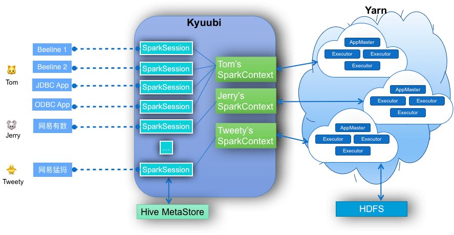
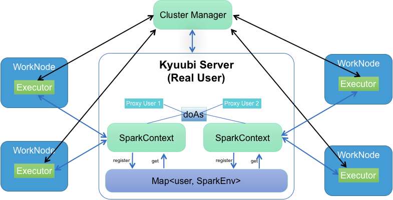
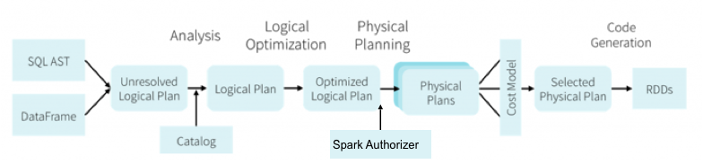
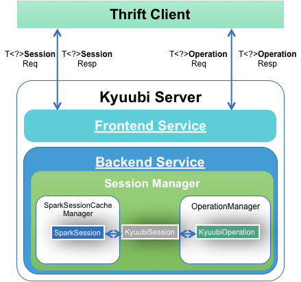

# Kyuubi Architecture Introduction

- [Unified Interface](#1.1)
- [Runtime Resource Resiliency](#1.2)
    - [Kyuubi Dynamic Resource Requesting](#1.2.1)
    - [Kyuubi Dynamic SparkContext Cache](#1.2.2)
    - [Spark Dynamic Resource Allocation](#1.2.3)
- [Security](#1.3)
    - [Authentication](#1.3.1)
    - [Authorization](#1.3.2)
- [High Availability](#1.4)
    - [HA Configurations](#1.4.1)

**Kyuubi** is an enhanced edition of the [Apache Spark](http://spark.apache.org)'s primordial
[Thrift JDBC/ODBC Server](http://spark.apache.org/docs/latest/sql-programming-guide.html#running-the-thrift-jdbcodbc-server).
It is mainly designed for directly running SQL towards a cluster with all components including HDFS, YARN, Hive MetaStore,
and itself secured. The main purpose of Kyuubi is to realize an architecture that can not only speed up SQL queries using
Spark SQL Engine, and also be compatible with the HiveServer2's behavior as much as possible. Thus, Kyuubi use the same protocol
of HiveServer2, which can be found at [HiveServer2 Thrift API](https://cwiki.apache.org/confluence/display/Hive/HiveServer2+Thrift+API)
as the client-server communication mechanism, and a user session level `SparkContext` instantiating / registering / caching / recycling
mechanism to implement multi-tenant functionality.

<div style="text-align: center">
    
</div>

<h2 id="1.1">Unified Interface</h2>

Because Kyuubi use the same protocol of HiveServer2, it supports all kinds of JDBC/ODBC clients, and user applications written based
on this Thrift API as shown in the picture above. Cat Tom can use various types of clients to create connections with the Kyuubi Server,
and each connection is bound to a `SparkSession` instance which also contains a independent `HiveMetaStoreClient` to interact with Hive MetaStore
Server. Tom can set session level configurations for each connection without affecting each other.

<h2 id="1.2">Runtime Resource Resiliency</h2>

Kyuubi does not occupy any resources from the Cluster Manager(Yarn) during startup, and will give all resources back to Yarn if there
is not any active session interacting with a `SparkContext`. And also with the ability of Spark [Dynamic Resource Allocation](http://spark.apache.org/docs/latest/job-scheduling.html#dynamic-resource-allocation),
it also allows us to dynamically allocating resources within a `SparkContext` a.k.a a Yarn Application.

<h4 id="1.2.1">Kyuubi Dynamic Resource Requesting</h4>
- Session Level Resource Configurations        
    Kyuubi supports all Spark/Hive/Hadoop configurations, such as `spark.executor.cores/memory`, to be set in the connection
    string which will be used to initialize SparkContext.    
- Example        
    ```
    jdbc:hive2://<host>:<port>/;hive.server2.proxy.user=tom#spark.yarn.queue=theque;spark.executor.instances=3;spark.executor.cores=3;spark.executor.memory=10g
    ```

<h4 id="1.2.2">Kyuubi Dynamic SparkContext Cache</h4>

Kyuubi implements a `SparkSessionCacheManager` to control `SparkSession`/`SparkContext` for instantiating, registering,
caching, reusing, and recycling. Different user has one and only one `SparkContext` instance in Kyuubi Server after it connects
to the server for the first time, which will be cached in `SparkSessionCacheManager` for the whole connection life time and
a while after all connections closed.

<div style="text-align: center">
    
</div>

All connections belong to the same user shares this `SparkContext` to generate their own `SparkSession`s

<h4 id="1.2.3">Spark Dynamic Resource Allocation</h4>

Spark provides a mechanism to dynamically adjust the resources your application occupies based on the workload. It means
that your application may give resources back to the cluster if they are no longer used and request them again later when
there is demand. This feature is particularly useful if multiple applications share resources in your Spark cluster.

Please refer to [Dynamic Resource Allocation](http://spark.apache.org/docs/latest/job-scheduling.html#dynamic-resource-allocation) to see more.

Please refer to [Dynamic Allocation Configuration](http://spark.apache.org/docs/latest/configuration.html#dynamic-allocation) to learn how to configure.

With these features, Kyuubi allows us to use computing resources more efficiently.

<h2 id="1.3">Security</h2>

<h4 id="1.3.1">Authentication</h4>

Please refer to the [Authentication/Security Guide](https://yaooqinn.github.io/kyuubi/docs/authentication.html) in the online documentation for an overview on how to enable security for Kyuubi.

<h4 id="1.3.2">Authorization</h4>

Kyuubi can be integrated with [Spark Authorizer](https://yaooqinn.github.io/spark-authorizer/) to offer row/column level access control.
Kyuubi does not explicitly support spark-authorizer plugin yet, here is an example you may refer to
[Spark Branch Authorized](https://github.com/yaooqinn/spark/tree/v2.1.2-based)

<div style="text-align: center">
    
</div>

<h2 id="1.4">High Availability</h2>

<div style="text-align: center">
    
</div>

Multiple Kyuubi Server instances can register themselves with ZooKeeper when `spark.kyuubi.ha.enabled=true` and then
the clients can find a Kyuubi Server through ZooKeeper. When a client requests a server instance, ZooKeeper randomly returns 
a selected registered one. This feature offers:

 - High Availability
 - Load Balancing
 - Rolling Upgrade

<h4 id="1.4.1">HA Configurations</h4>

Name|Default|Description
---|---|---
spark.kyuubi.ha.enabled|false|Whether KyuubiServer supports dynamic service discovery for its clients. To support this, each instance of KyuubiServer currently uses ZooKeeper to register itself, when it is brought up. JDBC/ODBC clients should use the ZooKeeper ensemble: spark.kyuubi.ha.zk.quorum in their connection string.
spark.kyuubi.ha.zk.quorum|none|Comma separated list of ZooKeeper servers to talk to, when KyuubiServer supports service discovery via Zookeeper.
spark.kyuubi.ha.zk.namespace|kyuubiserver|The parent node in ZooKeeper used by KyuubiServer when supporting dynamic service discovery.

# Kyuubi Internal

Kyuubi's internal is very simple to understand, which is shown as the picture below. We may take about it more detailly later.

<div style="text-align: center">
    
</div>

## Additional Documentations

[Building Kyuubi](https://yaooqinn.github.io/kyuubi/docs/building.html)  
[Kyuubi Deployment Guide](https://yaooqinn.github.io/kyuubi/docs/deploy.html)   
[Kyuubi Containerization Guide](https://yaooqinn.github.io/kyuubi/docs/containerization.html)   
[High Availability Guide](https://yaooqinn.github.io/kyuubi/docs/high_availability_guide.html)  
[Configuration Guide](https://yaooqinn.github.io/kyuubi/docs/configurations.html)  
[Authentication/Security Guide](https://yaooqinn.github.io/kyuubi/docs/authentication.html)  
[Kyuubi ACL Management Guide](https://yaooqinn.github.io/kyuubi/docs/authorization.html)   
[Home Page](https://yaooqinn.github.io/kyuubi/)
