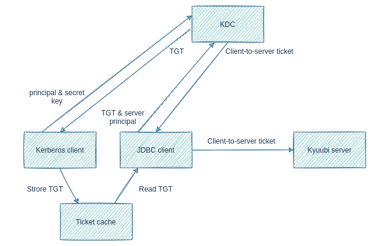

<!--
 - Licensed to the Apache Software Foundation (ASF) under one or more
 - contributor license agreements.  See the NOTICE file distributed with
 - this work for additional information regarding copyright ownership.
 - The ASF licenses this file to You under the Apache License, Version 2.0
 - (the "License"); you may not use this file except in compliance with
 - the License.  You may obtain a copy of the License at
 -
 -   http://www.apache.org/licenses/LICENSE-2.0
 -
 - Unless required by applicable law or agreed to in writing, software
 - distributed under the License is distributed on an "AS IS" BASIS,
 - WITHOUT WARRANTIES OR CONDITIONS OF ANY KIND, either express or implied.
 - See the License for the specific language governing permissions and
 - limitations under the License.
 -->


# Configure Kerberos for clients to Access Kerberized Kyuubi

## Instructions
When Kyuubi is secured by Kerberos, the authentication procedure becomes a little complicated.



The graph above shows a simplified kerberos authentication procedure:
1. Kerberos client sends user principal and secret key to KDC. Secret key can be a password or a keytab file.   
2. KDC returns a `ticket-granting ticket`(TGT).
3. Kerberos client stores TGT into a ticket cache.
4. JDBC client, such as beeline and BI tools, reads TGT from the ticket cache.
5. JDBC client sends TGT and server principal to KDC.
6. KDC returns a `client-to-server ticket`.
7. JDBC client sends `client-to-server ticket` to Kyuubi server to prove its identity.

In the rest part of this page, we will describe steps needed to pass through this authentication.

## Install Kerberos Client
Usually, Kerberos client is installed as default. You can validate it using klist tool.

Linux command and output:
```bash
$ klist -V
Kerberos 5 version 1.15.1
```

MacOS command and output:
```bash
$ klist --version
klist (Heimdal 1.5.1apple1)
Copyright 1995-2011 Kungliga Tekniska Högskolan
Send bug-reports to heimdal-bugs@h5l.org
```

Windows command and output:
```cmd
> klist -V
Kerberos for Windows
```

If the client is not installed, you should install it ahead based on the OS platform.  
We recommend you to install the MIT Kerberos Distribution as all commands in this guide is based on it.  

## Configure Kerberos Client
Kerberos client needs a configuration file for tuning up the creation of Kerberos ticket cache.
Following is the configuration file's default location on different OS:

OS | Path
---| ---
Linux | /etc/krb5.conf
MacOS | /etc/krb5.conf
Windows | %ProgramData%\MIT\Kerberos5\krb5.ini

You can use `KRB5_CONFIG` environment variable to overwrite the default location.

The configuration file should be configured to point to the same KDC as Kyuubi points to.

## Get Kerberos TGT
Execute `kinit` command to get TGT from KDC.

Suppose user principal is `kyuubi_user@KYUUBI.APACHE.ORG` and user keytab file name is `kyuubi_user.keytab`, 
the command should be:

```
$ kinit -kt kyuubi_user.keytab kyuubi_user@KYUUBI.APACHE.ORG

(Command is identical on different OS platform)
```

You may also execute `kinit` command with principal and password to get TGT:

```
$ kinit kyuubi_user@KYUUBI.APACHE.ORG
Password for kyuubi_user@KYUUBI.APACHE.ORG: password 

(Command is identical on different OS platform)
```

If the command executes successfully, TGT will be store in ticket cache.   
Use `klist` command to print TGT info in ticket cache:

```
$ klist

Ticket cache: FILE:/tmp/krb5cc_1000
Default principal: kyuubi_user@KYUUBI.APACHE.ORG

Valid starting       Expires              Service principal
2021-12-13T18:44:58  2021-12-14T04:44:58  krbtgt/KYUUBI.APACHE.ORG@KYUUBI.APACHE.ORG
    renew until 2021-12-14T18:44:57
    
(Command is identical on different OS platform. Ticket cache location may be different.)
```

Ticket cache may have different storage type on different OS platform. 

For example,

OS | Default Ticket Cache Type and Location
---| ---
Linux | FILE:/tmp/krb5cc_%{uid}
MacOS | KCM:%{uid}:%{gid}
Windows | API:krb5cc

You can find your ticket cache type and location in the `Ticket cache` part of `klist` output.

**Note**:  
- Ensure your ticket cache type is `FILE` as JVM can only read ticket cache stored as file.
- Do not store TGT into default ticket cache if you are running Kyuubi and execute `kinit` on the same 
host with the same OS user. The default ticket cache is already used by Kyuubi server.

Either because the default ticket cache is not a file, or because it is used by Kyuubi server, you 
should store ticket cache in another file location.  
This can be achieved by specifying a file location with `-c` argument in `kinit` command.

For example,
```
$ kinit -c /tmp/krb5cc_beeline -kt kyuubi_user.keytab kyuubi_user@KYUUBI.APACHE.ORG

(Command is identical on different OS platform)
```

To check the ticket cache, specify the file location with `-c` argument in `klist` command.

For example,
```
$ klist -c /tmp/krb5cc_beeline

(Command is identical on different OS platform)
```

## Add Kerberos Client Configuration File to JVM Search Path
The JVM, which JDBC client is running on, also needs to read the Kerberos client configuration file.
However, JVM uses different default locations from Kerberos client, and does not honour `KRB5_CONFIG`
environment variable.

OS | JVM Search Paths
---| ---
Linux | System scope: `/etc/krb5.conf`
MacOS | User scope: `$HOME/Library/Preferences/edu.mit.Kerberos`<br/>System scope: `/etc/krb5.conf`
Windows | User scoep: `%USERPROFILE%\krb5.ini`<br/>System scope: `%windir%\krb5.ini`

You can use JVM system property, `java.security.krb5.conf`, to overwrite the default location.

## Add Kerberos Ticket Cache to JVM Search Path
JVM determines the ticket cache location in the following order:
1. Path specified by `KRB5CCNAME` environment variable. Path must start with `FILE:`.
2. `/tmp/krb5cc_%{uid}` on Unix-like OS, e.g. Linux, MacOS
3. `${user.home}/krb5cc_${user.name}` if `${user.name}` is not null
4. `${user.home}/krb5cc` if `${user.name}` is null

**Note**:  
- `${user.home}` and `${user.name}` are JVM system properties.
- `${user.home}` should be replaced with `${user.dir}` if `${user.home}` is null.
 
Ensure your ticket cache is stored as a file and put it in one of the above locations. 

## Ensure core-site.xml Exists in Classpath
Like hadoop clients, `hadoop.security.authentication` should be set to `KERBEROS` in `core-site.xml` 
to let Hive JDBC driver use Kerberos authentication. `core-site.xml` should be placed under beeline's 
classpath or BI tools' classpath.

### Beeline
Here are the usual locations where `core-site.xml` should exist for different beeline distributions:

Client | Location | Note
--- | --- | ---
Hive beeline | `$HADOOP_HOME/etc/hadoop` | Hive resolves `$HADOOP_HOME` and use `$HADOOP_HOME/bin/hadoop` command to launch beeline. `$HADOOP_HOME/etc/hadoop` is in `hadoop` command's classpath.
Spark beeline | `$HADOOP_CONF_DIR` | In `$SPARK_HOME/conf/spark-env.sh`, `$HADOOP_CONF_DIR` often be set to the directory containing hadoop client configuration files.
Kyuubi beeline | `$HADOOP_CONF_DIR` | In `$KYUUBI_HOME/conf/kyuubi-env.sh`, `$HADOOP_CONF_DIR` often be set to the directory containing hadoop client configuration files.

If `core-site.xml` is not found in above locations, create one with the following content:
```xml
<configuration>
  <property>
    <name>hadoop.security.authentication</name>
    <value>kerberos</value>
  </property>
</configuration>
```

### BI Tools
As to BI tools, ways to add `core-site.xml` varies.  
Take DBeaver as an example. We can add files to DBeaver's classpath through its `Global libraries` preference.  
As `Global libraries` only accepts jar files, you should package `core-site.xml` into a jar file.

```bash
$ jar -c -f core-site.jar core-site.xml

(Command is identical on different OS platform)
```

## Connect with JDBC URL
The last step is to connect to Kyuubi with the right JDBC URL.  
The JDBC URL should be in format: 

```
jdbc:hive2://<kyuubi_server_address>:<kyuubi_server_port>/<db>;principal=<kyuubi_server_principal>
```
or
```
jdbc:hive2://<kyuubi_server_address>:<kyuubi_server_port>/<db>;kyuubiServerPrincipal=<kyuubi_server_principal>
```

**Note**:  
- `principal` is inherited from Hive JDBC Driver and is a little ambiguous, and we could use `kyuubiServerPrincipal` as its alias.
- `kyuubi_server_principal` is the value of `kyuubi.kinit.principal` set in `kyuubi-defaults.conf`.
- As a command line argument, JDBC URL should be quoted to avoid being split into 2 commands by ";".
- As to DBeaver, `<db>;principal=<kyuubi_server_principal>` should be set as the `Database/Schema` argument.

