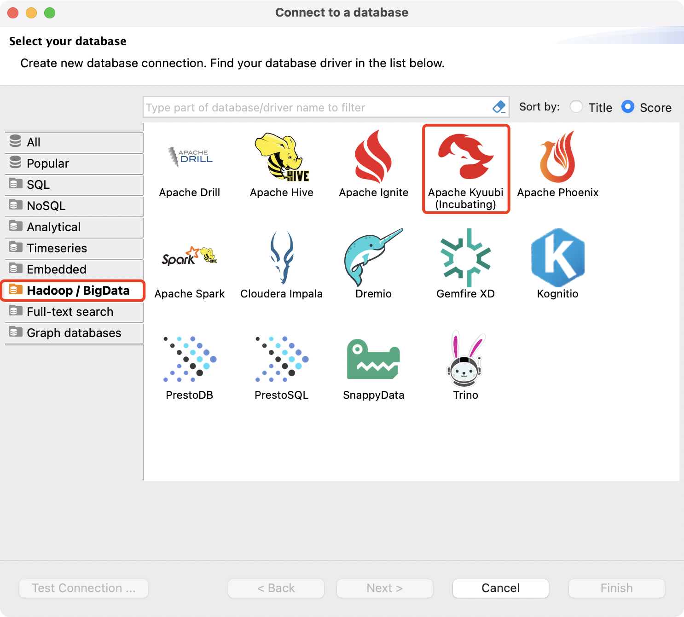
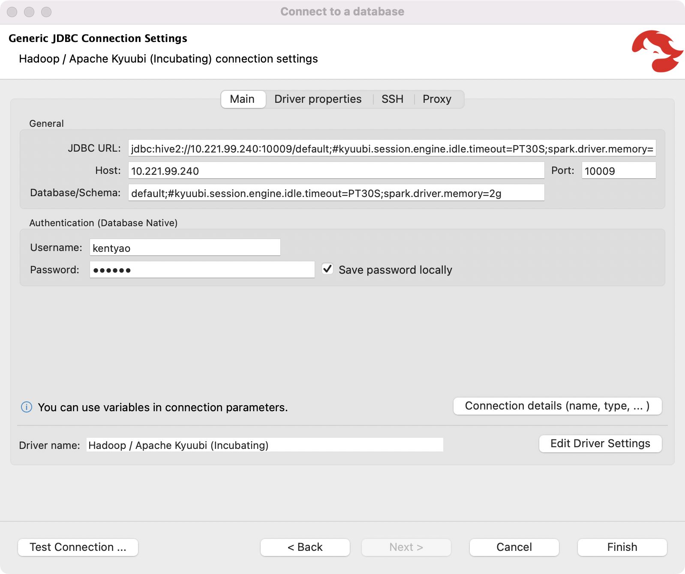

.. Licensed to the Apache Software Foundation (ASF) under one or more
   contributor license agreements.  See the NOTICE file distributed with
   this work for additional information regarding copyright ownership.
   The ASF licenses this file to You under the Apache License, Version 2.0
   (the "License"); you may not use this file except in compliance with
   the License.  You may obtain a copy of the License at

..    http://www.apache.org/licenses/LICENSE-2.0

.. Unless required by applicable law or agreed to in writing, software
   distributed under the License is distributed on an "AS IS" BASIS,
   WITHOUT WARRANTIES OR CONDITIONS OF ANY KIND, either express or implied.
   See the License for the specific language governing permissions and
   limitations under the License.

DBeaver
=======

What is DBeaver
---------------

.. image:: https://raw.githubusercontent.com/wiki/dbeaver/dbeaver/images/dbeaver-icon-64x64.png

`DBeaver`_ is a free multi-platform database tool for developers, database administrators, analysts, and all people who need to work with databases.
Supports all popular databases as well as kyuubi JDBC.

.. seealso:: `DBeaver Wiki`

Installation
------------
Please go to `Download DBeaver`_ page to get and install an appropriate release version for yourself.

.. versionadded:: 22.1.0(dbeaver)
   DBeaver officially supports apache kyuubi JDBC driver since 06 Jun 2022 via `PR 16567 <https://github.com/dbeaver/dbeaver/issues/16567>`_.

Using DBeaver with Kyuubi
-------------------------
If you have successfully installed dbeaver, just hit the button to launch it.

New Connection
**************

Firstly, we need to create a database connection against a live kyuubi server.
You are able to find the kyuubi jdbc driver since dbeaver 22.1.0, as shown in the following figure.

.. note::
   We can also choose Apache Hive or Apache Spark to set up a driver for Kyuubi, because they are compatible with the same client.

Configure Connection
********************

Secondly, we configure the JDBC connection settings to format an underlying kyuubi JDBC connection URL string.

Basic Connection Settings
^^^^^^^^^^^^^^^^^^^^^^^^^

The basic connection setting contains a minimal set of items you need to talk with kyuubi server,

- Host - hostname or IP address that the kyuubi server bound with, default: `localhost`.
- Port - port that the kyuubi server listening to, default: `10009`.
- Database/Schema - database or schema to use, default: `default`.
- Authentication - identity information, such as user/password, based on the server authentication mechanism.

Session Configurations
^^^^^^^^^^^^^^^^^^^^^^

Session configuration list is an optional part of kyuubi JDBC URLs, which are very helpful to override some configurations of the kyuubi server at session scope.
The setup page of dbeaver does not contain any text box for such behavior.
However, we can append the semicolon-separated configuration pairs to the Database/Schema filed leading with a number sign(#).
Though it's a bit weird, but it works.

As an example, shown in the picture above, the engine uses 2 gigabytes memory for the driver process of kyuubi engine and will be terminated after idle for 30 seconds.

Connecting in HA mode
^^^^^^^^^^^^^^^^^^^^^

Kyuubi supports HA by service discovery over Apache Zookeeper cluster.

.. image:: ../../imgs/dbeaver/configure_database_connection_ha.png

As an example, shown in the above picture, the Host and Port fields can be used to concat the comma separated zookeeper peers,
while the `serviceDiscoveryMode` and `zooKeeperNamespace` are appended to the Database/Schema field.

Test Connection
***************

It is not necessary but recommended to click `Test Connection` to verify the connection is set correctly.
If something wrong happens at the client side or server side, we can debug ahead with the error message.

SQL Operations
**************

Now, we can use the SQL editor to write queries to interact with Kyuubi server through the connection.

.. code-block:: sql

   DESC NAMESPACE DEFAULT;

.. code-block:: sql

   CREATE TABLE spark_catalog.`default`.SRC(KEY INT, VALUE STRING) USING PARQUET;
   INSERT INTO TABLE spark_catalog.`default`.SRC VALUES (11215016, 'Kent Yao');

.. code-block:: sql

   SELECT KEY % 10 AS ID, SUBSTRING(VALUE, 1, 4) AS NAME FROM spark_catalog.`default`.SRC;

.. image:: ../../imgs/dbeaver/metadata.png

.. code-block:: sql

   DROP TABLE spark_catalog.`default`.SRC;

Client Authentication
---------------------
For kerberized kyuubi clusters, please refer to `Kerberos Authentication`_ for more information.

.. _DBeaver: https://dbeaver.io/
.. _DBeaver Wiki: https://github.com/dbeaver/dbeaver/wiki
.. _Download DBeaver: https://dbeaver.io/download/
.. _Kerberos Authentication: ../advanced/kerberized_kyuubi.html#bi-tools
