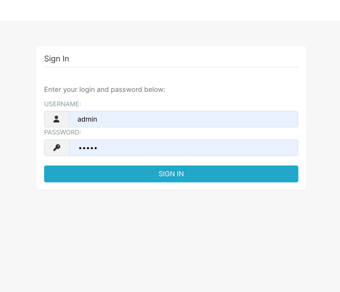
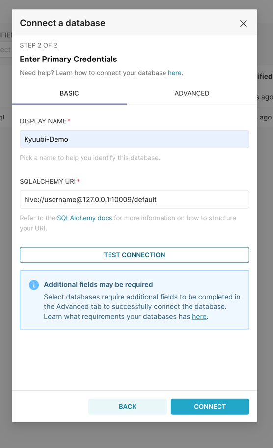
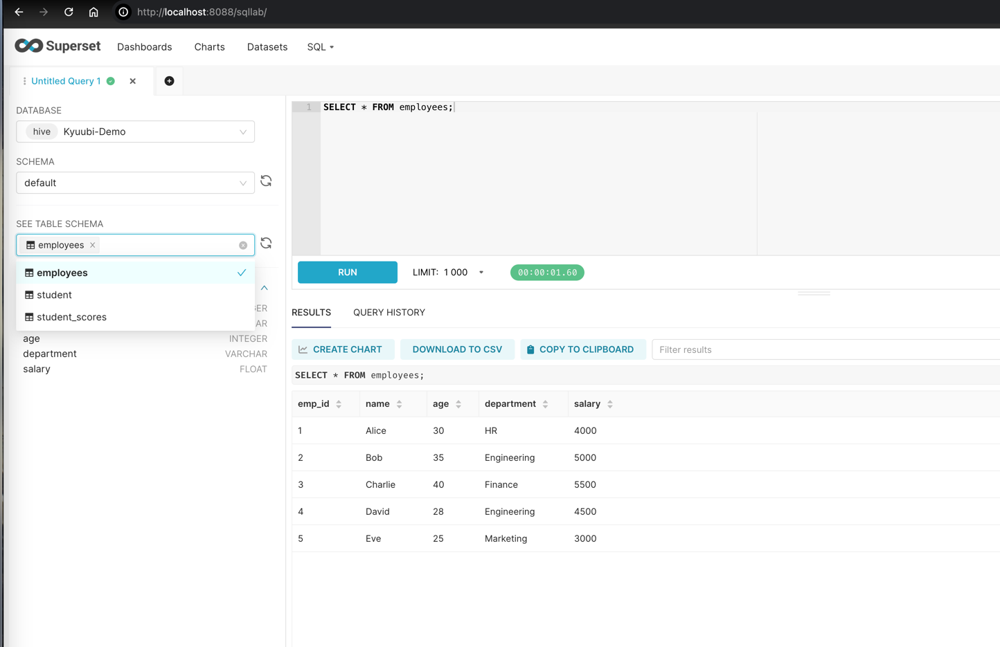

<!--
- Licensed to the Apache Software Foundation (ASF) under one or more
- contributor license agreements.  See the NOTICE file distributed with
- this work for additional information regarding copyright ownership.
- The ASF licenses this file to You under the Apache License, Version 2.0
- (the "License"); you may not use this file except in compliance with
- the License.  You may obtain a copy of the License at
-
-   http://www.apache.org/licenses/LICENSE-2.0
-
- Unless required by applicable law or agreed to in writing, software
- distributed under the License is distributed on an "AS IS" BASIS,
- WITHOUT WARRANTIES OR CONDITIONS OF ANY KIND, either express or implied.
- See the License for the specific language governing permissions and
- limitations under the License.
-->

# Apache Superset

## What is Apache Superset
[Apache Superset](https://superset.apache.org/) is an open-source modern data exploration and visualization platform.

## Preparation

### Get Kyuubi Started

[Get the server Started](../../quick_start/quick_start.html) first before your try Hue with Kyuubi.
```bash
Welcome to
  __  __                           __
 /\ \/\ \                         /\ \      __
 \ \ \/'/'  __  __  __  __  __  __\ \ \____/\_\
  \ \ , <  /\ \/\ \/\ \/\ \/\ \/\ \\ \ '__`\/\ \
   \ \ \\`\\ \ \_\ \ \ \_\ \ \ \_\ \\ \ \L\ \ \ \
    \ \_\ \_\/`____ \ \____/\ \____/ \ \_,__/\ \_\
     \/_/\/_/`/___/> \/___/  \/___/   \/___/  \/_/
                /\___/
                \/__/
```

## Run Apache Superset in Docker

### Using Docker Compose
**Note**:  
This documentation assumes that you have [Docker](https://www.docker.com/), [docker-compose](https://docs.docker.com/compose/), and [git](https://git-scm.com/) installed. And docker-compose version >= 2.24.0.

1. Clone Superset's GitHub repository

    Clone [Superset's repo](https://github.com/apache/superset) in your terminal with the following command:
    
    ```
    git clone --depth=1  https://github.com/apache/superset.git
    ```

2. Install the driver in the container

    Create the file requirements-local.txt in a subdirectory called docker.
    ```
    # Run from the repo root:
    touch ./docker/requirements-local.txt
    ```
    Add the driver identified.
    ```
    echo "pyhive" >> ./docker/requirements-local.txt
    ```

3. Launch Superset Through Docker Compose
    ```
    docker compose -f docker-compose-non-dev.yml up
    ```
4. Check the PyHive library installed  
    You can check its presence by entering the running container with `docker exec -it <container_name> bash` and running `pip freeze`. 
    The PyPI package should be present in the printed list.

5. Login to Superset  
    Now head over to http://localhost:8088 and log in with the default created account:
    ```
    username: admin
    password: admin
    ```
    

## Connecting to Kyuubi

1. Navigate to `Settings` -> `Data` -> `Database Connections` and Click `+ DATABASE`.
2. Choose `Apache Hive` as the database type and enter the `SQLALCHEMY URI`.
   ```
   hive://username@kyuubi-server-host:10009/default
   ```
3. Test the connection and CONNECT to save it.



Having fun with Superset and Kyuubi !




