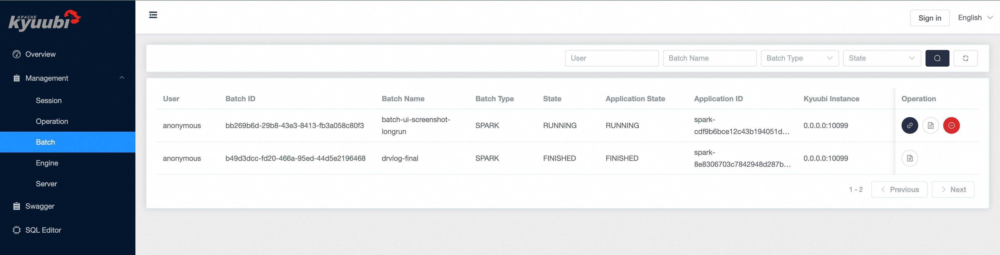
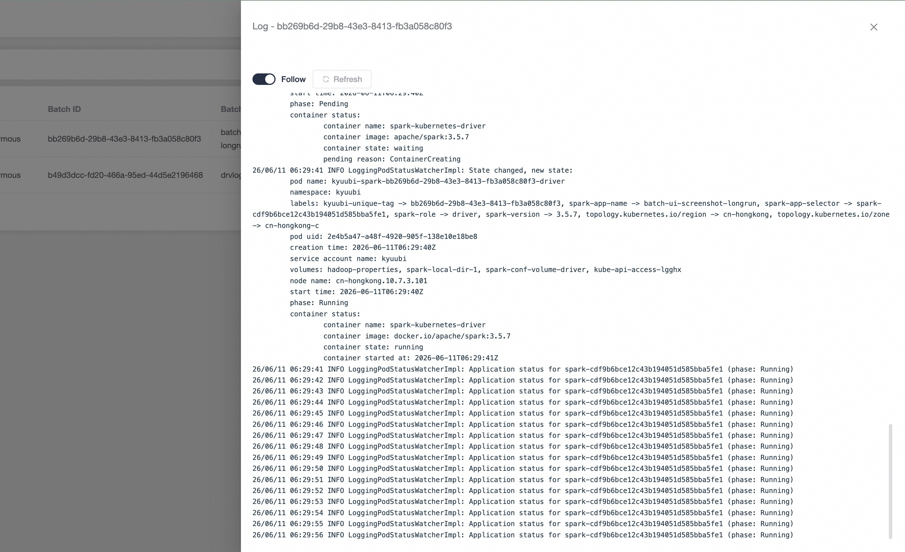

<!--
- Licensed to the Apache Software Foundation (ASF) under one or more
- contributor license agreements.  See the NOTICE file distributed with
- this work for additional information regarding copyright ownership.
- The ASF licenses this file to You under the Apache License, Version 2.0
- (the "License"); you may not use this file except in compliance with
- the License.  You may obtain a copy of the License at
-
-   http://www.apache.org/licenses/LICENSE-2.0
-
- Unless required by applicable law or agreed to in writing, software
- distributed under the License is distributed on an "AS IS" BASIS,
- WITHOUT WARRANTIES OR CONDITIONS OF ANY KIND, either express or implied.
- See the License for the specific language governing permissions and
- limitations under the License.
-->

# Batch UI

The Batch UI lets you inspect the batch jobs submitted through the Kyuubi REST API without falling back to raw REST calls. From this page you can list, filter and paginate batches, open the Spark UI of a running batch, tail a batch's log live, and cancel a batch that has not yet reached a terminal state.

## Accessing the Batch Page

Open the Web UI and select **Batch** under the **Management** section in the left navigation bar.

## Filtering and Pagination

By default the page shows the most recently created batches. Narrow the list with the filters at the top of the page, then click the **search** button:

| Filter     | Description                                                              |
|:-----------|:-------------------------------------------------------------------------|
| User       | The user who submitted the batch                                         |
| Batch Name | The batch name supplied at submission time                               |
| Batch Type | The batch type, either `SPARK` or `PYSPARK`                              |
| State      | The batch state: `PENDING`, `RUNNING`, `FINISHED`, `ERROR` or `CANCELED` |

The footer shows the range of batches currently displayed. Use **Previous** and **Next** to page through the results, and the **refresh** button to reload the current page.

## Batch List

Each row summarizes one batch:

| Name                   | Description                                                                         |
|:-----------------------|:------------------------------------------------------------------------------------|
| User                   | The user who submitted the batch                                                    |
| Batch ID               | The unique identifier of the batch                                                  |
| Batch Name             | The batch name supplied at submission time                                          |
| Batch Type             | The batch type, either `SPARK` or `PYSPARK`                                         |
| State                  | The batch state tracked by Kyuubi                                                   |
| Application State      | The state of the underlying application reported by the cluster manager             |
| Application ID         | The application identifier assigned by the cluster manager (YARN, Kubernetes, etc.) |
| Kyuubi Instance        | The Kyuubi server instance that owns the batch                                      |
| Create Time            | When the batch was submitted                                                        |
| End Time               | When the batch reached a terminal state                                             |
| Duration               | The elapsed time between create time and end time                                   |
| Application Diagnostic | The diagnostic message reported by the cluster manager, when available              |

## Operations

The **Operation** column exposes per-batch actions:

1. **Open the Spark UI.** For a live batch that has an application URL, a link button opens the batch's Spark driver UI. When `kyuubi.frontend.rest.engine.ui.proxy.enabled` is set to `true`, the UI is served through the Kyuubi engine-UI reverse proxy; otherwise the driver URL is opened directly. The link is hidden once the batch is terminal because the driver is no longer running.
2. **View the log.** Open a drawer that tails the batch's server-side log. Toggle **Follow** to live-tail the log as it grows, or use **Refresh** to reload on demand. Only the latest lines are kept in the browser; a notice is shown when the log is truncated.
3. **Cancel the batch.** For a batch that is not yet in a terminal state, a cancel button asks for confirmation and then requests Kyuubi to cancel the batch. Terminal batches cannot be canceled.

Opening the log viewer tails the batch's log in place, updating as new lines arrive while **Follow** is on.

