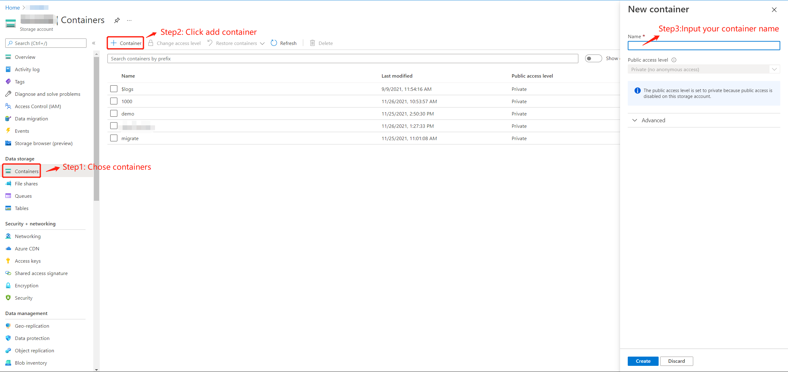
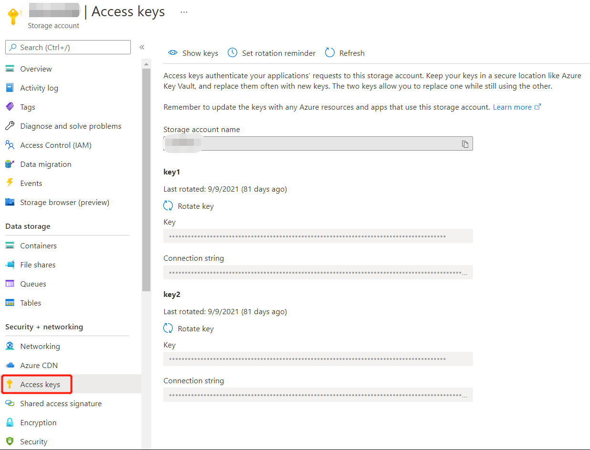
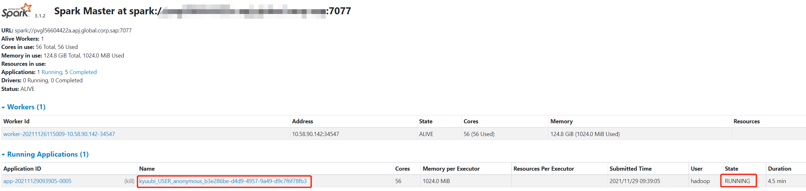

.. Licensed to the Apache Software Foundation (ASF) under one or more
   contributor license agreements.  See the NOTICE file distributed with
   this work for additional information regarding copyright ownership.
   The ASF licenses this file to You under the Apache License, Version 2.0
   (the "License"); you may not use this file except in compliance with
   the License.  You may obtain a copy of the License at

..    http://www.apache.org/licenses/LICENSE-2.0

.. Unless required by applicable law or agreed to in writing, software
   distributed under the License is distributed on an "AS IS" BASIS,
   WITHOUT WARRANTIES OR CONDITIONS OF ANY KIND, either express or implied.
   See the License for the specific language governing permissions and
   limitations under the License.

Delta Lake with Microsoft Azure Blob Storage
============================================

Registration And Configuration
----------------------------------------------

Register An Account And Log In
******************************

Regarding the Microsoft Azure account, please contact your organization or register
an account as an individual. For details, please refer to the `Microsoft Azure official
website`_.

Create Storage Container
************************

After logging in with your Microsoft Azure account, please follow the steps below to create a data storage container:



Get Access Key
**************



Deploy Spark
------------

Download Spark Package
**********************

Download spark package that matches your environment from `spark official website`_.
And then unpackage:
```shell
tar -xzvf spark-3.2.0-bin-hadoop3.2.tgz
```

Config Spark
************

Enter the ``$SPARK_HOME/conf`` directory and execute:

.. code-block:: shell

   cp spark-defaults.conf.template spark-defaults.conf

Add following configuration to spark-defaults.conf, please refer to your own local configuration for specific personalized configuration:

.. code-block:: properties

   spark.master                     spark://<YOUR_HOST>:7077
   spark.sql.extensions             io.delta.sql.DeltaSparkSessionExtension
   spark.sql.catalog.spark_catalog  org.apache.spark.sql.delta.catalog.DeltaCatalog

Create a new file named ``core-site.xml`` under ``$SPARK_HOME/conf`` directory, and add following configuration:

.. code-block:: xml

   <?xml version="1.0" encoding="UTF-8"?>
   <?xml-stylesheet type="text/xsl" href="configuration.xsl"?>
   <configuration>
   <property>
       <name>fs.AbstractFileSystem.wasb.Impl</name>
       <value>org.apache.hadoop.fs.azure.Wasb</value>
    </property>
    <property>
     <name>fs.azure.account.key.YOUR_AZURE_ACCOUNT.blob.core.windows.net</name>
     <value>YOUR_AZURE_ACCOUNT_ACCESS_KEY</value>
    </property>
    <property>
       <name>fs.azure.block.blob.with.compaction.dir</name>
       <value>/hbase/WALs,/tmp/myblobfiles</value>
    </property>
    <property>
       <name>fs.azure</name>
       <value>org.apache.hadoop.fs.azure.NativeAzureFileSystem</value>
    </property>
   <property>
       <name>fs.azure.enable.append.support</name>
       <value>true</value>
    </property>
   </configuration>


Copy Dependencies To Spark
**************************

Copy jar packages required by delta lake and microsoft azure to ./spark/jars directory:

.. code-block:: shell

   wget https://repo1.maven.org/maven2/io/delta/delta-core_2.12/1.0.0/delta-core_2.12-1.0.0.jar -O ./spark/jars/delta-core_2.12-1.0.0.jar
   wget https://repo1.maven.org/maven2/com/microsoft/azure/azure-storage/8.6.6/azure-storage-8.6.6.jar -O ./spark/jars/azure-storage-8.6.6.jar
   wget https://repo1.maven.org/maven2/com/azure/azure-storage-blob/12.14.2/azure-storage-blob-12.14.2.jar -O ./spark/jars/azure-storage-blob-12.14.2.jar
   wget https://repo1.maven.org/maven2/org/apache/hadoop/hadoop-azure/3.1.1/hadoop-azure-3.1.1.jar -O ./spark/jars/hadoop-azure-3.1.1.jar

Start Spark Standalone cluster
******************************

.. code-block:: shell

   ./spark/sbin/start-master.sh -h <YOUR_HOST> -p 7077 --webui-port 9090
   ./spark/sbin/start-worker.sh spark://<YOUR_HOST>:7077

Test The connectivity Of Spark And Delta Lake
*********************************************

Start spark shell:

.. code-block:: shell

   ./bin/spark-shell

Generate a piece of random data and push them to delta lake:

.. code-block:: scala

   scala> val data = spark.range(1000, 2000)
   scala> data.write.format("delta").mode("overwrite").save("wasbs://<YOUR_CONTAINER_NAME>@<YOUR_AZURE_ACCOUNT>.blob.core.windows.net/<YOUR_TABLE_NAME>")

After this, you can check your data on azure web UI. For example, my container name is 1000 and table name is alexDemo20211127:

.. image:: ../../imgs/deltalake/azure_spark_connection_test_storage.png

You can also check data by reading back the data from delta lake:

.. code-block:: scala

   scala> val df=spark.read.format("delta").load("wasbs://<YOUR_CONTAINER_NAME>@<YOUR_AZURE_ACCOUNT>.blob.core.windows.net/<YOUR_TABLE_NAME>")
   scala> df.show()

If there is no problem with the above, it proves that spark has been built with delta lake.

Deploy Kyuubi
-------------

Install Kyuubi
**************

1.Download the latest version of kyuubi from `kyuubi download page`_.

2.Unpackage

   tar -xzvf  apache-kyuubi-|release|-bin.tgz

Config Kyuubi
*************

Enter the ./kyuubi/conf directory

.. code-block:: shell

   cp kyuubi-defaults.conf.template kyuubi-defaults.conf
   vim kyuubi-defaults.conf

Add the following content:

.. code-block:: properties

   spark.master                    spark://<YOUR_HOST>:7077
   kyuubi.authentication           NONE
   kyuubi.frontend.bind.host       <YOUR_HOST>
   kyuubi.frontend.bind.port       10009
   # If you use your own zk cluster, you need to configure your zk host port.
   # kyuubi.ha.addresses    <YOUR_HOST>:2181

Start Kyuubi
************

.. code-block:: shell

   bin/kyuubi start

Check kyuubi log, in order to check kyuubi start status and find the jdbc connection url:

.. code-block::

   2021-11-26 17:49:50.235 INFO service.ThriftFrontendService: Starting and exposing JDBC connection at: jdbc:kyuubi://HOST:10009/
   2021-11-26 17:49:50.265 INFO client.ServiceDiscovery: Created a /kyuubi/serviceUri=host:10009;version=1.3.1-incubating;sequence=0000000037 on ZooKeeper for KyuubiServer uri: host:10009
   2021-11-26 17:49:50.267 INFO server.KyuubiServer: Service[KyuubiServer] is started.

You can get the jdbc connection url by the log above.

Test The Connectivity Of Kyuubi And Delta Lake
**********************************************

Use ``$KYUUBI_HOME/bin/kyuubi-beeline`` tool,

.. code-block:: shell

   ./bin/kyuubi-beeline -u 'jdbc:kyuubi://<YOUR_HOST>:10009/'

At the same time, you can also check whether the engine is running on the spark UI:



When the engine started, it will expose a thrift endpoint and register itself into ZooKeeper, Kyuubi server can get the connection info from ZooKeeper and establish the connection to the engine.
So, you can check the registration details in zookeeper path '/kyuubi_USER/anonymous'.

Dealing Delta Lake Data By Using Kyuubi Examples
------------------------------------------------

Operate delta-lake data through SQL:  

Create Table
************

.. code-block:: sql

   -- Create or replace table with path
   CREATE OR REPLACE TABLE delta.`wasbs://1000@azure_account.blob.core.windows.net/alexDemo20211129` (
     date DATE,
     eventId STRING,
     eventType STRING,
     data STRING)
   USING DELTA
   PARTITIONED BY (date);

Insert Data
***********

Append Mode
^^^^^^^^^^^

.. code-block:: sql

   INSERT INTO delta.`wasbs://1000@azure_account.blob.core.windows.net/alexDemo20211129` (
       date,
       eventId,
       eventType,
       data)
   VALUES
       (now(),'001','test','Hello World!'),
       (now(),'002','test','Hello World!'),
       (now(),'003','test','Hello World!');

Result:

.. code-block:: text

   +-------------+----------+------------+---------------+
   |    date     | eventId  | eventType  |     data      |
   +-------------+----------+------------+---------------+
   | 2021-11-29  | 001      | test       | Hello World!  |
   | 2021-11-29  | 003      | test       | Hello World!  |
   | 2021-11-29  | 002      | test       | Hello World!  |
   +-------------+----------+------------+---------------+

Overwrite Mode
^^^^^^^^^^^^^^

.. code-block:: sql

   INSERT OVERWRITE TABLE delta.`wasbs://1000@azure_account.blob.core.windows.net/alexDemo20211129`(
       date,
       eventId,
       eventType,
       data)
   VALUES
   (now(),'001','test','hello kyuubi'),
   (now(),'002','test','hello kyuubi');

Result:

.. code-block:: text

   +-------------+----------+------------+---------------+
   |    date     | eventId  | eventType  |     data      |
   +-------------+----------+------------+---------------+
   | 2021-11-29  | 002      | test       | hello kyuubi  |
   | 2021-11-29  | 001      | test       | hello kyuubi  |
   +-------------+----------+------------+---------------+

Delete Table Data
*****************

.. code-block:: sql

   DELETE FROM
      delta.`wasbs://1000@azure_account.blob.core.windows.net/alexDemo20211129`
   WHERE eventId = 002;

Result:

.. code-block:: text

   +-------------+----------+------------+---------------+
   |    date     | eventId  | eventType  |     data      |
   +-------------+----------+------------+---------------+
   | 2021-11-29  | 001      | test       | hello kyuubi  |
   +-------------+----------+------------+---------------+

Update table data
*****************

.. code-block:: sql

   UPDATE
       delta.`wasbs://1000@azure_account.blob.core.windows.net/alexDemo20211129`
   SET data = 'This is a test for update data.'
   WHERE eventId = 001;

Result:

.. code-block:: text

   +-------------+----------+------------+----------------------------------+
   |    date     | eventId  | eventType  |               data               |
   +-------------+----------+------------+----------------------------------+
   | 2021-11-29  | 001      | test       | This is a test for update data.  |
   +-------------+----------+------------+----------------------------------+

Select table data
*****************

.. code-block:: sql

   SELECT *
   FROM
       delta.`wasbs://1000@azure_account.blob.core.windows.net/alexDemo20211129`;

Result:

.. code-block:: text

   +-------------+----------+------------+----------------------------------+
   |    date     | eventId  | eventType  |               data               |
   +-------------+----------+------------+----------------------------------+
   | 2021-11-29  | 001      | test       | This is a test for update data.  |
   +-------------+----------+------------+----------------------------------+

.. _Microsoft Azure official website: https://azure.microsoft.com/en-gb/
.. _spark official website: https://spark.apache.org/downloads.html
.. _kyuubi download page: https://kyuubi.apache.org/releases.html
