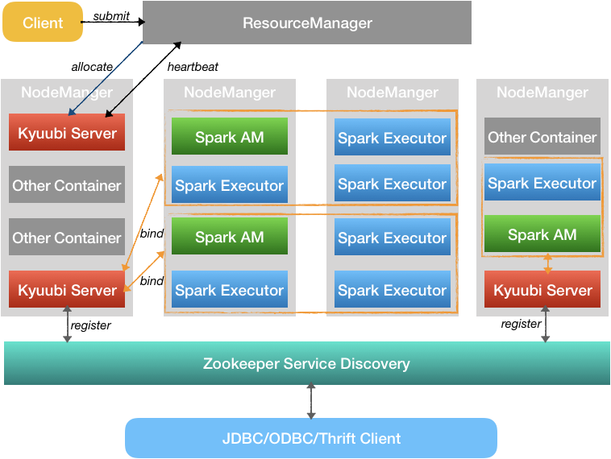
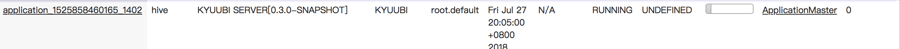
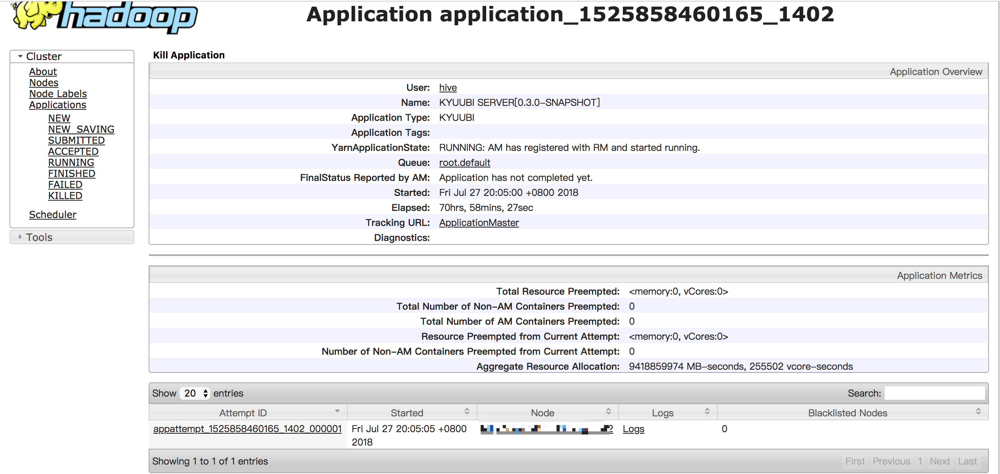

# Kyuubi Containerization Guide

This document gives you a brief description about how Kyuubi submits itself.

Kyuubi supports "client" mode by default, which means that Kyuubi launches a server process on the local machine node and serves
client side JDBC/ODBC connections. We need to setup all environments and other preparations for each node for launching Kyuubi
server. This is very discommodious to deploy Kyuubi server, especially in HA mode, and even worse when running on different
releases of Linux.

Kyuubi containerization is a much more easy for Kyuubi deployment, which makes Kyuubi server instance a containerized, server-less
service serving in YARN Container.

<h2 id="1">Service Model</h2>
 
<div style="text-align: center">
     
</div>

The above picture shows the whole architecture for Kyuubi containerization. The key concept is simple and obvious, which runs Kyuubi server as YARN container and serve the JDBC/ODBC client remotely. In such an deployment mode, we do not need to configure or even make some customizations for some complicated situations.

We can use the `Client` to fire a number ofr Kyuubi servers that meet our needs. The containerized Kyuubi server will be maintained in the YARN cluster as a long running service.

<h4 id="1.1">Glossary</h4>

Name|Description
---|---
Client| Kyuubi YARN Client, with all information we need to [deploy](https://yaooqinn.github.io/kyuubi/docs/deploy.html) Kyuubi
ResourceManager | YARN ResourceManager
NodeManager | YARN NodeManager
Kyuubi Server | Kyuubi server instance wrapped as KyuubiAppMaster launched by YARN as an ApplicationMaster container
Spark AM | Spark's ApplicationMaster, here as the role of ExecutorLauncher
Spark Executor | A process launched on a NodeManager, that runs tasks and keeps data in memory or disk storage across them. Each SparkContext has its own executors.
Zookeeper Service Discovery | [ZooKeeper Dynamic Service Discovery](https://yaooqinn.github.io/kyuubi/docs/architecture.html#1.4), which is useful in Kyuubi containerization because the port of KyuubiServer frontend service is random picked.
JDBC/ODBC/Thrift Client | Various kinds of clients talk to Kyuubi Server

<h4 id="1.2">Configurations</h4>

The table below contains the server side configurations used by the Kyuubi containter itself for launching and sizing itself. 

Name|Default|Description
---|---|---
--deploy-mode | client | when "cluster" is set, Kyuubi containerization will be enabled
spark.driver.memory| 1024m | Kyuubi server container heap size
spark.yarn.driver.memoryOverhead| spark.drive.memory * 0.1 | Overhead memory for Kyuubi server container
spark.driver.cores| DEFAULT_RM_SCHEDULER_MAXIMUM_ALLOCATION_VCORES| Kyuubi server container cores
spark.yarn.am.extraJavaOptions| (none) | Extra jvm options for Kyuubi container

<h2 id="2">Launching Kyuubi on Yarn</h2>

Firstly, please refer to the [Kyuubi Deployment Guide](https://yaooqinn.github.io/kyuubi/docs/deploy.html) on line documentation to learn how to configure the Kyuubi Client.

Then, the only thing we need to do is to launch Kyuubi with  `bin/start-kyuubi.sh` and specify the deploy mode to "cluster".

For example:

```bash
$ bin/start-kyuubi.sh \ 
    --master yarn \
    --deploy-mode cluster
```

At last, a KYUUBI type YARN application named KYUUBI SERVER[version] will be created on the YARN cluster. If we go to the ResourceManager UI, we may see somme thing as follow, 

<div style="text-align: center">
     
</div>

And also, the server log is available to look up through the ApplicationMaster page.

<div style="text-align: center">
     
</div>

## Additional Documentations
[Building Kyuubi](https://yaooqinn.github.io/kyuubi/docs/building.html)  
[Kyuubi Deployment Guide](https://yaooqinn.github.io/kyuubi/docs/deploy.html)  
[High Availability Guide](https://yaooqinn.github.io/kyuubi/docs/high_availability_guide.html)  
[Configuration Guide](https://yaooqinn.github.io/kyuubi/docs/configurations.html)  
[Authentication/Security Guide](https://yaooqinn.github.io/kyuubi/docs/authentication.html)  
[Kyuubi ACL Management Guide](https://yaooqinn.github.io/kyuubi/docs/authorization.html)  
[Kyuubi Architecture](https://yaooqinn.github.io/kyuubi/docs/architecture.html)  
[Home Page](https://yaooqinn.github.io/kyuubi/)
