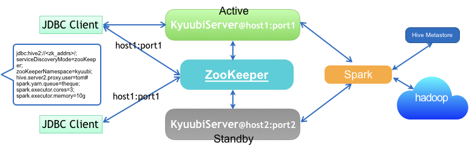

# Kyuubi High Availability Guide

As an enterprise-class ad-hoc SQL query service built on top of [Apache Spark](http://spark.apache.org/), Kyuubi takes high availability(HA) as a major characteristic, aiming to ensure an agreed level of service availability, such as a higher than normal period of uptime.

Running Kyuubi in HA mode is to use groups of computers or containers that support SQL query service on Kyuubi that can be reliably utilized with a minimum amount of down-time. Kyuubi operates by using [Apache ZooKeeper](https://zookeeper.apache.org/) to harness redundant service instances in groups that provide continuous service when one or more components fail.

Without HA, if a server crashes, Kyuubi will be unavailable until the crashed server is fixed. With HA, this situation will be remedied by hardware/software faults auto detecting, and immediately anther Kyuubi service instance will be ready to serve without requiring human intervention. 

## High Availability Mode Types

Kyuubi supports two different types of HA mode. One is load balance mode, and the other active/standby failover.

Load balance mode means that all Kyuubi server instances are active at the first place and their service uri can be reached by clients through the Zookeeper. This mode can greatly reduce the load on the instance itself, on the contrary the load on the cluster manager(YARN) may go higher for there may be more than one Spark application running for a single user who is connected. Another thing you need to know is that applying resources from YARN to launch an application is time consuming.

Active/Standby failover is another option for you to make Kyuubi system highly available. Only one node is the primary node and visible for clients via ZooKeeper and all the others are secondary ones during the service period and invisble. In this mode, the standby will become serviceable only when it has gained the leadership then publish its service uri to ZooKeeper, meanwhile the previous active one's uri will be retired. There will be only one Spark application running on YARN for a single user connected. YARN's load will not be as heavy as in load balance mode and the overhead for launching applications will be certainly reduced. On the other side, the active server will withstand more traffic. Anyway, it is a good choice for those small Hadoop clusters to apply this mode to gain high availability.

The number of user concurrency and the size of your cluster may be two major indicators which you need to weigh against the online environment.

## Load Balance Mode

Load balancing aims to optimize all Kyuubi service units usage, maximize throughput, minimize response time, and avoid overload of a single unit. Using multiple Kyuubi service units with load balancing instead of a single unit may increase reliability and availability through redundancy. 

With Hive JDBC Driver, a client can specify service discovery mode in JDBC connection string, i.e. `serviceDiscoveryMode=zooKeeper;` and set `zooKeeperNameSpace=kyuubiserver;`, then it can randomly pick one of the Kyuubi service uris from the specified ZooKeeper address in the `/kyuubiserver` path.

When we set `spark.kyuubi.ha.enabled` to `true`, load balance mode is activated by default. Please make sure that you specify the correct ZooKeeper address via `spark.kyuubi.ha.zk.quorum` and `spark.kyuubi.ha.zk.client.port`.

## Active/Standby Failover

Active/Standby failover enables you to use a standby Kyuubi server to take over the functionality of a failed unit. When the active unit fails, it changes to the standby state after fixed while the standby unit changes to the active state.

A client need not to change any of its behaviours to support load balance or failover mode. But because only the active Kyuubi server will expose its service uri to ZooKeeper in `/kyuubiserver`, clients always randomly pick a server from one and the only choice.

When we set `spark.kyuubi.ha.enabled` to `true` and `spark.kyuubi.ha.mode` to `failover`, failover mode is activated then. Please make sure that you specify the correct ZooKeeper address via `spark.kyuubi.ha.zk.quorum` and `spark.kyuubi.ha.zk.client.port`.

## Configuring High Availability

This section describes how to configure high availability. These configurations in the following table can be treat like normal Spark properties by setting them in `spark-defaults.conf` file or via `--conf` parameter in server starting scripts.

Name|Default|Description
---|---|---
spark.kyuubi. ha.enabled|false|Whether KyuubiServer supports dynamic service discovery for its clients. To support this, each instance of KyuubiServer currently uses ZooKeeper to register itself, when it is brought up. JDBC/ODBC clients should use the ZooKeeper ensemble: spark.kyuubi.ha.zk.quorum in their connection string.
spark.kyuubi. ha.mode|load-balance|High availability mode, one is load-balance which is used by default, another is failover as master-slave mode.
spark.kyuubi. ha.zk.quorum|none|Comma separated list of ZooKeeper servers to talk to, when KyuubiServer supports service discovery via Zookeeper.
spark.kyuubi. ha.zk.namespace|kyuubiserver|The parent node in ZooKeeper used by KyuubiServer when supporting dynamic service discovery.
spark.kyuubi. ha.zk.client.port|2181|The port of ZooKeeper servers to talk to. If the list of Zookeeper servers specified in spark.kyuubi.zookeeper.quorum does not contain port numbers, this value is used.
spark.kyuubi. ha.zk.session.timeout|1,200,000|ZooKeeper client's session timeout (in milliseconds). The client is disconnected, and as a result, all locks released, if a heartbeat is not sent in the timeout.
spark.kyuubi. ha.zk.connection.basesleeptime|1,000|Initial amount of time (in milliseconds) to wait between retries when connecting to the ZooKeeper server when using ExponentialBackoffRetry policy.
spark.kyuubi. ha.zk.connection.max.retries|3|Max retry times for connecting to the zk server

## Additional Documentations
[Building Kyuubi](https://yaooqinn.github.io/kyuubi/docs/building.html)  
[Kyuubi Deployment Guide](https://yaooqinn.github.io/kyuubi/docs/deploy.html)  
[Kyuubi Containerization Guide](https://yaooqinn.github.io/kyuubi/docs/containerization.html)   
[Configuration Guide](https://yaooqinn.github.io/kyuubi/docs/configurations.html)  
[Authentication/Security Guide](https://yaooqinn.github.io/kyuubi/docs/authentication.html)  
[Kyuubi ACL Management Guide](https://yaooqinn.github.io/kyuubi/docs/authorization.html)  
[Kyuubi Architecture](https://yaooqinn.github.io/kyuubi/docs/architecture.html)
