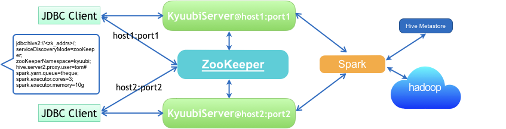

<!--
 - Licensed to the Apache Software Foundation (ASF) under one or more
 - contributor license agreements.  See the NOTICE file distributed with
 - this work for additional information regarding copyright ownership.
 - The ASF licenses this file to You under the Apache License, Version 2.0
 - (the "License"); you may not use this file except in compliance with
 - the License.  You may obtain a copy of the License at
 -
 -   http://www.apache.org/licenses/LICENSE-2.0
 -
 - Unless required by applicable law or agreed to in writing, software
 - distributed under the License is distributed on an "AS IS" BASIS,
 - WITHOUT WARRANTIES OR CONDITIONS OF ANY KIND, either express or implied.
 - See the License for the specific language governing permissions and
 - limitations under the License.
 -->

# Kyuubi High Availability Guide

As an enterprise-class ad-hoc SQL query service built on top of [Apache Spark](http://spark.apache.org/), Kyuubi takes high availability(HA) as a major characteristic, aiming to ensure an agreed level of service availability, such as a higher than normal period of uptime.

Running Kyuubi in HA mode is to use groups of computers or containers that support SQL query service on Kyuubi that can be reliably utilized with a minimum amount of down-time. Kyuubi operates by using [Apache ZooKeeper](https://zookeeper.apache.org/) to harness redundant service instances in groups that provide continuous service when one or more components fail.

Without HA, if a server crashes, Kyuubi will be unavailable until the crashed server is fixed. With HA, this situation will be remedied by hardware/software faults auto detecting, and immediately another Kyuubi service instance will be ready to serve without requiring human intervention. 

## Load Balance Mode

Load balancing aims to optimize all Kyuubi service units usage, maximize throughput, minimize response time, and avoid overload of a single unit. Using multiple Kyuubi service units with load balancing instead of a single unit may increase reliability and availability through redundancy. 

With Hive JDBC Driver, a client can specify service discovery mode in JDBC connection string, i.e. `serviceDiscoveryMode=zooKeeper;` and set `zooKeeperNameSpace=kyuubiserver;`, then it can randomly pick one of the Kyuubi service uris from the specified ZooKeeper address in the `/kyuubiserver` path.

When we set `kyuubi.ha.enabled` to `true`, load balance mode is activated by default. Please make sure that you specify the correct ZooKeeper address via `kyuubi.ha.zookeeper.quorum` and `kyuubi.ha.zookeeper.client.port`.

## Configuring High Availability

This section describes how to configure high availability. These configurations in the following table can be treat like normal Spark properties by setting them in `spark-defaults.conf` file or via `--conf` parameter in server starting scripts.

Key | Default | Meaning | Since
--- | --- | --- | ---
kyuubi\.ha\.zookeeper \.acl\.enabled|
false
|
Set to true if the zookeeper ensemble is kerberized
|
1.0.0

kyuubi\.ha\.zookeeper \.connection\.base\.retry \.wait|
1000
|
Initial amount of time to wait between retries to the zookeeper ensemble
|
1.0.0

kyuubi\.ha\.zookeeper \.connection\.max \.retries|
3
|
Max retry times for connecting to the zookeeper ensemble
|
1.0.0

kyuubi\.ha\.zookeeper \.connection\.max\.retry \.wait|
30000
|
Max amount of time to wait between retries for BOUNDED_EXPONENTIAL_BACKOFF policy can reach, or max time until elapsed for UNTIL_ELAPSED policy to connect the zookeeper ensemble
|
1.0.0

kyuubi\.ha\.zookeeper \.connection\.retry \.policy|
EXPONENTIAL_BACKOFF
|
The retry policy for connecting to the zookeeper ensemble, all candidates are: <ul><li>ONE_TIME</li><li> N_TIME</li><li> EXPONENTIAL_BACKOFF</li><li> BOUNDED_EXPONENTIAL_BACKOFF</li><li> UNTIL_ELAPSED</li></ul>
|
1.0.0

kyuubi\.ha\.zookeeper \.connection\.timeout|
15000
|
The timeout(ms) of creating the connection to the zookeeper ensemble
|
1.0.0

kyuubi\.ha\.zookeeper \.namespace|
kyuubi
|
The root directory for the service to deploy its instance uri. Additionally, it will creates a -[username] suffixed root directory for each application
|
1.0.0

kyuubi\.ha\.zookeeper \.quorum|

|
The connection string for the zookeeper ensemble
|
1.0.0

kyuubi\.ha\.zookeeper \.session\.timeout|
60000
|
The timeout(ms) of a connected session to be idled
|
1.0.0

