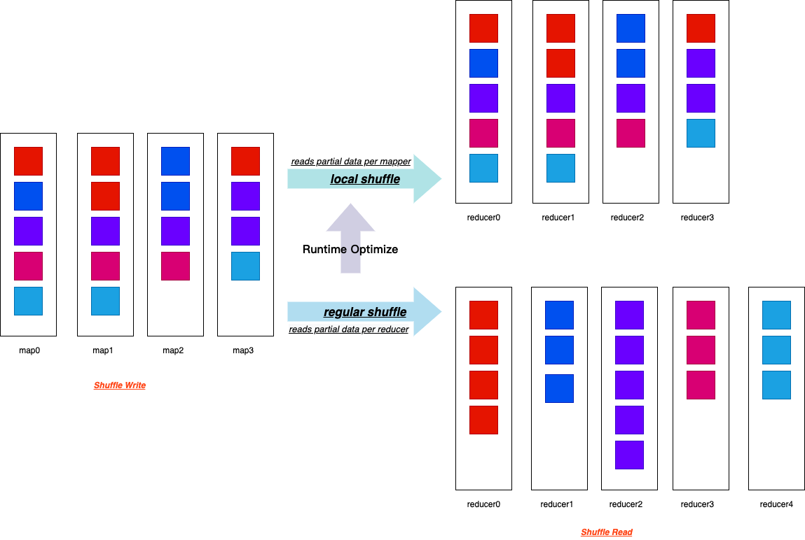
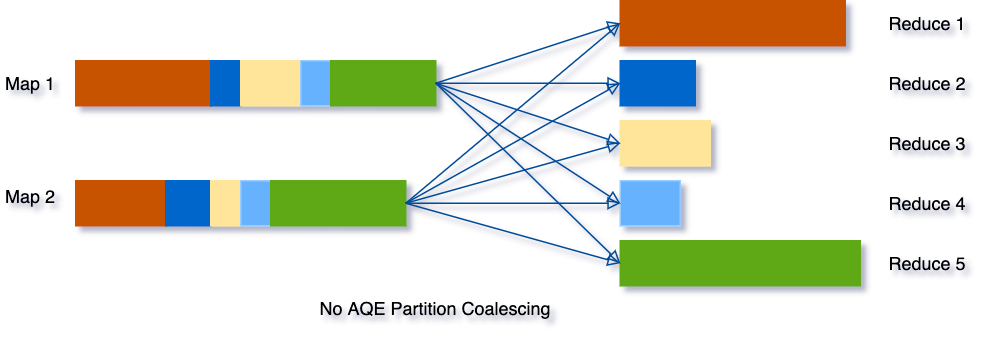
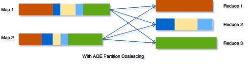

<!--
 - Licensed to the Apache Software Foundation (ASF) under one or more
 - contributor license agreements.  See the NOTICE file distributed with
 - this work for additional information regarding copyright ownership.
 - The ASF licenses this file to You under the Apache License, Version 2.0
 - (the "License"); you may not use this file except in compliance with
 - the License.  You may obtain a copy of the License at
 -
 -   http://www.apache.org/licenses/LICENSE-2.0
 -
 - Unless required by applicable law or agreed to in writing, software
 - distributed under the License is distributed on an "AS IS" BASIS,
 - WITHOUT WARRANTIES OR CONDITIONS OF ANY KIND, either express or implied.
 - See the License for the specific language governing permissions and
 - limitations under the License.
 -->

<div align=center>


</div>

# How To Use Spark Adaptive Query Execution (AQE) in Kyuubi

## The Basics of AQE

Spark Adaptive Query Execution (AQE) is a query re-optimization that occurs during query execution.

In terms of technical architecture, the AQE is a framework of dynamic planning and replanning of queries based on runtime statistics,
which supports a variety of optimizations such as,

- Dynamically Switch Join Strategies
- Dynamically Coalesce Shuffle Partitions
- Dynamically Handle Skew Joins

In Kyuubi, we strongly recommended that you turn on all capabilities of AQE by default for Kyuubi engines, no matter on what platform you run Kyuubi and Spark.

### Dynamically Switch Join Strategies

Spark supports several join strategies, among which `BroadcastHash Join` is usually the most performant when any join side fits well in memory. And for this reason, Spark plans a `BroadcastHash Join` if the estimated size of a join relation is less than the `spark.sql.autoBroadcastJoinThreshold`.

```properties
spark.sql.autoBroadcastJoinThreshold=10M
```

Without AQE, the estimated size of join relations comes from the statistics of the original table. It can go wrong in most real-world cases. For example, the join relation is a convergent but composite operation rather than a single table scan. In this case, Spark might not be able to switch the join-strategy to `BroadcastHash Join`.  While with AQE, we can runtime calculate the size of the composite operation accurately.  And then, Spark now can replan the join strategy unmistakably if the size fits `spark.sql.autoBroadcastJoinThreshold`

<div align=center>


</div>

<p align=right>
<em>
<a href="https://databricks.com/blog/2020/05/29/adaptive-query-execution-speeding-up-spark-sql-at-runtime.html">[2] From Databricks Blog</a>
</em>
</p>

What's more,  when `spark.sql.adaptive.localShuffleReader.enabled=true` and after converting `SortMerge Join` to `BroadcastHash Join`, Spark also does future optimize to reduce the network traffic by converting a regular shuffle to a localized shuffle.

<div align=center>



</div>

As shown in the above fig, the local shuffle reader can read all necessary shuffle files from its local storage, actually without performing the shuffle across the network.

The local shuffle reader optimization consists of avoiding shuffle when the `SortMerge Join` transforms to `BroadcastHash Join` after applying the AQE rules.

### Dynamically Coalesce Shuffle Partitions

Without this feature, Spark itself could be a small files maker sometimes, especially in a pure SQL way like Kyuubi does, for example,

1. When `spark.sql.shuffle.partitions` is set too large compared to the total output size, there comes very small or empty files after a shuffle stage.
2. When Spark performs a series of optimized `BroadcastHash Join` and `Union` together, the final output size for each partition might be reduced by the join conditions. However, the total final output file numbers get to explode.
3. Some pipeline jobs with selective filters to produce temporary data.
4. e.t.c

Reading small files leads to very small partitions or tasks. Spark tasks will have worse I/O throughput and tend to suffer more from scheduling overhead and task setup overhead.

<div align=center>



</div>

<p align=right>
<em>
<a href="https://databricks.com/blog/2020/05/29/adaptive-query-execution-speeding-up-spark-sql-at-runtime.html">[2] From Databricks Blog</a>
</em>
</p>

Combining small partitions saves resources and improves cluster throughput. Spark provides serial ways to handle small file issues, for example, adding an extra shuffle operation on the partition columns with the `distribute by` clause or using `HINT`[5]. In most scenarios, you need to have a good grasp of your data, Spark jobs, and configurations to apply these solutions case by case. Mostly, the daily used config - `spark.sql.shuffle.partitions` is data-dependent and unchangeable with a single Spark SQL query. For real-life Spark jobs with multiple stages, it' impossible to use it as one size to fit all.

But with AQE, things become more comfortable for you as Spark will do the partition coalescing automatically.

<div align=center>



</div>
<p align=right>
<em>
<a href="https://databricks.com/blog/2020/05/29/adaptive-query-execution-speeding-up-spark-sql-at-runtime.html">[2] From Databricks Blog</a>
</em>
</p>

It can simplify the tuning of shuffle partition numbers when running Spark SQL queries. You do not need to set a proper shuffle partition number to fit your dataset.

To enable this feature, we need to set the below two configs to true.

```properties
spark.sql.adaptive.enabled=true
spark.sql.adaptive.coalescePartitions.enabled=true
```

#### Other Tips for Best Practises

For further tuning our Spark jobs with this feature, we also need to be aware of these configs.

```properties
spark.sql.adaptive.advisoryPartitionSizeInBytes=128m
spark.sql.adaptive.coalescePartitions.minPartitionNum=1
spark.sql.adaptive.coalescePartitions.initialPartitionNum=200
```

##### How to set `spark.sql.adaptive.advisoryPartitionSizeInBytes`?

It stands for the advisory size in bytes of the shuffle partition during adaptive query execution, which takes effect when Spark coalesces small shuffle partitions or splits skewed shuffle partition. The default value of `spark.sql.adaptive.advisoryPartitionSizeInBytes` is 64M.  Typically, if we are reading and writing data with HDFS, matching it with the block size of HDFS should be the best choice, i.e. 128MB or 256MB.

Consequently, all blocks or partitions in Spark and files in HDFS are chopped up to 128MB/256MB chunks. And think about it, now all tasks for scans, sinks, and middle shuffle maps are dealing with mostly even-sized data partitions. It will make us much easier to set up executor resources or even one size to fit all.

##### How to set `spark.sql.adaptive.coalescePartitions.minPartitionNum`?

It stands for the suggested (not guaranteed) minimum number of shuffle partitions after coalescing. If not set, the default value is the default parallelism of the Spark application. The default parallelism is defined by `spark.default.parallelism` or else the total count of cores registered. I guess the motivation of this behavior made by the Spark community is to maximize the use of the resources and concurrency of the application.

But there are always exceptions. Relating these two seemingly unrelated parameters can be somehow tricky for users. This config is optional by default which means users may not touch it in most real-world cases. But `spark.default.parallelism` has a long history and is well known then. If users set the default parallelism to an illegitimate high value unexpectedly, it could block AQE from coalescing partitions to a fair number. Another scenario that requires special attention is writing data. Usually, coalescing partitions to avoid small file issues is more critical than task concurrency for final output stages. A better data layout can benefit plenty of downstream jobs. I suggest that we set `spark.sql.adaptive.coalescePartitions.minPartitionNum` to 1 in this case as Spark will try its best to but not guaranteed to coalesce partitions for output.

##### How to set `spark.sql.adaptive.coalescePartitions.initialPartitionNum`?

It stands for the initial number of shuffle partitions before coalescing. By default, it equals to `spark.sql.shuffle.partitions(200)`. Firstly, it's better to set it explicitly rather than falling back to `spark.sql.shuffle.partitions`. Spark community suggests set a large number to it as Spark will dynamically coalesce shuffle partitions, which I cannot agree more.

### Dynamically Handle Skew Joins

Without AQE, the data skewness is very likely to occur for map-reduce computing models in the shuffle phase. Data skewness can cause Spark jobs to have one or more tailing tasks, severely downgrading queries' performance. This feature dynamically handles skew in `SortMerge Join` by splitting (and replicating if needed) skewed tasks into roughly evenly sized tasks. For example, The optimization will split oversized partitions into subpartitions and join them to the other join side's corresponding partition.

<div align=center>


</div>
<p align=right>
<em>
<a href="https://databricks.com/blog/2020/05/29/adaptive-query-execution-speeding-up-spark-sql-at-runtime.html">[2] From Databricks Blog</a>
</em>
</p>

To enable this feature, we need to set the below two configs to true.

```properties
spark.sql.adaptive.enabled=true
spark.sql.adaptive.skewJoin.enabled=true
```

#### Other Tips for Best Practises

For further tuning our Spark jobs with this feature, we also need to be aware of these configs.

```properties
spark.sql.adaptive.skewJoin.skewedPartitionFactor=5
spark.sql.adaptive.skewJoin.skewedPartitionThresholdInBytes=256M
spark.sql.adaptive.advisoryPartitionSizeInBytes=64M
```

##### How to set `spark.sql.adaptive.skewJoin.skewedPartitionFactor` and `skewedPartitionThresholdInBytes`?

Spark uses these two configs and the median(**not average**) partition size to detect whether a partition skew or not.

```markdown
partition size > skewedPartitionFactor * the median partition size && \
skewedPartitionThresholdInBytes
```

As Spark splits skewed partitions targeting [spark.sql.adaptive.advisoryPartitionSizeInBytes](aqe.html#how-to-set-spark-sql-adaptive-advisorypartitionsizeinbytes), ideally `skewedPartitionThresholdInBytes` should be larger than `advisoryPartitionSizeInBytes`. In this case, anytime you increase `advisoryPartitionSizeInBytes`, you should also increase `skewedPartitionThresholdInBytes` if you tend to enable the feature.

### Hidden Features

#### DemoteBroadcastHashJoin

Internally, Spark has an optimization rule that detects a join child with a high ratio of empty partitions and adds a no-broadcast-hash-join hint to avoid broadcasting it.

```
spark.sql.adaptive.nonEmptyPartitionRatioForBroadcastJoin=0.2
```

By default, if there are only less than 20% partitions of the dataset contain data, Spark will not broadcast the dataset.

#### EliminateJoinToEmptyRelation

This optimization rule detects and converts a Join to an empty LocalRelation.


#### Disabling the Hidden Features

We can exclude some of the AQE additional rules if performance regression or bug occurs. For example,

```sql
SET spark.sql.adaptive.optimizer.excludedRules=org.apache.spark.sql.execution.adaptive.DemoteBroadcastHashJoin
```

## Best Practices for Applying AQE to Kyuubi

Kyuubi is a long-running service to make it easier for end-users to use Spark SQL without having much of Spark's basic knowledge. It is essential to have a basic configuration that works for most scenarios on the server-side.


### Setting Default Configurations

[Configuring by `spark-defaults.conf`](settings.html#via-spark-defaults-conf) at the engine side is the best way to set up Kyuubi with AQE. All engines will be instantiated with AQE enabled.

Here is a config setting that we use in our platform when deploying Kyuubi.

```properties
spark.sql.adaptive.enabled=true
spark.sql.adaptive.forceApply=false
spark.sql.adaptive.logLevel=info
spark.sql.adaptive.advisoryPartitionSizeInBytes=256m
spark.sql.adaptive.coalescePartitions.enabled=true
spark.sql.adaptive.coalescePartitions.minPartitionNum=1
spark.sql.adaptive.coalescePartitions.initialPartitionNum=8192
spark.sql.adaptive.fetchShuffleBlocksInBatch=true
spark.sql.adaptive.localShuffleReader.enabled=true
spark.sql.adaptive.skewJoin.enabled=true
spark.sql.adaptive.skewJoin.skewedPartitionFactor=5
spark.sql.adaptive.skewJoin.skewedPartitionThresholdInBytes=400m
spark.sql.adaptive.nonEmptyPartitionRatioForBroadcastJoin=0.2
spark.sql.adaptive.optimizer.excludedRules
spark.sql.autoBroadcastJoinThreshold=-1
```
#### Tips
Turn on AQE by default can significantly improve the user experience.
Other sub-features are all enabled.
`advisoryPartitionSizeInBytes` is targeting the HDFS block size
`minPartitionNum` is set to 1 for the reason of coalescing first.
`initialPartitionNum` has a high value.
Since AQE requires at least one shuffle, ideally, we need to set `autoBroadcastJoinThreshold` to -1 to involving `SortMerge Join` with a shuffle for all user queries with joins. But then, the  Dynamically Switch Join Strategies feature seems can not be applied later in this case. It appears to be a typo limitation of Spark AQE so far.

### Dynamically Setting

All AQE related configurations are runtime changeable, which means that it can still modify some specific configs by `SET` syntaxes for each SQL query with more precise control on the client-side.


## Spark Known issues

[SPARK-33933: Broadcast timeout happened unexpectedly in AQE](https://issues.apache.org/jira/browse/SPARK-33933)

For Spark versions(<3.1), we need to increase `spark.sql.broadcastTimeout(300s)` higher even the broadcast relation is tiny.

For other potential problems that may be found in the AQE features of Spark, you may refer to [SPARK-33828: SQL Adaptive Query Execution QA](https://issues.apache.org/jira/browse/SPARK-33828).

## References

1. [Adaptive Query Execution](https://spark.apache.org/docs/latest/sql-performance-tuning.html#adaptive-query-execution)
2. [Adaptive Query Execution: Speeding Up Spark SQL at Runtime](https://databricks.com/blog/2020/05/29/adaptive-query-execution-speeding-up-spark-sql-at-runtime.html)
3. [SPARK-31412: New Adaptive Query Execution in Spark SQL](https://issues.apache.org/jira/browse/SPARK-31412)
4. [SPARK-28560: Optimize shuffle reader to local shuffle reader when smj converted to bhj in adaptive execution](https://issues.apache.org/jira/browse/SPARK-28560)
5. [Coalesce and Repartition Hint for SQL Queries](https://issues.apache.org/jira/browse/SPARK-24940)
