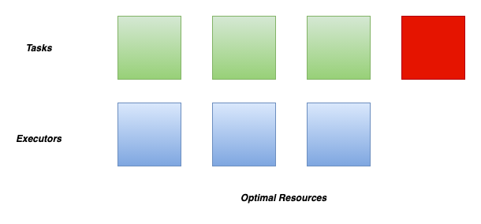
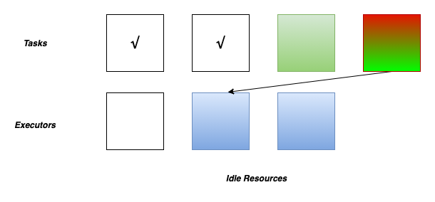
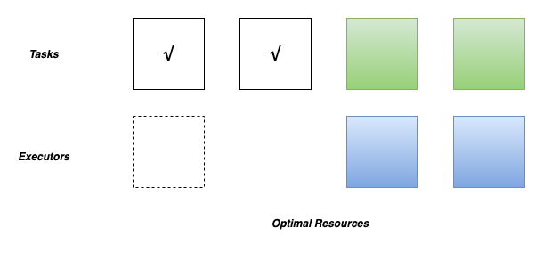

<div align=center>


</div>

# How To Use Spark Dynamic Resource Allocation (DRA) in Kyuubi


When we adopt Kyuubi in a production environment,
we always want to use the environment's computing resources more cost-effectively and efficiently.
Cluster managers such as  K8S and Yarn manage the cluster compute resources,
divided into different queues or namespaces with different ACLs and quotas.

In Kyuubi, we acquire computing resources from the cluster manager to submit the engines.
The engines respond to various types of client requests,
some of which consume many computing resources to process,
while others may require very few resources to complete.
If we have fixed-sized engines,
a.k.a. with a fixed number for `spark.executor.instances`,
it may cause a waste of resources for some lightweight workloads,
while for some heavyweight workloads,
it should probably not have enough concurrency capacity resulting in poor performance.

When the engine has executor idled,
we should release it back to the resource pool promptly,
and conversely, when the engine is doing chubby tasks,
we should be able to get and use more resources more efficiently.
On the one hand, we need to rely on the resource manager's capabilities for efficient resource allocation,
resource isolation, and sharing.
On the other hand, we need to enable Spark's DRA feature for the engines' executors' elastic scaling.


## The Basics of Dynamic Resource Allocation

Spark provides a mechanism to dynamically adjust the application resources based on the workload, which means that an application may give resources back to the cluster if they are no longer used and request them again later when there is demand.
This feature is handy if multiple applications share resources on YARN, Kubernetes, and other platforms.

For Kyuubi engines,
which are typical Spark applications,
the dynamic allocation allows Spark to dynamically scale the cluster resources allocated to them based on the workloads.
When dynamic allocation is enabled,
and an engine has a backlog of pending tasks,
it can request executors via ```ExecutorAllocationManager```.
When the engine has executors that become idle, the executors are released,
and the occupied resources are given back to the cluster manager.
Then other engines or other applications run in the same queue could acquire the resources.


## How to Enable Dynamic Resource Allocation

The prerequisite for enabling this feature is for downstream stages to have proper access to shuffle data, even if the executors that generated the data are recycled.

Spark provides two implementations for shuffle data tracking. If either is enabled, we can use the  DRA feature properly.

### Dynamic Resource Allocation w/ External Shuffle Service

Having an external shuffle service (ESS) makes sure that all the data is stored outside of executors.
This prerequisite was needed as Spark needed to ensure that the executors' removal does not remove shuffle data.
When deploying Kyuubi with a cluster manager that provides ESS, enable DRA for all the engines with the configurations below.

```properties
spark.dynamicAllocation.enabled=true
spark.shuffle.service.enabled=true
```

Another thing to be sure of is that ```spark.shuffle.service.port``` should be configured to point to the port on which the ESS is running.


### Dynamic Allocation w/o External Shuffle Service

Implementations of the ESS feature are cluster manager dependent. Yarn, for instance, where the ESS needs to be deployed cluster-widely and is actually running in the Yarn's `NodeManager` component. Nevertheless, if run Kyuubi's engines on Kubernetes, the ESS is not an option yet.
Since Spark 3.0, the DRA can run without ESS. The relative feature called ```Shuffle Tracking``` was introduced by [SPARK-27963](https://issues.apache.org/jira/browse/SPARK-27963).

When deploying Kyuubi with a cluster manager that without ESS or the ESS is not attractive, enable DRA with ```Shuffle Tracking``` instead for all the engines with the configurations below.

```properties
spark.dynamicAllocation.enabled=true
spark.dynamicAllocation.shuffleTracking.enabled=true
```

When ```Shuffle Tracking``` is enabled, ```spark.dynamicAllocation.shuffleTracking.timeout(default: infinity)``` controls the timeout for executors that are holding shuffle data. Spark will rely on the shuffles being garbage collected to be able to release executors by default. When the garbage collection is not cleaning up shuffles quickly enough, this timeout forces Spark to delete executors even when they are storing shuffle data.

## Sizing for engines w/ Dynamic Resource Allocation

Resources for a single executor, such as CPUs and memory, can be fixed size. So, the range [```minExecutors```, ```maxExecutors```] determines how many recourses the engine can take from the cluster manager.

On the one hand, the  ```minExecutors``` tells Spark to keep how many executors at least. If it is set too close to 0(default), the engine might complain about a lack of resources if the cluster manager is quite busy and for a long time.
However, the larger the ```minExecutors``` goes, the more resources may be wasted during the engine's idle time.

On the other hand, the ```maxExecutors``` determines the upper bound executors of an engine could reach. From the individual engine perspective, this value is the larger, the better, to handle heavier queries. However, we must limit it to a reasonable range in terms of the entire cluster's resources. Otherwise, a large query may trigger the engine where it runs to consume too many resources from the queue/namespace and occupy them for a considerable time, which could be a bad idea for using the resources efficiently. In this case, we would prefer that such an enormous task be done more slowly in a limited amount of concurrency.

The following Spark configurations consist of sizing for the DRA.


```
spark.dynamicAllocation.minExecutors=10
spark.dynamicAllocation.maxExecutors=500
```

Additionally, another config called ```spark.dynamicAllocation.initialExecutors``` can be used to decide how many executors to request during engine bootstrapping or failover.

Ideally,   the size relationship between them should be as ```minExecutors``` <= ```initialExecutors``` < ```maxExecutors```.

## Resource Allocation Policy

When the DRA notices that the current resources are insufficient for the current workload, it will request more executors.

<div align=center>


</div>

By default, the dynamic allocation will request enough executors to maximize the parallelism according to the number of tasks to process.

<div align=center>


</div>


While this minimizes the latency of the job, but with small tasks, the default behavior can waste many resources due to executor allocation overhead, as some executors might not even do any work.

In this case, we can adjust ```spark.dynamicAllocation.executorAllocationRatio``` a bit lower to reduce the number of executors w.r.t. full parallelism.  For instance, 0.5 will divide the target number of executors by 2.


<div align=center>



</div>

After finish one task,  Spark Driver will schedule a new task for the executor with available cores. When pending tasks become fewer and fewer, some executors become idle for no new coming tasks.

<div align=center>



</div>

If one executor reach the maximn timeout, it will be removed.
```properties
spark.dynamicAllocation.executorIdleTimeout=60s
spark.dynamicAllocation.cachedExecutorIdleTimeout=infinity
```

<div align=center>



</div>


If the DRA finds there have been pending tasks backlogged for more than the timeouts, new executors will be requested, controlled by the following configs.

```properties
spark.dynamicAllocation.schedulerBacklogTimeout=1s
spark.dynamicAllocation.sustainedSchedulerBacklogTimeout=1s
```

## Best Practices for Applying DRA to Kyuubi

Kyuubi is a long-running service to make it easier for end-users to use Spark SQL without having much of Spark's basic knowledge. It is essential to have a basic configuration for resource management that works for most scenarios on the server-side.


### Setting Default Configurations

[Configuring by `spark-defaults.conf`](settings.html#via-spark-defaults-conf) at the engine side is the best way to set up Kyuubi with DRA. All engines will be instantiated with DRA enabled.

Here is a config setting that we use in our platform when deploying Kyuubi.

```properties
spark.dynamicAllocation.enabled=true
##false if perfer shuffle tracking than ESS
spark.shuffle.service.enabled=true
spark.dynamicAllocation.initialExecutors=10
spark.dynamicAllocation.minExecutors=10
spark.dynamicAllocation.maxExecutors=500
spark.dynamicAllocation.executorAllocationRatio=0.5
spark.dynamicAllocation.executorIdleTimeout=60s
spark.dynamicAllocation.cachedExecutorIdleTimeout=30min
# true if perfer shuffle tracking than ESS
spark.dynamicAllocation.shuffleTracking.enabled=false
spark.dynamicAllocation.shuffleTracking.timeout=30min
spark.dynamicAllocation.schedulerBacklogTimeout=1s
spark.dynamicAllocation.sustainedSchedulerBacklogTimeout=1s
spark.cleaner.periodicGC.interval=5min
```

Note that, ```spark.cleaner.periodicGC.interval=5min``` is useful here when ```spark.dynamicAllocation.shuffleTracking.enabled``` is enabled, as we can tell Spark to be more active for shuffle data GC.

### Setting User Default Settings
On the server-side, the workloads for different users might be different.

Then we can set different defaults for them via the [User Defaults](../settings.html#user-defaults) in ```$KYUUBI_HOME/conf/kyuubi-defaults.conf```

```properties
# For a user named kent
___kent___.spark.dynamicAllocation.maxExecutors=20
# For a user named bob
___bob___.spark.dynamicAllocation.maxExecutors=600
```
In this case, the user named `kent` can only use 20 executors for his engines, but `bob` can use 600 executors for better performance or handle heavy workloads.

### Dynamically Setting

All AQE related configurations are static of Spark core and unchangeable by `SET` syntaxes before each SQL query. For example,

```sql
SET spark.dynamicAllocation.maxExecutors=33;
SELECT * FROM default.tableA;
```

For the above case, the value - 33 will not affect as Spark does not support change core configurations in runtime.

Instead, end-users can set them via [JDBC Connection URL](../settings.html#via-jdbc-connection-url) for some specific cases.


## References

1. [Spark Official Online Document: Dynamic Resource Allocation](https://spark.apache.org/docs/latest/job-scheduling.html#dynamic-resource-allocation)
2. [Spark Official Online Document: Dynamic Resource Allocation Configurations](https://spark.apache.org/docs/latest/configuration.html#dynamic-allocation)
3. [SPARK-27963: Allow dynamic allocation without an external shuffle service](https://issues.apache.org/jira/browse/SPARK-27963)
