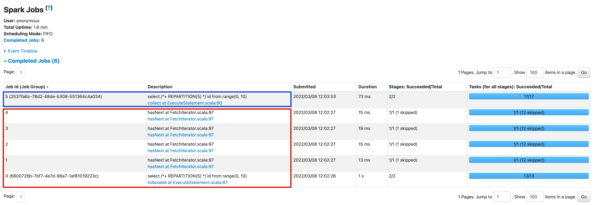

<!--
- Licensed to the Apache Software Foundation (ASF) under one or more
- contributor license agreements.  See the NOTICE file distributed with
- this work for additional information regarding copyright ownership.
- The ASF licenses this file to You under the Apache License, Version 2.0
- (the "License"); you may not use this file except in compliance with
- the License.  You may obtain a copy of the License at
-
-   http://www.apache.org/licenses/LICENSE-2.0
-
- Unless required by applicable law or agreed to in writing, software
- distributed under the License is distributed on an "AS IS" BASIS,
- WITHOUT WARRANTIES OR CONDITIONS OF ANY KIND, either express or implied.
- See the License for the specific language governing permissions and
- limitations under the License.
-->

# Solution for Large Query Results

By default, when you submit a query to Spark SQL engine, the Spark driver triggers the calculation of the
result RDD and then collect the entire query results from all partitions into memory, the query is marked as
completed after all partitions data arrived, then the client pulls the result set from the Spark driver through
the Kyuubi Server in small batches.

Therefore, for queries with a large result set, the major bottleneck here is the Spark driver. To avoid OOM, Spark
has a configuration `spark.driver.maxResultSize` which default value is `1g`, you should enlarge it as well as
`spark.driver.memory` if you are going to run a query that has result set in several GiB.

You may notice that even a simple query `SELECT * FROM table_1g` requires a larger value than `1g` for
`spark.driver.maxResultSize`, this is because the data is serialized in different formats between the HDFS/S3 and
the Spark memory, generally the persisted data using the columnar formats like Parquet/ORC is much smaller than
it occupied in memory.

So what if the result set size is dozens GiB or even hundreds GiB? The following sections may help you.

## Incremental collect

Since v1.4.0-incubating, Kyuubi supports incremental collect mode. This feature is disabled in default, you can turn on
it by setting `kyuubi.operation.incremental.collect` to `true`.

You may know that RDD (Resilient Distributed Dataset) is a core concept of Spark, which is a fault-tolerant collection
of elements that can be operated on in parallel. The key idea here is to serialize the calculation of the result RDD.

The incremental collect changes the gather method from `collect` to `toLocalIterator`. Unlike `collect` to trigger a
single job to calculate the whole result RDD in parallel and collect the entire result set into memory, `toLocalIterator`
sequentially submits jobs to calculate and retrieve partitions of RDD. The query is marked as completed once the first
partition of the result RDD is retrieved, then client pulls the result set from the Spark driver through the Kyuubi Server
in small batches. After the partition is consumed out, the Spark driver release the memory, then start to calculate
the next partition, and so on. It significantly reduces the consumption of the Spark driver memory from the whole
result RDD to the maximum partition.

The incremental collect is not a silver bullet, you should turn it on carefully, obviously, serialized execution
significantly hurt the performance. And even in incremental collect mode, when multiple queries execute concurrently,
each query still requires one partition of data in Spark driver memory. Therefore, it is still important to control
the number of concurrent queries to avoid OOM.

The incremental collect requires no changes on the client side, all existing clients could benefit from this feature.

### Retrieve large query results in isolated engine

As above explains, the incremental collect mode is not suitable for common query sense, you can enable incremental
collection mode for specific queries by using

```
kyuubi-beeline -u 'jdbc:kyuubi://kyuubi:10009/' \
    --hiveconf spark.driver.maxResultSize=8g \
    --hiveconf spark.driver.memory=12g \
    --hiveconf kyuubi.engine.share.level=CONNECTION \
    --hiveconf kyuubi.operation.incremental.collect=true \
    --incremental=true \
    -f large_result_query.sql
```

For Hive BeeLine prior to 2.3.0, `--incremental=true` is required, otherwise, the entire result sets is fetched and
buffered in memory before being displayed, which may cause client process OOM. See more details in HIVE-7224.

### Change incremental collect mode in session

The configuration `kyuubi.operation.incremental.collect` can also be changed using `SET` in session.

```
~ kyuubi-beeline -u 'jdbc:kyuubi://localhost:10009'
Connected to: Apache Kyuubi (version 1.9.0)

0: jdbc:kyuubi://localhost:10009/> set kyuubi.operation.incremental.collect=true;
+---------------------------------------+--------+
|                  key                  | value  |
+---------------------------------------+--------+
| kyuubi.operation.incremental.collect  | true   |
+---------------------------------------+--------+
1 row selected (0.039 seconds)

0: jdbc:kyuubi://localhost:10009/> select /*+ REPARTITION(5) */ * from range(1, 10);
+-----+
| id  |
+-----+
| 2   |
| 6   |
| 7   |
| 0   |
| 5   |
| 3   |
| 4   |
| 1   |
| 8   |
| 9   |
+-----+
10 rows selected (1.929 seconds)

0: jdbc:kyuubi://localhost:10009/> set kyuubi.operation.incremental.collect=false;
+---------------------------------------+--------+
|                  key                  | value  |
+---------------------------------------+--------+
| kyuubi.operation.incremental.collect  | false  |
+---------------------------------------+--------+
1 row selected (0.027 seconds)

0: jdbc:kyuubi://localhost:10009/> select /*+ REPARTITION(5) */ * from range(1, 10);
+-----+
| id  |
+-----+
| 2   |
| 6   |
| 7   |
| 0   |
| 5   |
| 3   |
| 4   |
| 1   |
| 8   |
| 9   |
+-----+
10 rows selected (0.128 seconds)
```

On the Spark UI, you can see that in incremental collect mode, the query produces 5 jobs (in red square), and in
full collect mode, only produces 1 job (in blue square).



## Arrow serialization

Since v1.7.0, Kyuubi supports an optimized query results serialization format that uses [Apache Arrow](https://arrow.apache.org/).
This feature is disabled by default, you can turn on it by setting `kyuubi.operation.result.format` to `arrow`.

The following diagram shows the data flow of the query results serialization in `thrift` and `arrow` formats.

Thrift serialization: Spark driver collects the result set from executor in Spark `InternalRow` format, then
converts it to Spark `Row` format, and then converts it to Thrift `TRowSet` format, this causes both high CPU
and memory load on the Spark driver. The result set is sent to the client over the Kyuubi Server in Thrift
`TRowSet` format, and finally convert to the Java types on the client.

```
Spark Executor ==> Spark Driver ==> Kyuubi Server ==> Client
        (Spark InternalRow)                         
                   (Spark Row)
                          (Thrift TRowSet)
                                         (Thrift TRowSet)
                                                    (Java Types)
```

Arrow serialization: Spark executors convert the result set from Spark `InternalRow` format to Arrow `RecordBatch`,
then send Arrow `RecordBatch` to the Spark driver, then the result set is sent to the client over the Kyuubi Server in
Arrow `RecordBatch` format without conversion, and finally convert to the Java types on the client.

The main benefits of Arrow serialization are:

1. the format conversion happens on the executors in parallel
2. no format conversion happens on the Spark driver
3. less time of format conversion that thrift serialization

```
Spark Executor ==> Spark Driver ==> Kyuubi Server ==> Client
(Spark InternalRow)
        (Arrow RecordBatch)                         
                        (Arrow RecordBatch)
                                      (Arrow RecordBatch)
                                                    (Java Types)
```

Arrow serialization is orthogonal with incremental collect, you can combine these two feature to achieve lower
memory consumption and better query results retrieval performance.

```
kyuubi-beeline -u 'jdbc:kyuubi://kyuubi:10009/' \
    --hiveconf kyuubi.operation.result.format=arrow \
    --hiveconf kyuubi.operation.incremental.collect=true \
    -f large_result_query.sql
```

Note: Arrow serialization requires the client to support deserializing Arrow format results, you must use Kyuubi
JDBC driver v1.7.0 or higher, third-party clients like Apache Hive JDBC driver, PyHive does not work.

## Save query results into files

Since v1.9.0, Kyuubi Spark SQL engine supports saving the query results into files instead of collecting to the
Spark driver memory before retrieving to client. This dramatically reduces the memory pressure of the Spark driver,
while no changes are required on the client side, that means all existing clients could benefit from this feature.

This feature is disabled by default, you can turn on it by setting `kyuubi.operation.result.saveToFile.enabled`
to `true`.

Saving the query result into files requires a directory to store the query result files, before enabling this feature,
you must set a temporary directory by configuring `kyuubi.operation.result.saveToFile.dir` for staging files,
it is typically an HDFS directory or S3 bucket, both the Spark driver and executor should be granted write and read permissions.
Normally, each query result will be cleaned up after the query operation is closed, for abnormally exited Spark applications,
you may need to manually clean up or leverage storage system features like TTL to handle leftover files.

For small query results(lower than `kyuubi.operation.result.saveToFile.minSize`, default is 200MiB), saving them
as files may not help, Kyuubi collects the result to the Spark driver memory directly. Note that, Kyuubi
uses Spark internal methods to estimate query result size, the estimated size sometimes is inaccurate.

```
kyuubi-beeline -u 'jdbc:kyuubi://kyuubi:10009/' \
    --hiveconf kyuubi.operation.result.saveToFile.enabled=true \
    -f large_result_query.sql
```

This feature is conflict with the above two features, please don't enable them at the same time.
