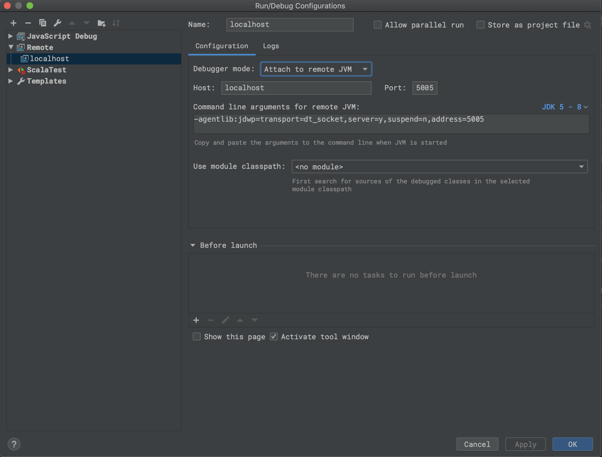

<!--
 - Licensed to the Apache Software Foundation (ASF) under one or more
 - contributor license agreements.  See the NOTICE file distributed with
 - this work for additional information regarding copyright ownership.
 - The ASF licenses this file to You under the Apache License, Version 2.0
 - (the "License"); you may not use this file except in compliance with
 - the License.  You may obtain a copy of the License at
 -
 -   http://www.apache.org/licenses/LICENSE-2.0
 -
 - Unless required by applicable law or agreed to in writing, software
 - distributed under the License is distributed on an "AS IS" BASIS,
 - WITHOUT WARRANTIES OR CONDITIONS OF ANY KIND, either express or implied.
 - See the License for the specific language governing permissions and
 - limitations under the License.
 -->

<div align=center>


</div>

# Debugging Kyuubi

You can use the [Java Debug Wire Protocol](https://docs.oracle.com/javase/8/docs/technotes/guides/jpda/conninv.html#Plugin) to debug Kyuubi
with your favorite IDE tool, e.g. Intellij IDEA.

## Debugging Server

We can configure the JDWP agent in `KYUUBI_JAVA_OPTS` for debugging.
 
 
For example,
```bash
KYUUBI_JAVA_OPTS=-agentlib:jdwp=transport=dt_socket,server=y,suspend=y,address=5005 \
bin/kyuubi start
```

In the IDE, you set the corresponding parameters(host&port) in debug configurations, for example,
<div align=center>



</div>

## Debugging Apps

- Spark Driver

```bash
spark.driver.extraJavaOptions   -agentlib:jdwp=transport=dt_socket,server=y,suspend=y,address=5005
```

- Spark Executor
```bash
spark.executor.extraJavaOptions   -agentlib:jdwp=transport=dt_socket,server=y,suspend=y,address=5005
```