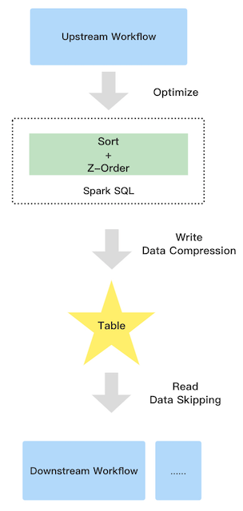

<!--
- Licensed to the Apache Software Foundation (ASF) under one or more
- contributor license agreements.  See the NOTICE file distributed with
- this work for additional information regarding copyright ownership.
- The ASF licenses this file to You under the Apache License, Version 2.0
- (the "License"); you may not use this file except in compliance with
- the License.  You may obtain a copy of the License at
-
-   http://www.apache.org/licenses/LICENSE-2.0
-
- Unless required by applicable law or agreed to in writing, software
- distributed under the License is distributed on an "AS IS" BASIS,
- WITHOUT WARRANTIES OR CONDITIONS OF ANY KIND, either express or implied.
- See the License for the specific language governing permissions and
- limitations under the License.
-->

# Z-Ordering Support

To improve query speed, Kyuubi supports Z-Ordering to optimize the layout of data
stored in all kind of storage with various data format.

## Introduction

The following picture shows the workflow of z-order.



It contains three parties:

- Upstream

  Due to the extra sort, the upstream job will run a little slower than before

- Table

  Z-order has the good data clustering, so the compression ratio can be improved

- Downstream

  Improve the downstream read performance benefit from data skipping. Since the parquet and orc file support collect data statistic automatically when you write data e.g. minimum and maximum values, the good data clustering let the pushed down filter more efficient

### Supported table format

| Table Format | Supported |
|--------------|-----------|
| parquet      | Y         |
| orc          | Y         |
| json         | N         |
| csv          | N         |
| text         | N         |

### Supported column data type

| Column Data Type | Supported |
|------------------|-----------|
| byte             | Y         |
| short            | Y         |
| int              | Y         |
| long             | Y         |
| float            | Y         |
| double           | Y         |
| boolean          | Y         |
| string           | Y         |
| decimal          | Y         |
| date             | Y         |
| timestamp        | Y         |
| array            | N         |
| map              | N         |
| struct           | N         |
| udt              | N         |

## How to use

This feature is inside Kyuubi extension, so you should apply the extension to Spark by following steps.

- add extension jar: `copy $KYUUBI_HOME/extension/kyuubi-extension-spark-3-5* $SPARK_HOME/jars/`
- add config into `spark-defaults.conf`: `spark.sql.extensions=org.apache.kyuubi.sql.KyuubiSparkSQLExtension`

### Optimize history data

If you want to optimize the history data of a table, the `OPTIMIZE ...` syntax is good to go. Due to Spark SQL doesn't support read and overwrite same datasource table, the syntax can only support to optimize Hive table.

#### Syntax

```sql
OPTIMIZE table_name [WHERE predicate] ZORDER BY col_name1 [, ...]
```

Note that, the `predicate` only supports partition spec.

#### Examples

```sql
OPTIMIZE t1 ZORDER BY c3;

OPTIMIZE t1 ZORDER BY c1,c2;

OPTIMIZE t1 WHERE day = '2021-12-01' ZORDER BY c1,c2;
```

### Optimize incremental data

Kyuubi supports optimize a table automatically for incremental data. e.g., time partitioned table. The only things you need to do is adding Kyuubi properties into the target table properties:

```sql
ALTER TABLE t1 SET TBLPROPERTIES('kyuubi.zorder.enabled'='true','kyuubi.zorder.cols'='c1,c2');
```

- the key `kyuubi.zorder.enabled` decide if the table allows Kyuubi to optimize by z-order.
- the key `kyuubi.zorder.cols` decide which columns are used to optimize by z-order.

Kyuubi will detect the properties and optimize SQL using z-order during SQL compilation, so you can enjoy z-order with all writing table command like:

```sql
INSERT INTO TABLE t1 PARTITION() ...;

INSERT OVERWRITE TABLE t1 PARTITION() ...;

CREATE TABLE t1 AS SELECT ...;
```

## Benchmark

For this test, we used aliyun Databricks Delta test case
https://help.aliyun.com/document_detail/168137.html?spm=a2c4g.11186623.6.563.10d758ccclYtVb.

### Overview

Prepare data for the three scenarios:

1. 10 billion data and 2 hundred files (parquet files): for big file(1G)
2. 10 billion data and 1 thousand files (parquet files): for medium file(200m)
3. 1 billion data and 10 thousand files (parquet files): for smaller file(200k)

Test env:
spark-3.1.2
hadoop-2.7.2
kyuubi-1.4.0

Test step:

Step1: create hive tables.

```scala
spark.sql(s"drop database if exists $dbName cascade")
spark.sql(s"create database if not exists $dbName")
spark.sql(s"use $dbName")
spark.sql(s"create table $connRandomParquet (src_ip string, src_port int, dst_ip string, dst_port int) stored as parquet")
spark.sql(s"create table $connOrderbyOnlyIp (src_ip string, src_port int, dst_ip string, dst_port int) stored as parquet")
spark.sql(s"create table $connOrderby (src_ip string, src_port int, dst_ip string, dst_port int) stored as parquet")
spark.sql(s"create table $connZorderOnlyIp (src_ip string, src_port int, dst_ip string, dst_port int) stored as parquet")
spark.sql(s"create table $connZorder (src_ip string, src_port int, dst_ip string, dst_port int) stored as parquet")
spark.sql(s"show tables").show(false)
```

Step2: prepare data for parquet table with three scenarios,
we use the following code.

```scala
def randomIPv4(r: Random) = Seq.fill(4)(r.nextInt(256)).mkString(".")
def randomPort(r: Random) = r.nextInt(65536)

def randomConnRecord(r: Random) = ConnRecord(
  src_ip = randomIPv4(r), src_port = randomPort(r),
  dst_ip = randomIPv4(r), dst_port = randomPort(r))
```

Step3: do optimize with z-order only ip and do optimize with order by only ip, sort column: src_ip, dst_ip and shuffle partition just as file numbers.

```
INSERT overwrite table conn_order_only_ip select src_ip, src_port, dst_ip, dst_port from conn_random_parquet order by src_ip, dst_ip;
OPTIMIZE conn_zorder_only_ip ZORDER BY src_ip, dst_ip;
```

Step4: do optimize with z-order and do optimize with order by, sort column: src_ip, src_port, dst_ip, dst_port and shuffle partition just as file numbers.

```
INSERT overwrite table conn_order select src_ip, src_port, dst_ip, dst_port from conn_random_parquet order by src_ip, src_port, dst_ip, dst_port;
OPTIMIZE conn_zorder ZORDER BY src_ip, src_port, dst_ip, dst_port;
```

The complete code is as follows:

```shell
./spark-shell
import org.apache.spark.SparkConf
import org.apache.spark.sql.SparkSession

case class ConnRecord(src_ip: String, src_port: Int, dst_ip: String, dst_port: Int)

val  conf  = new SparkConf().setAppName("zorder_test")
val spark = SparkSession.builder().config(conf).enableHiveSupport().getOrCreate()
import spark.implicits._

val sc = spark.sparkContext
sc.setLogLevel("WARN")
//ten billion rows and two hundred files
val numRecords = 10*1000*1000*1000L
val numFiles = 200

val dbName = s"zorder_test_$numFiles"
val baseLocation = s"hdfs://localhost:9000/zorder_test/$dbName/"
val connRandomParquet = "conn_random_parquet"
val connZorderOnlyIp = "conn_zorder_only_ip"
val connZorder = "conn_zorder"
spark.conf.set("spark.sql.shuffle.partitions", numFiles)
spark.conf.get("spark.sql.shuffle.partitions")
spark.conf.set("spark.sql.hive.convertMetastoreParquet",false)
spark.sql(s"drop database if exists $dbName cascade")
spark.sql(s"create database if not exists $dbName")
spark.sql(s"use $dbName")
spark.sql(s"create table $connRandomParquet (src_ip string, src_port int, dst_ip string, dst_port int) stored as parquet")
spark.sql(s"create table $connOrderbyOnlyIp (src_ip string, src_port int, dst_ip string, dst_port int) stored as parquet")
spark.sql(s"create table $connOrderby (src_ip string, src_port int, dst_ip string, dst_port int) stored as parquet")
spark.sql(s"create table $connZorderOnlyIp (src_ip string, src_port int, dst_ip string, dst_port int) stored as parquet")
spark.sql(s"create table $connZorder (src_ip string, src_port int, dst_ip string, dst_port int) stored as parquet")
spark.sql(s"show tables").show(false)

import scala.util.Random
// Function for preparing Zorder_Test data
def randomIPv4(r: Random) = Seq.fill(4)(r.nextInt(256)).mkString(".")
def randomPort(r: Random) = r.nextInt(65536)

def randomConnRecord(r: Random) = ConnRecord(
src_ip = randomIPv4(r), src_port = randomPort(r),
dst_ip = randomIPv4(r), dst_port = randomPort(r))

val df = spark.range(0, numFiles, 1, numFiles).mapPartitions { it =>
val partitionID = it.toStream.head
val r = new Random(seed = partitionID)
Iterator.fill((numRecords / numFiles).toInt)(randomConnRecord(r))
}

df.write
.mode("overwrite")
.format("parquet")
.insertInto(connRandomParquet)

spark.read.table(connRandomParquet)
.write
.mode("overwrite")
.format("parquet")
.insertInto(connZorderOnlyIp)

spark.read.table(connRandomParquet)
.write
.mode("overwrite")
.format("parquet")
.insertInto(connZorder)
spark.stop()

```

Z-order Optimize statement:

```sql
set spark.sql.hive.convertMetastoreParquet=false;

OPTIMIZE conn_zorder_only_ip ZORDER BY src_ip, dst_ip;

OPTIMIZE zorder_test.conn_zorder ZORDER BY src_ip, src_port, dst_ip, dst_port;
```

ORDER BY statement:

```
INSERT overwrite table conn_order_only_ip select src_ip, src_port, dst_ip, dst_port from conn_random_parquet order by src_ip, dst_ip;

INSERT overwrite table conn_order select src_ip, src_port, dst_ip, dst_port from conn_random_parquet order by src_ip, src_port, dst_ip, dst_port;
```

Query statement:

```sql
set spark.sql.hive.convertMetastoreParquet=true;

select count(*) from conn_random_parquet where src_ip like '157%' and dst_ip like '216.%';

select count(*) from conn_zorder_only_ip where src_ip like '157%' and dst_ip like '216.%';

select count(*) from conn_zorder where src_ip like '157%' and dst_ip like '216.%';
```

### Z-order vs Order By Sort

Compare the efficiency of Z-order Optimize versus Order by Sort.

**10 billion data and 1000 files and Query resource: 200 core 600G memory**

Z-order by or order by only ip:

|        Table        |   row count    | optimize time |
|---------------------|----------------|---------------|
| conn_order_only_ip  | 10,000,000,000 | 1591.99 s     |
| conn_zorder_only_ip | 10,000,000,000 | 8371.405 s    |

Z-order by or order by all columns:

|    Table    |   row count    | optimize time |
|-------------|----------------|---------------|
| conn_order  | 10,000,000,000 | 1515.298 s    |
| conn_zorder | 10,000,000,000 | 11057.194 s   |

### Z-order vs Random order

Compare the efficiency of querying Z-order optimized data versus random data order.

**10 billion data and 200 files and Query resource: 200 core 600G memory**

|        Table        | Average File Size | Scan row count | Average query time | row count Skipping ratio |
|---------------------|-------------------|----------------|--------------------|--------------------------|
| conn_random_parquet | 1.2 G             | 10,000,000,000 | 27.554 s           | 0.0%                     |
| conn_zorder_only_ip | 890 M             | 43,170,600     | 2.459 s            | 99.568%                  |
| conn_zorder         | 890 M             | 54,841,302     | 3.185 s            | 99.451%                  |

**10 billion data and 1000 files and Query resource: 200 core 600G memory**

|        Table        | Average File Size | Scan row count | Average query time | row count Skipping ratio |
|---------------------|-------------------|----------------|--------------------|--------------------------|
| conn_random_parquet | 234.8 M           | 10,000,000,000 | 27.031 s           | 0.0%                     |
| conn_zorder_only_ip | 173.9 M           | 53,499,068     | 3.120 s            | 99.465%                  |
| conn_zorder         | 174.0 M           | 35,910,500     | 3.103 s            | 99.640%                  |

**1 billion data and 10000 files and Query resource: 10 core 40G memory**

|        Table        | Average File Size | Scan row count | Average query time | row count Skipping ratio |
|---------------------|-------------------|----------------|--------------------|--------------------------|
| conn_random_parquet | 2.7 M             | 1,000,000,000  | 76.772 s           | 0.0%                     |
| conn_zorder_only_ip | 2.1 M             | 406,572        | 3.963 s            | 99.959%                  |
| conn_zorder         | 2.2 M             | 387,942        | 3.621s             | 99.961%                  |

