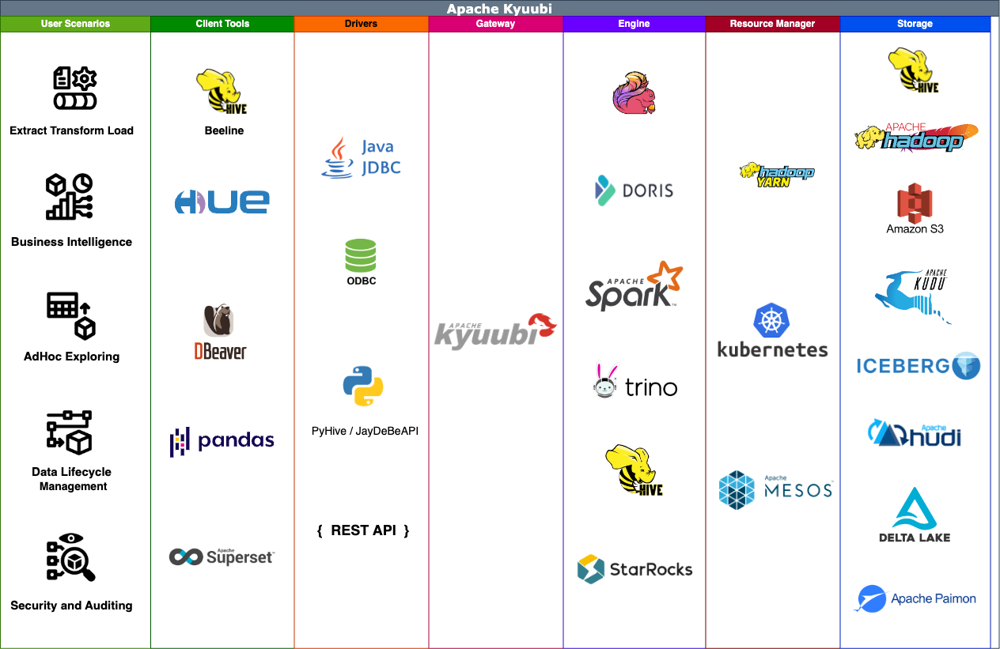

.. Licensed to the Apache Software Foundation (ASF) under one or more
   contributor license agreements.  See the NOTICE file distributed with
   this work for additional information regarding copyright ownership.
   The ASF licenses this file to You under the Apache License, Version 2.0
   (the "License"); you may not use this file except in compliance with
   the License.  You may obtain a copy of the License at

..    http://www.apache.org/licenses/LICENSE-2.0

.. Unless required by applicable law or agreed to in writing, software
   distributed under the License is distributed on an "AS IS" BASIS,
   WITHOUT WARRANTIES OR CONDITIONS OF ANY KIND, either express or implied.
   See the License for the specific language governing permissions and
   limitations under the License.

.. Kyuubi documentation master file, created by
   sphinx-quickstart on Wed Oct 28 14:23:28 2020.
   You can adapt this file completely to your liking, but it should at least
   contain the root `toctree` directive.

Welcome
=======

Apache Kyuubi™ is a distributed and multi-tenant gateway to provide serverless
SQL on Data Warehouses and Lakehouses.

Kyuubi builds distributed SQL query engines on top of various kinds of modern
computing frameworks, e.g.,
Apache `Spark <https://spark.apache.org/>`_,
`Flink <https://flink.apache.org/>`_,
`Doris <https://doris.apache.org/>`_,
`Hive <https://hive.apache.org/>`_,
`Trino <https://trino.io/>`_,
and `StarRocks <https://www.starrocks.io/>`_, etc., to query massive datasets distributed
over fleets of machines from heterogeneous data sources.

The Kyuubi Server lane of the below swimlane divides our prospective users into
end users and administrators. On the one hand, it hides the technical details of
computing and storage from the end users. Thus, they can focus on their business and
data with familiar tools. On the other hand, it hides the complexity of business
logic from the administrators. Therefore, they can upgrade components on the server
side with zero maintenance downtime, optimize workloads with a clear view of what
end users are doing, ensure authentication, authorization, and auditing for both
cluster and data security, and so forth.

In general, the complete ecosystem of Kyuubi falls into the hierarchies shown in
the above figure, with each layer loosely coupled to the other. It's a child's play
to combine some of the components above to build a modern data stack. For example,
you can use Kyuubi, Spark and `Iceberg <https://iceberg.apache.org/>`_ to build
and manage Data Lakehouse with pure SQL for both data processing, e.g. ETL, and online analytics processing(OLAP), e.g. BI.
All workloads can be done on one platform, using one copy of data, with one SQL interface.

A Unified Gateway
-----------------

The Server module plays the role of a unified gateway. The server enables simplified,
secure access to any cluster resource through an entry point to deploy different
workloads for end(remote) users. Behind this single entry, administrators have a single
point for configuration, security, and control of remote access to clusters. And end
users have an improved experience with seamless data processing with any the Kyuubi
engine they need.

Application Programming Interface
~~~~~~~~~~~~~~~~~~~~~~~~~~~~~~~~~

End users can use the application programming interface listed below for connectivity
and interoperation between supported clients and a Kyuubi server. The current implementations are:

- Hive Thrift Protocol
   - A HiveServer2-compatible interface that allows end users to use a thrift
     client(cross-language support, both tcp and http), a `Java Database Connectivity(JDBC) <client/jdbc/index.html>`_ interface over
     thrift, or an `Open Database Connectivity (ODBC) <client/odbc/index.html>`_ interface over a JDBC-to-ODBC bridge to communicate with Kyuubi.
- `RESTful APIs <client/rest/index.html>`_
   - It provides system management APIs, including engines, sessions, operations, and miscellaneous ones.
   - It provides methods that allow clients to submit SQL queries and receive the query results, submit metadata requests and receive metadata results.
   - It enables easy submission of self-contained applications for batch processing, such as Spark jobs.
- MySQL Protocol
   - A MySQL-compatible interface that allows end users to use MySQL Connectors, such as Connector/J, to communicate with Kyuubi.
- We've planned to add more
   - Please join our mailing lists if you have any ideas or questions.

Multi-tenancy
~~~~~~~~~~~~~

Kyuubi supports the end-to-end multi-tenancy. On the control plane, the Kyuubi server
provides a centralized authentication layer to reduce the risk of data and resource
breaches. It supports various protocols, such as LDAP and Kerberos, for securing networking
between clients and servers. On the data plane, the Kyuubi engines use the same trusted
client identities to instantiate themselves. The resource acquirement and data
and metadata access all happen within their own engine. Thus, cluster managers and storage
providers can easily guarantee data and resource security. Besides, Kyuubi also provides engine
authorization extensions to optimize the data security model to fine-grained row/column level.
Please see the `security page <security/index.html>`_ for more information.

High Availability
~~~~~~~~~~~~~~~~~

Kyuubi is designed with High availability (HA), ensuring it operates continuously
without failure for a designated period. HA works to provide Kyuubi that meets an
agreed-upon operational performance level.

- `Load balancing <deployment/high_availability_guide.html>`_
   - It becomes necessary for Kyuubi in a real-world production environment to ensure high availability because of multi-tenant access.
   - It effectively prevents single point of failures.
   - It helps achieve zero downtime for planned system maintenance
- `Failure detectability <monitor/index.html>`_
   - Failures and system load of kyuubi server and engines are visible via metrics, logs, and so forth.

Serverless SQL and More
-----------------------

Serverless SQL on Lakehouses makes it easier for end users to gain insight
from the data universe and optimize data pipelines. It enables:

- The same user experience as an RDBMS using familiar SQL for various workloads.
- Extensive and secure data access capability across diverse data sources.
- High performance on large volumes of data with scalable computing resources.

Besides, Kyuubi also supports submissions of code snippets and self-contained applications serverlessly
for more advanced usage.

Ease of Use
~~~~~~~~~~~

End users could have an optimized experience exploring their data universe in a
serverless way, using either JDBC + SQL or REST + code. For most scenarios, the
superpower of corresponding engines, such as Spark, and Flink, is no longer necessary.
That is, most work related to deployment, runtime optimization, etc., should be done
by professionals on the Kyuubi server side. It is suitable for the following scenarios:

- Basic discovery and exploration
   - Quickly reason about the data in various formats (Parquet, CSV, JSON, text)
     in your data lake in cloud storage or an on-prem HDFS cluster.

- Lakehouse formation and analytics
   - Easily build an ACID table storage layer via Hudi, Iceberg, Delta Lake or/and Paimon.

- Logical data warehouse
   - Provide a relational abstraction on top of disparate data without ETL jobs,
     from collecting to connecting.

Run Anywhere at Any Scale
~~~~~~~~~~~~~~~~~~~~~~~~~

Most of the Kyuubi engine types have a distributed backend or can schedule distributed
tasks at runtime. They can process data on single-node machines or clusters, such as
YARN and Kubernetes. Besides, the Kyuubi server also supports running on bare metal or
in a docker.

High Performance
~~~~~~~~~~~~~~~~

Query performance is one of the critical factors in implementing Serverless SQL.
Implementing serviceability on state-of-the-art query engines for bigdata lays
the foundation for us to achieve this goal:

- State-of-the-art query engines
- Multiple application for high throughput
- Sharable execution runtime for low latency
- Server-side global and continuous optimization
- Auxiliary performance plugins, such as Z-Ordering,
  Query Optimizer, and so on

Another goal of Serverless SQL is to make end users
need not or rarely care about tricky performance
optimization issues.

What's Next
-----------

.. toctree::
   :caption: Admin Guide
   :maxdepth: 2
   :glob:

   quick_start/index
   configuration/settings
   deployment/index
   Security <security/index>
   monitor/index
   tools/index

.. toctree::
   :caption: User Guide
   :maxdepth: 2
   :glob:

   Clients & APIs <client/index>

.. toctree::
   :caption: Extension Guide
   :maxdepth: 2
   :glob:

   Extensions <extensions/index>

.. toctree::
   :caption: Connectors
   :maxdepth: 2
   :glob:

   connector/index

.. toctree::
   :caption: Kyuubi Insider
   :maxdepth: 2

   overview/index

.. toctree::
   :caption: Contributing
   :maxdepth: 2

   contributing/code/index
   contributing/doc/index

.. toctree::
   :caption: Appendix
   :maxdepth: 2

   appendix/index
