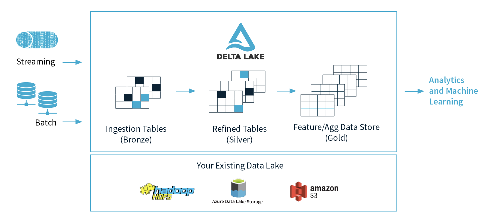

<!--
 - Licensed to the Apache Software Foundation (ASF) under one or more
 - contributor license agreements.  See the NOTICE file distributed with
 - this work for additional information regarding copyright ownership.
 - The ASF licenses this file to You under the Apache License, Version 2.0
 - (the "License"); you may not use this file except in compliance with
 - the License.  You may obtain a copy of the License at
 -
 -   http://www.apache.org/licenses/LICENSE-2.0
 -
 - Unless required by applicable law or agreed to in writing, software
 - distributed under the License is distributed on an "AS IS" BASIS,
 - WITHOUT WARRANTIES OR CONDITIONS OF ANY KIND, either express or implied.
 - See the License for the specific language governing permissions and
 - limitations under the License.
 -->

# Kyuubi On Delta Lake

## What is Delta Lake

> Delta lake is an open-source project that enables building a Lakehouse Architecture on top of existing storage systems such as S3, ADLS, GCS, and HDFS.

This article assumes that you have mastered the basic knowledge and operation of [Delta Lake](https://delta.io/).
For the knowledge about delta lake not mentioned in this article, you can obtain it from its [official documentation](https://docs.delta.io/latest/index.html). 

## Why Kyuubi on Delta Lake
As we know, Kyuubi provides a pure SQL gateway through Thrift JDBC/ODBC interface for end-users to manipulate large-scale data with pre-programmed and extensible Spark SQL engines. By using kyuubi, we can run SQL queries towards delta lake which is more convenient, easy to understand, and easy to expand than directly using spark to manipulate delta lake.

## References
- [https://delta.io/](https://delta.io/)

