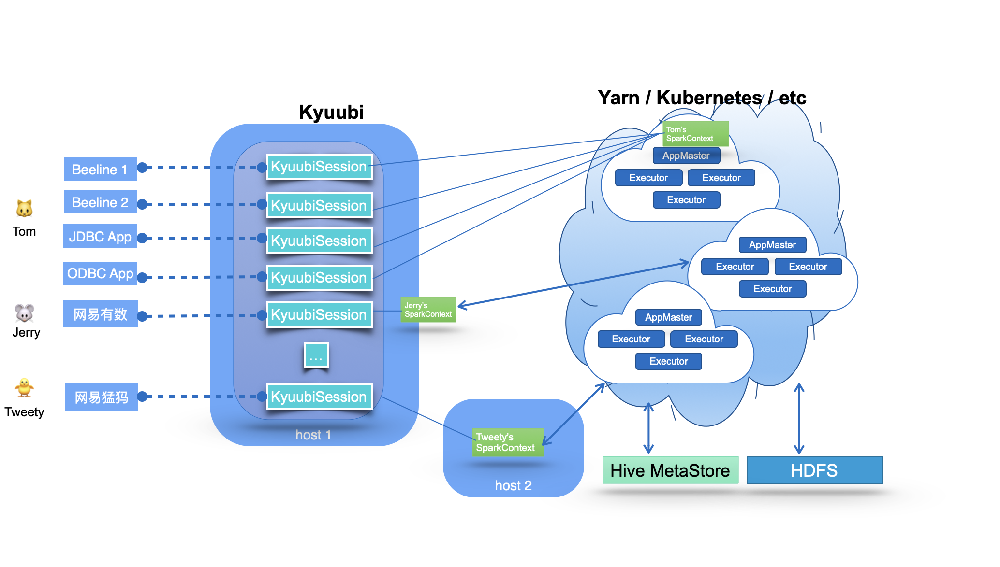

<div align=center>


</div>

# Kyuubi Architecture

## Introduction

Kyuubi is a high-performance universal JDBC and SQL execution engine. The goal of Kyuubi is to facilitate users to handle big data like ordinary data.

It provides a standardized JDBC interface with easy-to-use data access in big data scenarios.
End-users can focus on developing their business systems and mining data value without being aware of the underlying big data platform (compute engines, storage services, metadata management, etc.).

Kyuubi relies on Apache Spark to provide high-performance data query capabilities,
and every improvement in the engine's capabilities can help Kyuubi's performance make a qualitative leap.
Besides, Kyuubi improves ad-hoc responsiveness through the way of engine caching,
and enhances concurrency through horizontal scaling and load balancing.

It provides complete authentication and authentication services to ensure data and metadata security.

It provides robust high availability and load-balancing to help you guarantee the SLA commitment.

It provides a two-level elastic resource management architecture to effectively improve resource utilization while covering the performance and response requirements of all scenarios, including interactive,
or batch processing and point queries or full table scans.

It embraces Spark and builds an ecosystem on top of it,
which allows Kyuubi to expand its existing ecosystem and introduce new features quickly,
such as cloud-native support and `Data Lake/Lake House` support.

Kyuubi's vision is to build on top of Apache Spark and Data Lake technologies to unify the portal and become an ideal data lake management platform.
It can support data processing e.g. ETL, and analytics e.g. BI, in a pure SQL way.
All workloads can be done on one platform, using one copy of data, with one SQL interface.

## Architecture Overview

The fundamental technical architecture of the Kyuubi system is shown in the following diagram.



The middle part of the diagram shows the Kyuubi server's main component, which handles the clients' connection and execution requests shown in the left part of the image. Within Kyuubi,
these connection requests are maintained as the Kyuubi session's,
and execution requests are supported as the Kyuubi Operation's which are bound to the corresponding sessions.

The creation of a `Kyuubi Session` can be divided into two cases: lightweight and heavyweight.
Most session creations are lightweight and user-unaware.
The only heavyweight case is when there is no `SparkContext` instantiated or cached in the user's shared domain,
which usually happens when the user is connecting for the first time or has not connected for a long time.
This one-time cost session maintenance model can meet most of the ad-hoc fast response requirements.

Kyuubi maintains connections to `SparkConext` in a loosely coupled fashion. These `SparkContext's can be Spark programs created locally in client deploy mode by this service instance,
or in Yarn or Kubernetes clusters in cluster deploy mode.
In highly available mode, these `SparkConext` can also be created by other Kyuubi instances on different machines and shared by this instance.

These `SparkConext` instances are essentially remote query execution engine programs hosted by Kyuubi services.
These programs are implemented on Spark SQL and compile, optimize, and execute SQL statements end-to-end and the necessary interaction with the metadata (e.g. Hive Metastore) and storage (e.g. HDFS) services,
maximizing the power of Spark SQL.
They can manage their lifecycle, cache and recycle themselves,
and are not affected by failover on the Kyuubi server.

Next, let us share some of the key design concepts of Kyuubi.

## Unified Interface

Kyuubi implements the [Hive Service RPC](https://mvnrepository.com/artifact/org.apache.hive/hive-service-rpc/2.3.7) module,
which provides the same way of accessing data as HiveServer2 and Spark Thrift Server.
On the client side，you can build fantastic business reports, BI applications, or even ETL jobs only via the [Hive JDBC](https://mvnrepository.com/artifact/org.apache.hive/hive-jdbc/2.3.7) module.

You only need to be familiar with Structured Query Language (SQL) and Java Database Connectivity (JDBC) to handle massive data.
It helps you focus on the design and implementation of your business system.

- SQL is the standard language for accessing relational databases and very popular in big data eco too.
  It turns out that everybody knows SQL.
- JDBC provides a standard API for tool/database developers and makes it possible to write database applications using a pure Java API.
- There are plenty of free or commercial JDBC tools out there.

## Runtime Resource Resiliency

The most significant difference between Kyuubi and Spark Thrift Server(STS) is that STS is a single Spark application.
For example, if it runs on an Apache Hadoop Yarn cluster,
this application is also a single Yarn application that can only exist in a specific fixed queue of the Yarn cluster after it is created.
Kyuubi supports the submission of multiple Spark applications.

Yarn loses its role as a resource manager for resource management and does not play the corresponding role of resource isolation and sharing.
When users from the client have different resource queue permissions,
STS will not be able to handle it in this case.

For data access, a single Spark application has only one user globally,
a.k.a. `sparkUser`, and we have to grant it a superuser-like role to allow it to perform data access to different client users,
which is a too insecure practice in production environments.

Kyuubi creates different Spark applications based on the connection requests from the client,
and these applications can be placed in different shared domains for other connection requests to share.

Kyuubi does not occupy any resources from the Cluster Manager(e.g. Yarn) during startup and will give all resources back if there
is not any active session interacting with a `SparkContext`.

Spark also provides [Dynamic Resource Allocation](http://spark.apache.org/docs/latest/job-scheduling.html#dynamic-resource-allocation) to dynamically adjust the resources your application occupies based on the workload. It means
that your application may give resources back to the cluster if they are no longer used and request them again later when
there is demand. This feature is handy if multiple applications share resources in your Spark cluster.

With these features, Kyuubi provides a two-level elastic resource management architecture to improve resource utilization effectively.

For example,

```shell
./beeline - u 'jdbc:hive2://kyuubi.org:10009/; \
  hive.server2.proxy.user=tom# \
  spark.yarn.queue=thequeue; \
  spark.dynamicAllocation.enabled=true \
  spark.dynamicAllocation.maxExecutors=500 \
  spark.shuffle.service.enabled=true \
  spark.executor.cores=3; \
  spark.executor.memory=10g'

```

If the user named `tom` opens a connection like above, Kyuubi will try to create a Spark SQL engine application with [3, 500] executors (3 cores, 10g mem each) in the queue named `thequeue` in the Yarn cluster.

On the one hand, because tom enables Spark's dynamic resource request feature,
Spark will efficiently request and recycle executors within the program based on the SQL operations scale and the available resources in the queue.
On the other hand, when Kyuubi finds that the application has been idle for too long, it will also recycle its application.


## High Availability & Load Balance

For an enterprise service, the Service Level Agreement(SLA) commitment must be very high.
And the concurrency needs to be sufficiently robust to support the entire enterprise's requests.
As a single Spark application and without high availability, Spark Thrift Server can hardly meet the SLA and concurrency requirement.
When there are large query requests, there are potential bottlenecks in metadata service access, scheduling and memory pressure of Spark Driver, or the application's overall computational resource constraints.

Kyuubi provides high availability and load balancing solutions based on Zookeeper, as shown in the following diagram.


Let us try to break it down from top to bottom based on the above diagram.

1. At the top of the diagram is the client layer. A client can find multiple registered instances of Kyuubi instance (k.i.) from the namespace in the service discovery layer and then choose to connect.
   Kyuubi instances registered to the same namespace provide the ability to load balance each other.

2. The selected Kyuubi instance will pick an available engine instance (e.i.) from the engine-namespace in the service discovery layer to establish a connection.
   If no available instance is found, it will create a new one, wait for the engine to finish registering, and then proceed to connect.

3. If the same person requests a new connection, the connection will be set up to the same or another Kyuubi instance, but the engine instance will be reused.

4. For connections from different users, the step 2 and 3 will be repeated.
   This is because in the service discovery layer,
   the namespaces used to store the address of the engine instances are isolated based on the user(by default),
   and different users cannot access other' s instances across the namespace.

## Authentication & Authorization

In a secure cluster, services should be able to identify and authenticate callers.
As the fact that the user claims does not necessarily mean this is true.
The authentication process of Kyuubi is used to verify the user identity that a client used to talk to the Kyuubi server.
Once done, a trusted connection will be set up between the client and server if they are successful; otherwise, they will be rejected.

The authenticated client user will also be the user that creates the associate engine instance, then authorizations for database objects or storage could be applied.
We also create a [Submarine: Spark Security](https://mvnrepository.com/artifact/org.apache.submarine/submarine-spark-security) external plugin to achieve fined-grained SQL standard-based authorization.

## Conclusions

Kyuubi is a unified multi-tenant JDBC interface for large-scale data processing and analytics, built on top of [Apache Spark™](http://spark.apache.org/).
It extends the Spark Thrift Server's scenarios in enterprise applications, the most important of which is multi-tenancy support.
