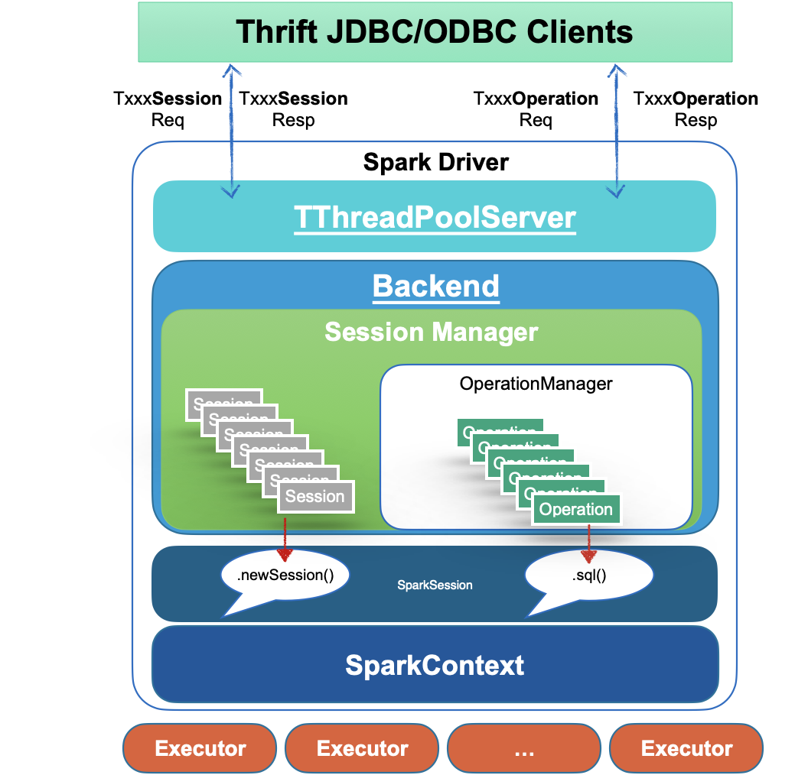
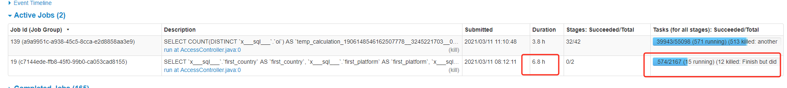

<!--
 - Licensed to the Apache Software Foundation (ASF) under one or more
 - contributor license agreements.  See the NOTICE file distributed with
 - this work for additional information regarding copyright ownership.
 - The ASF licenses this file to You under the Apache License, Version 2.0
 - (the "License"); you may not use this file except in compliance with
 - the License.  You may obtain a copy of the License at
 -
 -   http://www.apache.org/licenses/LICENSE-2.0
 -
 - Unless required by applicable law or agreed to in writing, software
 - distributed under the License is distributed on an "AS IS" BASIS,
 - WITHOUT WARRANTIES OR CONDITIONS OF ANY KIND, either express or implied.
 - See the License for the specific language governing permissions and
 - limitations under the License.
 -->

# Kyuubi v.s. Spark Thrift JDBC/ODBC Server (STS)

## Introductions

The Apache Spark [Thrift JDBC/ODBC Server](http://spark.apache.org/docs/latest/sql-distributed-sql-engine.html) is a Thrift service implemented by the Apache Spark community based on HiveServer2.
Designed to be seamlessly compatible with HiveServer2, it provides Spark SQL capabilities to end-users in a pure SQL way through a JDBC interface.
This "out-of-the-box" model minimizes the barriers and costs for users to use Spark. 

Kyuubi and Spark are aligned in this goal.
On top of that, Kyuubi has made enhancements in multi-tenant support, service availability, service concurrency capability, data security, and other aspects.

### Barriers to common Spark job usage

In this part, the most fundamental one is how we define a `Spark User`.
Generally speaking, a Spark user is a guy that calls Spark APIs directly,
but from Kyuubi and Spark ThriftServer's perspective,
the direct API calls occur on the server-side,
then a Spark user indirectly interacts with Spark's backend through the more common JDBC specification and protocols.
With JDBC and SQL, Kyuubi and Spark ThriftServer make users experience the same way that interacts with most of the world's popular modern DBMSes.

Using Spark APIs directly is flexible for programmers with a bigdata background but may not be friendly for everyone.

#### High Barrier

Users need a certain programming framework to use Spark through the Scala/Java/Python interfaces provided by Spark.
Also, users need to have a good background in big data.
For example, users need to know which platform their application will be submitted to, YARN, Kubernetes, or others.
They also need to be aware of the resource consumption of their jobs, for example, executor numbers, memory for each executor.
If they use too many resources, will it affect other critical tasks?
Otherwise, will the cluster's resources be idle and wasted?
It is also hard for users to set up thousands of Spark configurations properly.
Key features like [Dynamic Resource Allocation](../deployment/spark/dynamic_allocation.md), Speculation might be hard to benefit all with a one-time setup.
And new features like [Adaptive Query Execution](../deployment/spark/aqe.md) could come a long way from the first release involved of Spark to finally get applied to end-users. 

#### Insecurity

Users can access metadata and data by means of code, and data security cannot be guaranteed.
All client configurations need to be handed over to the user directly or indirectly.
These configurations may contain sensitive information and let all the backend services be completely exposed to the users.
For example, in terms of data security, the [Submarine Spark Security Plugin](https://submarine.apache.org/docs/userDocs/submarine-security/spark-security/README) provides SQL Standard ACL Management for Apache Spark SQL with Apache Ranger.
But in the end, this kind of security feature is at most a "gentleman's agreement" in front of programmers who can write code to submit jobs via Spark code.

#### Compatibility

Client-side compatibility is difficult to guarantee.
When a user's Spark job is finally scheduled to run on a cluster, it faces problems such as inconsistencies between the client environment and the cluster environment, conflicts between user job dependencies, Spark dependencies, and Hadoop cluster dependencies.
When we upgrade the server-side staffs, such as Spark, Hive, and YARN, etc., it is also necessary to upgrade all of the user clients with transitive dependencies as much as possible, which may introduce a lot of unnecessary compatibility testing work, and it is hard to have complete test coverage.

#### Bootstrap latency

For long-running Spark applications, the bootstrap time is negligible compared to the total lifecycle, such as Spark Structured Streaming.
In this case, the task scheduling and computing are fully thread-level with low latency and fast response.
For short-term ones, the bootstrap time counts, such as the `SparkPi`.
Relatively speaking, this process is very time-consuming, especially for some second-and minute-level computation tasks.

Spark ThriftServer is essentially a Spark application in a multi-threaded scenario.
It pre-starts a distributed SQL engine consisting of a driver and multiple executors at runtime.
At the SQL parsing layer, the service takes full advantage of the Spark SQL optimizer,
and at the computation execution layer, since Spark ThriftServer is resident, there is no bootstrap overhead, and when [DRA](../deployment/spark/dynamic_allocation.md) is not enabled, the entire SQL computation process is in pure threaded scheduling model with excellent performance.

The JDBC connections and operations are handled by the frontend thread pool as various requests.
And the corresponding methods of the backend are called to bind to the `SparkSession` related interface.
For example, the `DriverManager.getConnection` at the client-side will invoke `SparkSession.newSession()` at the server-side,
and all queries from the client-side will be submitted to the backend thread pool asynchronously and executed by `SparkSession.sql(...)`.

First, in this mode, users can interact with Spark ThriftServer through simple SQL language and JDBC interface to implement their own business logic.
The basic capacity planning of Spark ThriftServer, the consolidation of underlying services, and all the optimizations can all be made on the server-side.
Some people may think that only using SQL does not meet all the business, that's true, but the service itself is targeting users that migrating from HiveServer2 for the reason of query speed.
With UDF/UDAF support, Some complex logic can still be fulfilled, so basically,  Spark ThriftServer is able to deal with most of the big data processing workloads.

Secondly, all the setups for backend services, such as YARN, HDFS, and Hive Metastore Server(HMS), are completed in Spark ThriftServer, so there is no need to hand over the configuration of the backend services to the end-users.
This ensures data security to a certain extent.
On top of that, the server generally has the ability to do authentication/authorization and other assurance to protect data security.

Finally, the JDBC interface protocol and C/S architecture under the server-side backward compatibility constraints basically ensure that there will be no client-side compatibility obstacles.
Users only need to choose the appropriate version of the JDBC driver.
The server-side upgrade will not cause interface incompatibility.
As for the potential SQL compatibility problem in Spark version upgrade, it also exists when not using Spark ThriftServer, and is more challenging to solve.
Moreover, in Spark ThriftServer mode, the server-side can do the full amount of SQL collection in advance, and the verification can be done before the upgrade.

## Limitations of Spark ThriftServer

As we can see from the basic architecture of Spark ThriftServer above, it is essentially a single Spark application, and there are generally significant limitations to responding to thousands of client requests.

### Driver Bottleneck

The Spark Driver has to both play the role of the scheduler of a Spark application and also the handler of thousands of connections and operations from the client-side.
In this case,  it is very likely to hit its bottleneck.
The Hive metastore client on which the Spark analyzer depends for resolving all queries is one and only, so there will be more obvious concurrency issues when accessing the HMS.

### Resource isolation issues

Over-sized Spark jobs encroach on too many of Spark ThriftServer resources, causing other jobs to delay or get stuck.

With Fair Scheduler Pools, Spark ThriftServer has the ability of resource isolation and sharing to a certain extent.
It will send queries to a high-weight pool to get more executors for execution.
In essence, resource isolation such as CPU/memory/IO should be something that resource managers like YARN and Kubernetes should do.
Doing logical isolation at the computing layer is unlikely to work well, and this problem exists in the Apache Impala project as well, for example.
And it is difficult to avoid the problem of HMS, HDFS  single point access, especially in the scenario of reading and writing dynamic partition tables or handling queries with numerous `Union`s. 

### Multi-tenancy limitations

Spark ThriftServer itself should be a multi-tenant-enabled system, i.e., it can accept requests from different clients and users.
However, from Spark's design point of view, Spark ThriftServer implemented in a single Spark application cannot fully support multi-tenancy because the entire application has only a globally unique username, including both the driver side, and the executor side.
So, it has to access all users' data with a single tenant.

Spark ThriftServer occupies a single resource queue (YARN Queue / Kubernetes Namespace), making it difficult to control the resource pool's size available to each tenant in a fine-grained or elastic way from the perspective of resource isolation and sharing.
No one would like to restart the server and stop it from serving to adjust some pool's weight or increase the total computing resources.

### High Availability Limitations

The community edition of Spark ThriftServer does not support High Availability (HA).
It is hard to imagine whether a server-side application without high availability can support the SLA commitment.
It's not that difficult to apply an HA implementation to Spark ThriftServer, but tricky.
For example, there is already a [JIRA ticket: SPARK-11100](https://issues.apache.org/jira/browse/SPARK-11100) with a pull request attached, see [SPARK-11100].
There are generally two ways for the HA implementation of Spark ThriftServer, namely `Active/Standby` and `LoadBalancing`.

The Active/Standby mode consists of active Spark ThriftServer and several standby servers.
When the active crashes or hangs, the standby nodes trigger the leader selection to become the new active one to take over.
The problems here are undeniable:
There is only one active node runtime, so the concurrency capability is limited.
When a failover occurs due to hardware and software failure, all current connections and running jobs will fail.
This kind of failover is expensive for client-side users.
The clients will retry simultaneously, so it's hard for the new elected active server to handle the coming flood of client retries.
It's very likely to crash again.
The Standby node causes serious waste of cluster resources, whether Spark dynamic resource allocation is enabled or not.
A more appropriate approach to solve the server-side single-point problem is to add LoadBalancing support of your own.
So that when client requests increase, we can expand Spark ThriftServer horizontally. However, this model also has some limitations.
Each Spark ThriftServer is stateful with transient data or functionalities, such as some global temporary views, UDFs, etc., which cannot be shared between two servers.
And it's expensive to expand with computing resources together.

### UDF Issues

For operations like `ADD JAR ...` or `CREATE TEMPORARY FUNCTION  ... USING...`, classes or jars might conflict in the Spark ThriftServer.
And there is no such way for deleting when conflicts.
Besides, since UDFs are loaded directly into the Spark ThriftServer, if they contain some unintentional or malicious logic, such as calling `System.exit(-1)`, which may kill the service directly, or some operations that affect the server behavior globally like Kerberos authentication.

## Kyuubi VS Spark Thrift Server

The HiveServer2 is also introduced here for a more comprehensive comparison.

|| HiveServer2  (Hive on Spark) | Spark ThriftServer | Kyuubi |
|--|--|--|--|
|**Interface** | HiveJDBC | HiveJDBC | HiveJDBC |
|**SQL Syntax** | Hive QL | Spark SQL | Spark SQL |
|**SQL Optimizer** | Hive Optimizer | Spark SQL Catalyst | Spark SQL Catalyst |
|**SQL Parsing & Planing** | Server Side | Server Side | Engine Side |
|**UDF Loading** | Server Side | Server Side | Engine Side |
|**Job Submission** | A query is split into multiple Spark applications, called `RemoteDriver` | within the server | Using Kyuubi Engines with different  policies for isolation  1. `USER` level isolation, where different JDBC connections of the same user share the Engine belonging to the user   2. `CONNECTION` level isolation, where one JDBC connection has one Engine, and the same Engine executes all SQL within a connection |
|**Spark Compatibility** | Single version-specific | Builtin| Multi-versions |
|**Catalog Management**| HMS | HMS | HMS | HMS, various data lake frameworks and third-party catalogs |
|**High Availability** | Yes | No | Yes | Yes|
|**Multi tenancy** | Yes | No | Yes|
|**Permission Control** | SQL Standard, Fine-Grained | No | SQL Standard, Fine-Grained |
|**Performance** | Fair | Good | Good |
|**Client Concurrency** | High | Low | High |
|**Queuing** | for queries | None | for Engines|
|**Resource Setting** | for queries | for pools | for Engines|
|**Compute Resource Management** | YARN |pools| YARN, Kubernetes, etc. |
|**Resource Occupancy Time** | within a query | Permanent | Using Kyuubi Engine to request and  release resources  1. For `CONNECTION` level isolation, an Engine terminates when a JDBC connection disconnects   2. For other modes, an Engine timeouts after all connections disconnect.   3. All isolation modes support [DRA](../deployment/spark/dynamic_allocation.md) |

###  Consistent Interfaces

Kyuubi, Spark Thrift Server, and HiveServer2 are identical in terms of interfaces and protocols.
Therefore, from the user's point of view, the way of use is unchanged.
Compared with HiveServer2, the most significant advantage of the first two should be the performance improvement. 

From the perspective of SQL syntax compatibility, Kyuubi and Spark Thrift Server are fully compatible with Spark SQL as they are completely delegated to the Spark SQL Catalyst layer.
Spark SQL also fully supports Hive QL collections, with only a few enumerable SQL behaviors and syntax differences.

### Multi-tenant Architecture

`From wikipedia`: The term "software multitenancy" refers to a software architecture in which a single instance of the software runs on a server and serves multiple tenants. Systems designed in such a manner are often called shared (in contrast to dedicated or isolated).

Kyuubi, Spark ThriftServer, and HiveServer2 have been designed for a typical multi-tenant architecture scenario.

Firstly, we need to consider how to 1) make safer and more efficient use of these compute resources based on resource isolation and 2) how to give users enough control over their own resources.

HiveServer2 is supposed to be the most flexible one.
Each SQL is programmed into several Spark applications for execution, and the resource queue, memory, and others can be set before execution.
But this approach leads to extremely high Spark bootstrap latency and can not efficiently utilize resources.

Spark ThriftServer goes in the opposite direction because there is only one Spark application.
It is impossible to adjust the queue, memory, and other resource-related configs from the user side interface as it is already pre-started.
Queries can be sent to pre-set `Fair Scheduler Pools` for running in isolation.
The `Fair Scheduler Pools` can only provide low isolation within a Spark application and be configured before Spark ThriftServer starts.

Kyuubi has neutralized these aspects with two other system implementations.
Kyuubi applies the multi-tenant feature based on the concept of Kyuubi Engines, where an Engine is a Spark application.

In Kyuubi's system, the Engines are isolated according to tenants.
The tenant, a.k.a. user, is unified and end-to-end unique through a JDBC connection.
Kyuubi server will identify and authenticate the user and then retrieve or create an Engine belonging to this particular user.
This user will be used as the submitter for Engine, and it must have authority to use the resources from YARN, Kubernetes, or just Local machine, e.t.c.
Inside an Engine, the Engine's user, a.k.a. `Spark User`, will also be the same.
When an Engine runs queries received from the JDBC connection, the Engine's user must also have rights to access the data.
Besides, if it needs access to metadata during this process, then we can also add a fine-grained SQL standard ACL management on the metadata layer now with [Submarine Spark Security Plugin](https://submarine.apache.org/docs/userDocs/submarine-security/spark-security/README).

The Engines have their lifecycle, which is related to the `kyuubi.session.engine.share.level` specified via client configurations.
For example, if set to `CONNECTION`, then the corresponding Engine will be created for each JDBC connection and terminates itself when we close the connection.
For another example, if set to `USER`,  the corresponding Engine is cached and shared with all JDBC connections from the same user, even through different Kyuubi servers in HA mode.
The Engine will eventually timeout after all the sessions are closed.

As we need to create Engines, on the one hand, we can configure all the Spark configurations during startup.
On the other hand, it does bring the Spark application bootstraps overhead here, but overall, it is just a one-time cost.
All queries or connections of the Engine's user will share this application.
The more queries it runs, the lower the bootstraps overhead is.

### High Availability Capabilities

The HA issues in Spark ThriftServer have already been covered in the previous section so that we won't go over them here again. In Kyuubi, we provide HA in the way of `LoadBlancing`.  Kyuubi is lightweight, as it does not create any Engine when it starts.
It's cheap to add Kyuubi HA nodes, so horizontal scaling is not overly burdensome.

### Client Concurrency

The compilation and optimization for queries in both HiveServer2 and Spark ThriftServer are done on the server-side.
In contrast, Kyuubi will do these at the Engine-side.
It is instrumental in reducing the workload of the server and improving client concurrency.
For task scheduling that belongs to the compute phase also happens at Kyuubi's Engine side.
It is not as heavy as the Spark ThriftServer, where there is an intense competition between the client concurrency and the task scheduling.
In principle, the more executors there are, or the more significant the amount of data processed, the more pressure on the server-side.

### Service Stability

The intense competition between the client concurrency and the task scheduling increases GC issues and OOM risks of Spark ThriftServer.
Kyuubi has no problem in this area due to the separation of the server and engines.
The UDF risks cannot harm the stability of the service either.
As if a user loads and calls an invalid UDF, which only damages its own Engine and will not affect other users or the Kyuubi server.

## Summary

Kyuubi extends the use of Spark ThriftServer in a multi-tenant model based on a unified interface and relies on the concept of multi-tenancy to interact with cluster managers to finally gain the ability of resources sharing/isolation and data security.
The loosely coupled architecture of Kyuubi Server and Engine greatly improves the concurrency and service stability of the service itself.
