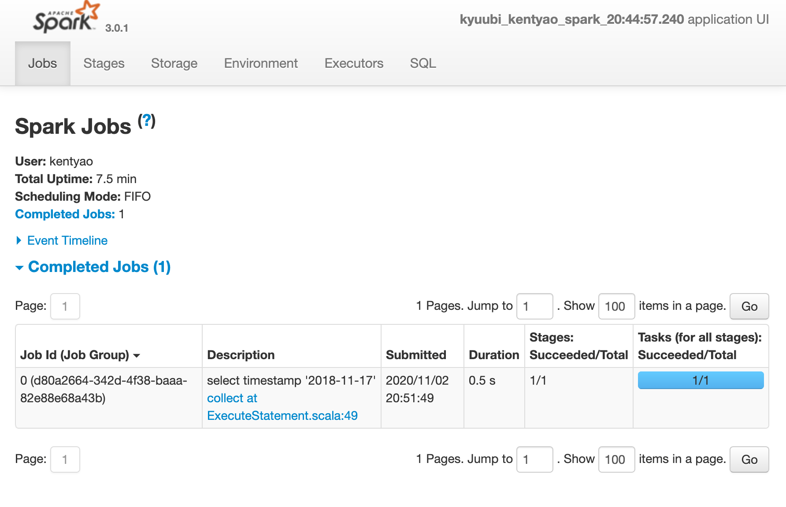

<script async defer src="https://buttons.github.io/buttons.js"></script>
<div align=center>


</div>

# Getting Started with Kyuubi


## Getting Kyuubi

Currently, Kyuubi maintains all releases on GitHub directly. You can get the most recent stable release of Kyuubi here:

<a class="github-button" href="https://github.com/yaooqinn/kyuubi/releases" data-color-scheme="no-preference: light; light: dark; dark: light;" data-icon="octicon-download" data-size="large" aria-label="Download yaooqinn/kyuubi on GitHub">Download</a>

## Requirements

These are essential components required for Kyuubi to startup. For quick start deployment, the only thing you need is `JAVA_HOME` being correctly set. The Kyuubi release package you downloaded or built contains the rest prerequisites inside already.

Components| Role | Optional | Version | Remarks
--- | --- | --- | --- | ---
Java | Java<br>Runtime<br>Environment | Required | 1.8 | Kyuubi is pre-built w/ Java 1.8
Spark | Distribute<br>SQL<br>Engine | Optional | 3.0.x | By default Kyuubi is pre-built w/<br> a Apache Spark release inside at<br> `$KYUUBI_HOME/externals`
HDFS | Distributed<br>File<br>System |  Optional | referenced<br>by<br>Spark | Hadoop Distributed File System is a <br>part of Hadoop framework, used to<br> store and process the datasets.<br> You can interact w/ any<br> Spark-compatible versions of HDFS.
Hive | Metastore | Optional | referenced<br>by<br>Spark | Hive Metastore for Spark SQL to connect
Zookeeper | Service<br>Discovery | Optional | Any<br>zookeeper<br>ensemble<br>compatible<br>with<br>curator(2.7.1) | By default, Kyuubi provides a<br> embeded Zookeeper server inside for<br> non-production use.

Additionally, if you want to work with other Spark compatible systems or plugins, you only need to take care of them as using them w/ regular Spark applications. For example, you can run Spark SQL engines created by the Kyuubi on any kind of cluster manager, including YARN, Kubernetes, Mesos, e.t.c... Or, you can manipulate data from different data sources w/ the Spark Datasource API, e.g. Delta Lake, Apache Hudi, Apache Iceberg, Apache Kudu and e.t.c...

## Installation

To install Kyuubi, you need to unpack the tarball. For example, 

```bash
tar zxf kyuubi-1.0.2-bin-spark-3.0.1.tar.gz
```

This will result in the creation of a subdirectory named `kyuubi-1.0.2-bin-spark-3.0.1` shown below, where the `1.0.2` is the Kyuubi version and `3.0.1` is the pre-built Spark version.

```bash
kyuubi-1.0.2-bin-spark-3.0.1
├── LICENSE
├── RELEASE
├── bin
│   └── kyuubi
├── conf
│   ├── kyuubi-defaults.conf
│   ├── kyuubi-env.sh
│   └── log4j.properties
├── externals
│   ├── engines
│   └── spark-3.0.1-bin-hadoop2.7
├── jars
├── logs
├── pid
└── work
```

From top to bottom are:

- LICENSE: the [APACHE LICENSE, VERSION 2.0](https://www.apache.org/licenses/LICENSE-2.0) we claim to obey.
- RELEASE: the build information of this package
- bin: the entry of the Kyuubi server w/ `kyuubi` as the startup script.
- conf: all the defaults used by Kyuubi Server itself or creating session with Spark applications.
- externals
  - engines: contains all kinds of SQL engines that we support, e.g. Apache Spark, Apache Flink(coming soon).
  - spark-3.0.1-bin-hadoop2.7: a pre-downloaded official Spark release, used as default.
- jars: packages needed by the Kyuubi server.
- logs: Where the logs of Kyuubi server locates.
- pid: stores the pid file of Kyuubi server instance.
- work: the root of the working directories of all the forked sub-processes a.k.a. SQL engines. 


## Running Kyuubi

As mentioned above, for a quick start deployment, the only you need to be sure is that your java runtime environment is correct.

### Setup JAVA

Your can either set it system-widely,  e.g. in the `.bashrc` file.

```bash
java -version
java version "1.8.0_251"
Java(TM) SE Runtime Environment (build 1.8.0_251-b08)
Java HotSpot(TM) 64-Bit Server VM (build 25.251-b08, mixed mode)
```

Or, `export JAVA_HOME=/path/to/java` in the local os session.

```bash
export JAVA_HOME=/Library/Java/JavaVirtualMachines/jdk-11.0.5.jdk/Contents/Home
 java -version
java version "11.0.5" 2019-10-15 LTS
Java(TM) SE Runtime Environment 18.9 (build 11.0.5+10-LTS)
Java HotSpot(TM) 64-Bit Server VM 18.9 (build 11.0.5+10-LTS, mixed mode)

```

But, the recommended place to set `JAVA_HOME` is `$KYUUBI_HOME/conf/kyuubi-env.sh`, as the ways above are too flaky.
The `JAVA_HOME` in `$KYUUBI_HOME/conf/kyuubi-env.sh` will take precedence of others.

### Starting Kyuubi


```bash
bin/kyuubi start
```

During the server starts, it will print all essential environment variables on the screen, you may check whether they are expected.

```logtalk
Starting Kyuubi Server from /Users/kentyao/kyuubi/kyuubi-1.0.2-bin-spark-3.0.1
Using kyuubi.sh environment file /Users/kentyao/kyuubi/kyuubi-1.0.2-bin-spark-3.0.1/conf/kyuubi-env.sh to initialize...
JAVA_HOME: /Library/Java/JavaVirtualMachines/jdk1.8.0_251.jdk/Contents/Home
KYUUBI_HOME: /Users/kentyao/kyuubi/kyuubi-1.0.2-bin-spark-3.0.1
KYUUBI_CONF_DIR: /Users/kentyao/kyuubi/kyuubi-1.0.2-bin-spark-3.0.1/conf
KYUUBI_LOG_DIR: /Users/kentyao/kyuubi/kyuubi-1.0.2-bin-spark-3.0.1/logs
KYUUBI_PID_DIR: /Users/kentyao/kyuubi/kyuubi-1.0.2-bin-spark-3.0.1/pid
KYUUBI_WORK_DIR_ROOT: /Users/kentyao/kyuubi/kyuubi-1.0.2-bin-spark-3.0.1/work
SPARK_HOME: /Users/kentyao/kyuubi/kyuubi-1.0.2-bin-spark-3.0.1/externals/spark-3.0.1-bin-hadoop2.7
SPARK_CONF_DIR:
HADOOP_CONF_DIR:
Starting org.apache.kyuubi.server.KyuubiServer, logging to /Users/kentyao/kyuubi/kyuubi-1.0.2-bin-spark-3.0.1/logs/kyuubi-kentyao-org.apache.kyuubi.server.KyuubiServer-hulk.local.out
Welcome to
  __  __                           __
 /\ \/\ \                         /\ \      __
 \ \ \/'/'  __  __  __  __  __  __\ \ \____/\_\
  \ \ , <  /\ \/\ \/\ \/\ \/\ \/\ \\ \ '__`\/\ \
   \ \ \\`\\ \ \_\ \ \ \_\ \ \ \_\ \\ \ \L\ \ \ \
    \ \_\ \_\/`____ \ \____/\ \____/ \ \_,__/\ \_\
     \/_/\/_/`/___/> \/___/  \/___/   \/___/  \/_/
                /\___/
                \/__/

```

If all goes well, this will result in the creation of the Kyuubi server instance with a `PID` stored in `$KYUUBI_HOME/pid/kyuubi-<username>-org.apache.kyuubi.server.KyuubiServer.pid`

Alternatively, it can be run in the foreground, with the logs and other output written to stdout/stderr. Both streams should be captured if using a supervision system like daemontools:

```bash
bin/kyuubi run
```

Then, you can get the JDBC connection url at the end of log file, e.g.

```
FrontendService: Starting and exposing JDBC connection at: jdbc:hive2://localhost:10009/
```

If something goes wrong, you shall be able to find some clues in the log file too.

## Using Hive Beeline

Kyuubi server is compatible with Apache Hive beeline,
and a builtin beeline tool can be found within the pre-built Spark package in the `$KYUUBI_HOME/externals` directory, e.g. `$KYUUBI_HOME/externals/spark-3.0.1-bin-hadoop2.7/bin/beeline`

### Opening a Connection

The command below will tell Kyuubi server to create a session with itself. 

```logtalk
bin/beeline -u 'jdbc:hive2://localhost:10009/'
Connecting to jdbc:hive2://localhost:10009/
Connected to: Spark SQL (version 1.0.2)
Driver: Hive JDBC (version 2.3.7)
Transaction isolation: TRANSACTION_REPEATABLE_READ
Beeline version 2.3.7 by Apache Hive
0: jdbc:hive2://localhost:10009/>
```

In this case, the session will create for the user named 'anonymous'.

Kyuubi will create a Spark SQL engine application using `kyuubi-spark-sql-engine-<version>.jar` if there is no existing one.
It will cost a while for the application to be ready before the session is fully established.
Otherwise, an existing application will be resued and the time cost here is negligible.

Similarly, you can create a session for another user(or principal, subject, and maybe something else you defined), e.g. named `kentyao`,

```bash
bin/beeline -u 'jdbc:hive2://localhost:10009/' -n kentyao
```

The formerly created Spark application for user 'anonymous' will not be reused in this case, while a brand new application will be submitted for user 'kentyao' instead.

Then, you can see 3 processes running in your local environment, including one `KyuubiServer` instance and 2 `SparkSubmit` instance as the SQL engines.

```
75730 Jps
70843 KyuubiServer
72566 SparkSubmit
75356 SparkSubmit
```
### Execute Statements

If the beeline session is successfully connected, then you can run any query supported by Spark SQL now. For example,

```logtalk
0: jdbc:hive2://localhost:10009/> select timestamp '2018-11-17';
2020-11-02 20:51:49.019 INFO operation.ExecuteStatement:
           Spark application name: kyuubi_kentyao_spark_20:44:57.240
                 application ID:  local-1604321098626
                 application web UI: http://10.242.189.214:64922
                 master: local[*]
                 deploy mode: client
                 version: 3.0.1
           Start time: 2020-11-02T12:44:57.398Z
           User: kentyao
2020-11-02 20:51:49.501 INFO codegen.CodeGenerator: Code generated in 13.673142 ms
2020-11-02 20:51:49.625 INFO spark.SparkContext: Starting job: collect at ExecuteStatement.scala:49
2020-11-02 20:51:50.129 INFO scheduler.DAGScheduler: Job 0 finished: collect at ExecuteStatement.scala:49, took 0.503838 s
2020-11-02 20:51:50.151 INFO codegen.CodeGenerator: Code generated in 9.685752 ms
2020-11-02 20:51:50.228 INFO operation.ExecuteStatement: Processing kentyao's query[d80a2664-342d-4f38-baaa-82e88e68a43b]: RUNNING_STATE -> FINISHED_STATE, statement: select timestamp '2018-11-17', time taken: 1.211 seconds
+----------------------------------+
| TIMESTAMP '2018-11-17 00:00:00'  |
+----------------------------------+
| 2018-11-17 00:00:00.0            |
+----------------------------------+
1 row selected (1.466 seconds)
```

As shown in the above case, you can retrieve all the operation logs, the result schema, and the result to your client side in the beeline console.

Additionally, some usefully information about the background Spark SQL application that associated with this connection is also printed in the operation log.
For example, you can get the Spark web UI from the log for debugging or tuning.



### Closing a Connection

Close the session between beeline and Kyuubi server by executing `!quit`, for example,

```bash
0: jdbc:hive2://localhost:10009/> !quit
Closing: 0: jdbc:hive2://localhost:10009/
```

## Stopping Kyuubi

Stop Kyuubi by running the following in the `$KYUUBI_HOME` directory:

```bash
bin/kyuubi.sh stop
```

The `KyuubiServer` instance will be stopped immediately while the SQL engines application will still be alive for a while.

If you start kyuubi again before the SQL engine application terminate itself, they will reconnect to the newly create `KyuubiServer` instance.
