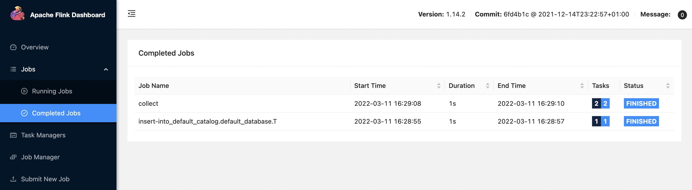
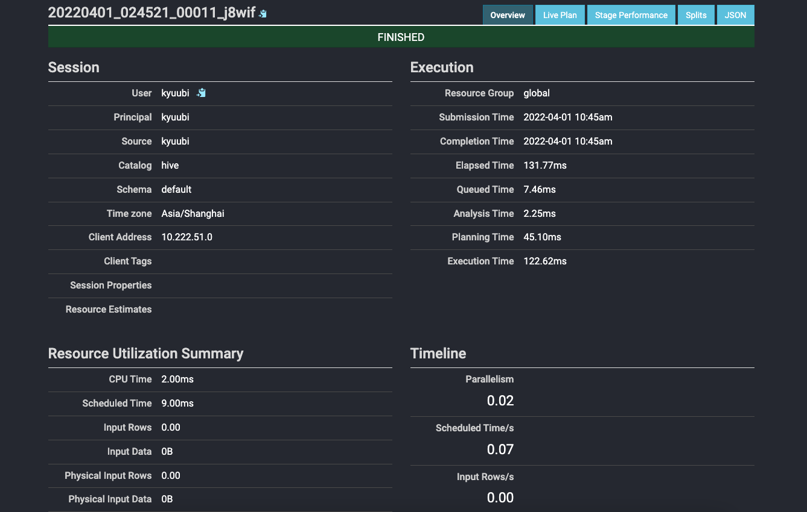

<!--
 - Licensed to the Apache Software Foundation (ASF) under one or more
 - contributor license agreements.  See the NOTICE file distributed with
 - this work for additional information regarding copyright ownership.
 - The ASF licenses this file to You under the Apache License, Version 2.0
 - (the "License"); you may not use this file except in compliance with
 - the License.  You may obtain a copy of the License at
 -
 -   http://www.apache.org/licenses/LICENSE-2.0
 -
 - Unless required by applicable law or agreed to in writing, software
 - distributed under the License is distributed on an "AS IS" BASIS,
 - WITHOUT WARRANTIES OR CONDITIONS OF ANY KIND, either express or implied.
 - See the License for the specific language governing permissions and
 - limitations under the License.
 -->


# Getting Started with Apache Kyuubi


## Getting Kyuubi

Currently, Apache Kyuubi maintains all its releases on our official [website](https://kyuubi.apache.org/releases.html).
You can get the most recent stable release of Apache Kyuubi here:

<p><a class="btn btn-neutral" href="https://kyuubi.apache.org/releases.html" data-color-scheme="no-preference: light; light: dark; dark: light;" data-icon="octicon-download" data-size="large" aria-label="Download Kyuubi"><span class="fa fa-arrow-circle-down" aria-hidden="true"></span>Download</a></p>

## Requirements

These are essential components required for Kyuubi to startup.
For quick start deployment, the only thing you need is `JAVA_HOME` being correctly set.
The Kyuubi release package you downloaded or built contains the rest prerequisites inside already.

Components| Role | Optional | Version | Remarks
--- | --- | --- | --- | ---
Java | Java<br>Runtime<br>Environment | Required | Java 8/11 | Kyuubi is pre-built with Java 8
Spark | Distributed<br>SQL<br>Engine | Optional | 3.0.0 and above | By default Kyuubi binary release is delivered without<br> a Spark tarball.
Flink | Distributed<br>SQL<br>Engine | Optional | 1.14.0 and above | By default Kyuubi binary release is delivered without<br> a Flink tarball.
Trino | Distributed<br>SQL<br>Engine | Optional | 363 and above | By default Kyuubi binary release is delivered without<br> a Trino tarball.
HDFS | Distributed<br>File<br>System |  Optional | referenced<br>by<br>Spark | Hadoop Distributed File System is a <br>part of Hadoop framework, used to<br> store and process the datasets.<br> You can interact with any<br> Spark-compatible versions of HDFS.
Hive | Metastore | Optional | referenced<br>by<br>Spark | Hive Metastore for Spark SQL to connect
Zookeeper | Service<br>Discovery | Optional | Any<br>zookeeper<br>ensemble<br>compatible<br>with<br>curator(2.12.0) | By default, Kyuubi provides a<br> embedded Zookeeper server inside for<br> non-production use.

Additionally, if you want to work with other Spark/Flink/Trino compatible systems or plugins, you only need to take care of them as using them with regular Spark/Flink/Trino applications.
For example, you can run Spark/Flink/Trino SQL engines created by the Kyuubi on any cluster manager, including YARN, Kubernetes, Mesos, e.t.c...
Or, you can manipulate data from different data sources with the Spark Datasource/Flink Table API, e.g. Delta Lake, Apache Hudi, Apache Iceberg, Apache Kudu and e.t.c...

## Installation

To install Kyuubi, you need to unpack the tarball. For example,

```bash
tar zxf apache-kyuubi-1.5.0-incubating-bin.tgz
```

This will result in the creation of a subdirectory named `apache-kyuubi-1.5.0-incubating-bin` shown below,

```bash
apache-kyuubi-1.5.0-incubating-bin
├── DISCLAIMER
├── LICENSE
├── NOTICE
├── RELEASE
├── beeline-jars
├── bin
├── conf
|   ├── kyuubi-defaults.conf.template
│   ├── kyuubi-env.sh.template
│   └── log4j2.properties.template
├── docker
│   ├── Dockerfile
│   ├── helm
│   ├── kyuubi-configmap.yaml
│   ├── kyuubi-deployment.yaml
│   ├── kyuubi-pod.yaml
│   └── kyuubi-service.yaml
├── externals
│  └── engines
├── jars
├── licenses
├── logs
├── pid
└── work
```

From top to bottom are:

- DISCLAIMER: the disclaimer made by Apache Kyuubi Community as a project still in ASF Incubator.
- LICENSE: the [APACHE LICENSE, VERSION 2.0](https://www.apache.org/licenses/LICENSE-2.0) we claim to obey.
- RELEASE: the build information of this package.
- NOTICE: the notice made by Apache Kyuubi Community about its project and dependencies.
- bin: the entry of the Kyuubi server with `kyuubi` as the startup script.
- conf: all the defaults used by Kyuubi Server itself or creating a session with Spark applications.
- externals
  - engines: contains all kinds of SQL engines that we support, e.g. Apache Spark, Apache Flink, Trino.
- licenses: a bunch of licenses included.
- jars: packages needed by the Kyuubi server.
- logs: where the logs of the Kyuubi server locates.
- pid: stores the PID file of the Kyuubi server instance.
- work: the root of the working directories of all the forked sub-processes, a.k.a. SQL engines.

## Running Kyuubi

As mentioned above, for a quick start deployment, then only you need to be sure is that the below environments are correct:
 
- Java runtime environment 
- `SPARK_HOME` for the Spark engine
- `FLINK_HOME` and `kyuubi.engine.type` in `$KYUUBI_HOME/conf/kyuubi-defaults.conf` for the Flink engine.
- `kyuubi.engine.type` `session.engine.trino.connection.url` and `session.engine.trino.connection.catalog` in `$KYUUBI_HOME/conf/kyuubi-defaults.conf` for the Trino engine

### Setup JAVA

You can either set it system-widely, e.g. in the `.bashrc` file.

```bash
java -version
java version "1.8.0_251"
Java(TM) SE Runtime Environment (build 1.8.0_251-b08)
Java HotSpot(TM) 64-Bit Server VM (build 25.251-b08, mixed mode)
```

Or, `export JAVA_HOME=/path/to/java` in the local os session.

```bash
export JAVA_HOME=/Library/Java/JavaVirtualMachines/jdk-11.0.5.jdk/Contents/Home
java -version
java version "11.0.5" 2019-10-15 LTS
Java(TM) SE Runtime Environment 18.9 (build 11.0.5+10-LTS)
Java HotSpot(TM) 64-Bit Server VM 18.9 (build 11.0.5+10-LTS, mixed mode)
```

The recommended place to set `JAVA_HOME` is `$KYUUBI_HOME/conf/kyuubi-env.sh`, as the ways above are too flaky.
The `JAVA_HOME` in `$KYUUBI_HOME/conf/kyuubi-env.sh` will take others' precedence.

### Spark Engine 

#### Setup Spark

Similar to `JAVA_HOME`, you can also set `SPARK_HOME` in different ways. However, we recommend setting it in `$KYUUBI_HOME/conf/kyuubi-env.sh` too.

For example,

```bash
SPARK_HOME=~/Downloads/spark-3.2.0-bin-hadoop3.2
```

### Flink Engine

#### Setup Flink

Similar to `JAVA_HOME`, you can also set `FLINK_HOME` in different ways. However, we recommend setting it in `$KYUUBI_HOME/conf/kyuubi-env.sh` too.

For example,

```bash
FLINK_HOME=/Downloads/flink-1.15.1
```

#### Setup Kyuubi Flink Configration

To enable the Flink SQL engine, the `kyuubi.engine.type` in `$KYUUBI_HOME/conf/kyuubi-defaults.conf` need to be set as `FLINK_SQL`.

```bash
kyuubi.engine.type FLINK_SQL
```

### Trino Engine

#### Setup Trino
Different from Spark/Flink, you must have a Trino cluster first. Trino client stored in `$KYUUBI_HOME/externals/engines/trino`.

#### Setup Kyuubi Trino Configration

To enable the Trino engine, the `kyuubi.engine.type` need to be set as `TRINO`. And `kyuubi.session.engine.trino.connection.url` and `kyuubi.session.engine.trino.connection.catalog` are also necessary. You can set all those configs in `$KYUUBI_HOME/conf/kyuubi-defaults.conf`, or set them in your connection parameters.

```bash
kyuubi.engine.type TRINO
kyuubi.session.engine.trino.connection.url http://localhost:8080    # Your trino cluster server url
kyuubi.session.engine.trino.connection.catalog hive   # The default catalog connect to.
```

### Starting Kyuubi

```bash
bin/kyuubi start
```

It will print all essential environment variables on the screen during the server starts, and you may check whether they are expected.

```log
Starting Kyuubi Server from /Users/kentyao/svn-kyuubi/v1.3.1-incubating-rc0/apache-kyuubi-1.3.1-incubating-bin
Warn: Not find kyuubi environment file /Users/kentyao/svn-kyuubi/v1.3.1-incubating-rc0/apache-kyuubi-1.3.1-incubating-bin/conf/kyuubi-env.sh, using default ones...
JAVA_HOME: /Library/Java/JavaVirtualMachines/jdk1.8.0_251.jdk/Contents/Home
KYUUBI_HOME: /Users/kentyao/svn-kyuubi/v1.3.1-incubating-rc0/apache-kyuubi-1.3.1-incubating-bin
KYUUBI_CONF_DIR: /Users/kentyao/svn-kyuubi/v1.3.1-incubating-rc0/apache-kyuubi-1.3.1-incubating-bin/conf
KYUUBI_LOG_DIR: /Users/kentyao/svn-kyuubi/v1.3.1-incubating-rc0/apache-kyuubi-1.3.1-incubating-bin/logs
KYUUBI_PID_DIR: /Users/kentyao/svn-kyuubi/v1.3.1-incubating-rc0/apache-kyuubi-1.3.1-incubating-bin/pid
KYUUBI_WORK_DIR_ROOT: /Users/kentyao/svn-kyuubi/v1.3.1-incubating-rc0/apache-kyuubi-1.3.1-incubating-bin/work
SPARK_HOME: /Users/kentyao/Downloads/spark/spark-3.2.0-bin-hadoop3.2
SPARK_CONF_DIR: /Users/kentyao/Downloads/spark/spark-3.2.0-bin-hadoop3.2/conf
HADOOP_CONF_DIR:
YARN_CONF_DIR:
Starting org.apache.kyuubi.server.KyuubiServer, logging to /Users/kentyao/svn-kyuubi/v1.3.1-incubating-rc0/apache-kyuubi-1.3.1-incubating-bin/logs/kyuubi-kentyao-org.apache.kyuubi.server.KyuubiServer-hulk.local.out
Welcome to
  __  __                           __
 /\ \/\ \                         /\ \      __
 \ \ \/'/'  __  __  __  __  __  __\ \ \____/\_\
  \ \ , <  /\ \/\ \/\ \/\ \/\ \/\ \\ \ '__`\/\ \
   \ \ \\`\\ \ \_\ \ \ \_\ \ \ \_\ \\ \ \L\ \ \ \
    \ \_\ \_\/`____ \ \____/\ \____/ \ \_,__/\ \_\
     \/_/\/_/`/___/> \/___/  \/___/   \/___/  \/_/
                /\___/
                \/__/
```

If all goes well, this will result in the creation of the Kyuubi server instance with a `PID` stored in `$KYUUBI_HOME/pid/kyuubi-<username>-org.apache.kyuubi.server.KyuubiServer.pid`

Then, you can get the JDBC connection URL at the end of the log file, e.g.

```
ThriftFrontendService: Starting and exposing JDBC connection at: jdbc:hive2://localhost:10009/
```

If something goes wrong, you shall be able to find some clues in the log file too.

Alternatively, it can run in the foreground, with the logs and other output written to stdout/stderr.
Both streams should be captured if using a supervision system like `supervisord`.

```bash
bin/kyuubi run
```

## Using Hive Beeline

Kyuubi server is compatible with Apache Hive beeline, so you can use `$KYUUBI_HOME/bin/beeline` for testing.

### Opening a Connection

The command below will tell the Kyuubi server to create a session with itself.

```logtalk
bin/beeline -u 'jdbc:hive2://localhost:10009/'
Connecting to jdbc:hive2://localhost:10009/
Connected to: Spark SQL (version 1.0.2)
Driver: Hive JDBC (version 2.3.7)
Transaction isolation: TRANSACTION_REPEATABLE_READ
Beeline version 2.3.7 by Apache Hive
0: jdbc:hive2://localhost:10009/>
```

In this case, the session will create for the user named 'anonymous'.

Kyuubi will create a Spark/Flink/Trino SQL engine application using `kyuubi-<engine>-sql-engine_2.12-<version>.jar`.
It will cost awhile for the application to be ready before fully establishing the session.
Otherwise, an existing application will be reused, and the time cost here is negligible.

Similarly, you can create a session for another user(or principal, subject, and maybe something else you defined), e.g. named `kentyao`,

```bash
bin/beeline -u 'jdbc:hive2://localhost:10009/' -n kentyao
```

The formerly created Spark application for user 'anonymous' will not be reused in this case, while a brand new application will be submitted for user 'kentyao' instead.

Then, you can see two processes running in your local environment, including one `KyuubiServer` instance, one `SparkSubmit` `FlinkSQLEngine` or `TrinoSqlEngine` instances as the SQL engines.

- Spark

```
75730 Jps
70843 KyuubiServer
72566 SparkSubmit
```

- Flink

```
43484 Jps
43194 KyuubiServer
43260 FlinkSQLEngine
```

- Trino

```
63483 Jps
63693 KyuubiServer
63266 TrinoSqlEngine
```

### Execute Statements

#### Execute Spark SQL Statements

If the beeline session is successfully connected, then you can run any query supported by Spark SQL now. For example,

```logtalk
0: jdbc:hive2://10.242.189.214:2181/> select timestamp '2018-11-17';
2021-10-28 13:56:27.509 INFO operation.ExecuteStatement: Processing kent's query[1f619182-20ad-4733-995b-a5e43b80d998]: INITIALIZED_STATE -> PENDING_STATE, statement: select timestamp '2018-11-17'
2021-10-28 13:56:27.547 INFO operation.ExecuteStatement: Processing kent's query[1f619182-20ad-4733-995b-a5e43b80d998]: PENDING_STATE -> RUNNING_STATE, statement: select timestamp '2018-11-17'
2021-10-28 13:56:27.540 INFO operation.ExecuteStatement: Processing kent's query[a46ca504-fe3a-4dfb-be1e-19770af8ac4c]: INITIALIZED_STATE -> PENDING_STATE, statement: select timestamp '2018-11-17'
2021-10-28 13:56:27.541 INFO operation.ExecuteStatement: Processing kent's query[a46ca504-fe3a-4dfb-be1e-19770af8ac4c]: PENDING_STATE -> RUNNING_STATE, statement: select timestamp '2018-11-17'
2021-10-28 13:56:27.543 INFO operation.ExecuteStatement:
           Spark application name: kyuubi_USER_kent_7ad055d0-3eca-4b78-87e8-94b22f3bade9
                 application ID: local-1635400506190
                 application web UI: http://10.242.189.214:56774
                 master: local[*]
                 deploy mode: client
                 version: 3.2.0
           Start time: 2021-10-28T13:55:05.528
           User: kent
2021-10-28 13:56:27.604 INFO operation.ExecuteStatement: Processing kent's query[a46ca504-fe3a-4dfb-be1e-19770af8ac4c]: RUNNING_STATE -> RUNNING_STATE, statement: select timestamp '2018-11-17'
2021-10-28 13:56:27.627 INFO codegen.CodeGenerator: Code generated in 6.696179 ms
2021-10-28 13:56:27.635 INFO spark.SparkContext: Starting job: collect at ExecuteStatement.scala:97
2021-10-28 13:56:27.639 INFO kyuubi.SQLOperationListener: Query [a46ca504-fe3a-4dfb-be1e-19770af8ac4c]: Job 3 started with 1 stages, 1 active jobs running
2021-10-28 13:56:27.639 INFO kyuubi.SQLOperationListener: Query [a46ca504-fe3a-4dfb-be1e-19770af8ac4c]: Stage 3 started with 1 tasks, 1 active stages running
2021-10-28 13:56:27.651 INFO scheduler.DAGScheduler: Job 3 finished: collect at ExecuteStatement.scala:97, took 0.016234 s
2021-10-28 13:56:27.653 INFO kyuubi.SQLOperationListener: Finished stage: Stage(3, 0); Name: 'collect at ExecuteStatement.scala:97'; Status: succeeded; numTasks: 1; Took: 13 msec
2021-10-28 13:56:27.663 INFO scheduler.StatsReportListener: task runtime:(count: 1, mean: 8.000000, stdev: 0.000000, max: 8.000000, min: 8.000000)
2021-10-28 13:56:27.664 INFO scheduler.StatsReportListener: 	0%	5%	10%	25%	50%	75%	90%	95%	100%
2021-10-28 13:56:27.664 INFO scheduler.StatsReportListener: 	8.0 ms	8.0 ms	8.0 ms	8.0 ms	8.0 ms	8.0 ms	8.0 ms	8.0 ms	8.0 ms
2021-10-28 13:56:27.665 INFO scheduler.StatsReportListener: shuffle bytes written:(count: 1, mean: 0.000000, stdev: 0.000000, max: 0.000000, min: 0.000000)
2021-10-28 13:56:27.665 INFO scheduler.StatsReportListener: 	0%	5%	10%	25%	50%	75%	90%	95%	100%
2021-10-28 13:56:27.665 INFO scheduler.StatsReportListener: 	0.0 B	0.0 B	0.0 B	0.0 B	0.0 B	0.0 B	0.0 B	0.0 B	0.0 B
2021-10-28 13:56:27.666 INFO scheduler.StatsReportListener: fetch wait time:(count: 1, mean: 0.000000, stdev: 0.000000, max: 0.000000, min: 0.000000)
2021-10-28 13:56:27.666 INFO scheduler.StatsReportListener: 	0%	5%	10%	25%	50%	75%	90%	95%	100%
2021-10-28 13:56:27.666 INFO scheduler.StatsReportListener: 	0.0 ms	0.0 ms	0.0 ms	0.0 ms	0.0 ms	0.0 ms	0.0 ms	0.0 ms	0.0 ms
2021-10-28 13:56:27.667 INFO scheduler.StatsReportListener: remote bytes read:(count: 1, mean: 0.000000, stdev: 0.000000, max: 0.000000, min: 0.000000)
2021-10-28 13:56:27.667 INFO scheduler.StatsReportListener: 	0%	5%	10%	25%	50%	75%	90%	95%	100%
2021-10-28 13:56:27.667 INFO scheduler.StatsReportListener: 	0.0 B	0.0 B	0.0 B	0.0 B	0.0 B	0.0 B	0.0 B	0.0 B	0.0 B
2021-10-28 13:56:27.668 INFO scheduler.StatsReportListener: task result size:(count: 1, mean: 1402.000000, stdev: 0.000000, max: 1402.000000, min: 1402.000000)
2021-10-28 13:56:27.668 INFO scheduler.StatsReportListener: 	0%	5%	10%	25%	50%	75%	90%	95%	100%
2021-10-28 13:56:27.669 INFO scheduler.StatsReportListener: 	1402.0 B	1402.0 B	1402.0 B	1402.0 B	1402.0 B	1402.0 B	1402.0 B	1402.0 B	1402.0 B
2021-10-28 13:56:27.669 INFO codegen.CodeGenerator: Code generated in 8.815996 ms
2021-10-28 13:56:27.672 INFO scheduler.StatsReportListener: executor (non-fetch) time pct: (count: 1, mean: 12.500000, stdev: 0.000000, max: 12.500000, min: 12.500000)
2021-10-28 13:56:27.672 INFO scheduler.StatsReportListener: 	0%	5%	10%	25%	50%	75%	90%	95%	100%
2021-10-28 13:56:27.672 INFO scheduler.StatsReportListener: 	13 %	13 %	13 %	13 %	13 %	13 %	13 %	13 %	13 %
2021-10-28 13:56:27.673 INFO scheduler.StatsReportListener: fetch wait time pct: (count: 1, mean: 0.000000, stdev: 0.000000, max: 0.000000, min: 0.000000)
2021-10-28 13:56:27.673 INFO scheduler.StatsReportListener: 	0%	5%	10%	25%	50%	75%	90%	95%	100%
2021-10-28 13:56:27.673 INFO scheduler.StatsReportListener: 	 0 %	 0 %	 0 %	 0 %	 0 %	 0 %	 0 %	 0 %	 0 %
2021-10-28 13:56:27.674 INFO scheduler.StatsReportListener: other time pct: (count: 1, mean: 87.500000, stdev: 0.000000, max: 87.500000, min: 87.500000)
2021-10-28 13:56:27.674 INFO scheduler.StatsReportListener: 	0%	5%	10%	25%	50%	75%	90%	95%	100%
2021-10-28 13:56:27.674 INFO scheduler.StatsReportListener: 	88 %	88 %	88 %	88 %	88 %	88 %	88 %	88 %	88 %
2021-10-28 13:56:27.674 INFO kyuubi.SQLOperationListener: Query [a46ca504-fe3a-4dfb-be1e-19770af8ac4c]: Job 3 succeeded, 0 active jobs running
2021-10-28 13:56:27.744 INFO operation.ExecuteStatement: Processing kent's query[a46ca504-fe3a-4dfb-be1e-19770af8ac4c]: RUNNING_STATE -> FINISHED_STATE, statement: select timestamp '2018-11-17', time taken: 0.202 seconds
2021-10-28 13:56:27.784 INFO operation.ExecuteStatement: Query[1f619182-20ad-4733-995b-a5e43b80d998] in FINISHED_STATE
2021-10-28 13:56:27.784 INFO operation.ExecuteStatement: Processing kent's query[1f619182-20ad-4733-995b-a5e43b80d998]: RUNNING_STATE -> FINISHED_STATE, statement: select timestamp '2018-11-17', time taken: 0.237 seconds
+----------------------------------+
| TIMESTAMP '2018-11-17 00:00:00'  |
+----------------------------------+
| 2018-11-17 00:00:00.0            |
+----------------------------------+
1 row selected (0.404 seconds)
```

As shown in the above case, you can retrieve all the operation logs, the result schema, and the result to your client-side in the beeline console.

Additionally, some useful information about the background Spark SQL application associated with this connection is also printed in the operation log.
For example, you can get the Spark web UI from the log for debugging or tuning.


#### Execute Flink SQL Statements

If the beeline session is successfully connected, then you can run any query supported by Flink SQL now. For example,

```logtalk
0: jdbc:hive2://127.0.0.1:10009/default> CREATE TABLE T (
. . . . . . . . . . . . . . . . . . . . . . >     a INT,
. . . . . . . . . . . . . . . . . . . . . . >     b VARCHAR(10)
. . . . . . . . . . . . . . . . . . . . . . > ) WITH (
. . . . . . . . . . . . . . . . . . . . . . >     'connector.type' = 'filesystem',
. . . . . . . . . . . . . . . . . . . . . . >     'connector.path' = 'file:///tmp/T.csv',
. . . . . . . . . . . . . . . . . . . . . . >     'format.type' = 'csv',
. . . . . . . . . . . . . . . . . . . . . . >     'format.derive-schema' = 'true'
. . . . . . . . . . . . . . . . . . . . . . > );
16:28:47.164 INFO org.apache.kyuubi.operation.ExecuteStatement: Processing anonymous's query[22a73e39-d9d7-479b-a118-33f9d2a5ad3f]: INITIALIZED_STATE -> PENDING_STATE, statement: CREATE TABLE T(
a INT,
b VARCHAR(10)
) WITH (
'connector.type' = 'filesystem',
'connector.path' = 'file:///tmp/T.csv',
'format.type' = 'csv',
'format.derive-schema' = 'true'
)
16:28:47.187 INFO org.apache.kyuubi.operation.ExecuteStatement: Processing anonymous's query[22a73e39-d9d7-479b-a118-33f9d2a5ad3f]: PENDING_STATE -> RUNNING_STATE, statement: CREATE TABLE T(
a INT,
b VARCHAR(10)
) WITH (
'connector.type' = 'filesystem',
'connector.path' = 'file:///tmp/T.csv',
'format.type' = 'csv',
'format.derive-schema' = 'true'
)
16:28:47.320 INFO org.apache.kyuubi.operation.ExecuteStatement: Query[22a73e39-d9d7-479b-a118-33f9d2a5ad3f] in FINISHED_STATE
16:28:47.322 INFO org.apache.kyuubi.operation.ExecuteStatement: Processing anonymous's query[22a73e39-d9d7-479b-a118-33f9d2a5ad3f]: RUNNING_STATE -> FINISHED_STATE, statement: CREATE TABLE T(
a INT,
b VARCHAR(10)
) WITH (
'connector.type' = 'filesystem',
'connector.path' = 'file:///tmp/T.csv',
'format.type' = 'csv',
'format.derive-schema' = 'true'
), time taken: 0.134 seconds
+---------+
| result  |
+---------+
| OK      |
+---------+
1 row selected (0.341 seconds)
0: jdbc:hive2://127.0.0.1:10009/default> INSERT INTO T VALUES (1, 'Hi'), (2, 'Hello');
16:28:52.780 INFO org.apache.kyuubi.operation.ExecuteStatement: Processing anonymous's query[d79abf78-d2ae-468f-87b2-19db1fc6e19a]: INITIALIZED_STATE -> PENDING_STATE, statement: INSERT INTO T VALUES (1, 'Hi'), (2, 'Hello')
16:28:52.786 INFO org.apache.kyuubi.operation.ExecuteStatement: Processing anonymous's query[d79abf78-d2ae-468f-87b2-19db1fc6e19a]: PENDING_STATE -> RUNNING_STATE, statement: INSERT INTO T VALUES (1, 'Hi'), (2, 'Hello')
16:28:57.827 INFO org.apache.kyuubi.operation.ExecuteStatement: Query[d79abf78-d2ae-468f-87b2-19db1fc6e19a] in RUNNING_STATE
16:28:59.836 INFO org.apache.kyuubi.operation.ExecuteStatement: Query[d79abf78-d2ae-468f-87b2-19db1fc6e19a] in FINISHED_STATE
16:28:59.837 INFO org.apache.kyuubi.operation.ExecuteStatement: Processing anonymous's query[d79abf78-d2ae-468f-87b2-19db1fc6e19a]: RUNNING_STATE -> FINISHED_STATE, statement: INSERT INTO T VALUES (1, 'Hi'), (2, 'Hello'), time taken: 7.05 seconds
+-------------------------------------+
| default_catalog.default_database.T  |
+-------------------------------------+
| -1                                  |
+-------------------------------------+
1 row selected (7.104 seconds)
0: jdbc:hive2://127.0.0.1:10009/default>
0: jdbc:hive2://127.0.0.1:10009/default> SELECT * FROM T;
16:29:08.092 INFO org.apache.kyuubi.operation.ExecuteStatement: Processing anonymous's query[af5660c0-fcc4-4f80-b3fd-c4a799faf33f]: INITIALIZED_STATE -> PENDING_STATE, statement: SELECT * FROM T
16:29:08.101 INFO org.apache.kyuubi.operation.ExecuteStatement: Processing anonymous's query[af5660c0-fcc4-4f80-b3fd-c4a799faf33f]: PENDING_STATE -> RUNNING_STATE, statement: SELECT * FROM T
16:29:12.519 INFO org.apache.kyuubi.operation.ExecuteStatement: Query[af5660c0-fcc4-4f80-b3fd-c4a799faf33f] in FINISHED_STATE
16:29:12.520 INFO org.apache.kyuubi.operation.ExecuteStatement: Processing anonymous's query[af5660c0-fcc4-4f80-b3fd-c4a799faf33f]: RUNNING_STATE -> FINISHED_STATE, statement: SELECT * FROM T, time taken: 4.419 seconds
+----+--------+
| a  |   b    |
+----+--------+
| 1  | Hi     |
| 2  | Hello  |
+----+--------+
2 rows selected (4.466 seconds)
```

As shown in the above case, you can retrieve all the operation logs, the result schema, and the result to your client-side in the beeline console.

Additionally, some useful information about the background Flink SQL application associated with this connection is also printed in the operation log.
For example, you can get the Flink web UI from the log for debugging or tuning.



#### Execute Trino Statements

If the beeline session is successfully connected, then you can run any query supported by Trino now. For example,

```logtalk
0: jdbc:hive2://127.0.0.1:10009/default> select timestamp '2018-11-17';
10:33:37.663 INFO org.apache.kyuubi.operation.ExecuteStatement: Processing yizhifeidie123's query[d059bc77-f2b6-4f95-b72b-859dbc07aacb]: INITIALIZED_STATE -> PENDING_STATE, statement: select timestamp '2018-11-17'
10:33:37.694 INFO org.apache.kyuubi.operation.ExecuteStatement: Processing yizhifeidie123's query[d059bc77-f2b6-4f95-b72b-859dbc07aacb]: PENDING_STATE -> RUNNING_STATE, statement: select timestamp '2018-11-17'
10:33:37.669 INFO org.apache.kyuubi.engine.trino.operation.ExecuteStatement: Processing yizhifeidie123's query[6353e64f-94ba-4770-989b-7186d267d8be]: INITIALIZED_STATE -> PENDING_STATE, statement: select timestamp '2018-11-17'10:33:37.693 INFO org.apache.kyuubi.engine.trino.operation.ExecuteStatement: Processing yizhifeidie123's query[6353e64f-94ba-4770-989b-7186d267d8be]: PENDING_STATE -> RUNNING_STATE, statement: select timestamp '2018-11-17'10:33:37.997 INFO org.apache.kyuubi.engine.trino.operation.ExecuteStatement: Execute in full collect mode10:33:37.999 INFO org.apache.kyuubi.engine.trino.operation.ExecuteStatement: Processing yizhifeidie123's query[6353e64f-94ba-4770-989b-7186d267d8be]: RUNNING_STATE -> FINISHED_STATE, statement: select timestamp '2018-11-17', time taken: 0.305 seconds
10:33:38.003 INFO org.apache.kyuubi.operation.ExecuteStatement: Query[d059bc77-f2b6-4f95-b72b-859dbc07aacb] in FINISHED_STATE
10:33:38.004 INFO org.apache.kyuubi.operation.ExecuteStatement: Processing yizhifeidie123's query[d059bc77-f2b6-4f95-b72b-859dbc07aacb]: RUNNING_STATE -> FINISHED_STATE, statement: select timestamp '2018-11-17', time taken: 0.31 seconds
+------------------------+
|         _col0          |
+------------------------+
| 2018-11-17 00:00:00.0  |
+------------------------+
1 row selected (0.422 seconds)
0: jdbc:hive2://localhost:10009/default> select * from tpch.tiny.customer limit 6;
11:10:07.869 INFO org.apache.kyuubi.operation.ExecuteStatement: Processing kyuubi's query[8b96ccd1-d1e2-4068-b250-c5a66950e629]: INITIALIZED_STATE -> PENDING_STATE, statement: select * from tpch.tiny.customer limit 6
11:10:07.878 INFO org.apache.kyuubi.operation.ExecuteStatement: Processing kyuubi's query[8b96ccd1-d1e2-4068-b250-c5a66950e629]: PENDING_STATE -> RUNNING_STATE, statement: select * from tpch.tiny.customer limit 6
11:10:07.871 INFO org.apache.kyuubi.engine.trino.operation.ExecuteStatement: Processing kyuubi's query[d66faea0-fac8-4d3c-a38a-c84fba57d8a7]: INITIALIZED_STATE -> PENDING_STATE, statement: select * from tpch.tiny.customer limit 611:10:07.877 INFO org.apache.kyuubi.engine.trino.operation.ExecuteStatement: Processing kyuubi's query[d66faea0-fac8-4d3c-a38a-c84fba57d8a7]: PENDING_STATE -> RUNNING_STATE, statement: select * from tpch.tiny.customer limit 611:10:08.063 INFO org.apache.kyuubi.engine.trino.operation.ExecuteStatement: Execute in full collect mode11:10:08.064 INFO org.apache.kyuubi.engine.trino.operation.ExecuteStatement: Processing kyuubi's query[d66faea0-fac8-4d3c-a38a-c84fba57d8a7]: RUNNING_STATE -> FINISHED_STATE, statement: select * from tpch.tiny.customer limit 6, time taken: 0.186 seconds
11:10:08.066 INFO org.apache.kyuubi.operation.ExecuteStatement: Query[8b96ccd1-d1e2-4068-b250-c5a66950e629] in FINISHED_STATE
11:10:08.066 INFO org.apache.kyuubi.operation.ExecuteStatement: Processing kyuubi's query[8b96ccd1-d1e2-4068-b250-c5a66950e629]: RUNNING_STATE -> FINISHED_STATE, statement: select * from tpch.tiny.customer limit 6, time taken: 0.188 seconds
+----------+---------------------+----------------------------------+------------+------------------+----------+-------------+----------------------------------------------------+
| custkey  |        name         |             address              | nationkey  |      phone       | acctbal  | mktsegment  |                      comment                       |
+----------+---------------------+----------------------------------+------------+------------------+----------+-------------+----------------------------------------------------+
| 749      | Customer#000000749  | U1Dvu0r793a                      | 24         | 34-158-697-9591  | 7491.42  | MACHINERY   | accounts was. final, final requests wake. theodolites was slyly. blithely even foxes wake carefully ac |
| 750      | Customer#000000750  | 5OyNRajjgjjbaXtI rkxvB2lX4c6u    | 8          | 18-235-587-1274  | 269.9    | BUILDING    | s. regular, regular deposits sleep carefully blithely bol |
| 751      | Customer#000000751  | e OSrreG6sx7l1t3wAg8u11DWk D 9   | 0          | 10-658-550-2257  | 2130.98  | FURNITURE   | ges sleep furiously bold deposits. furiously regular requests cajole slyly. unusual accounts nag unusual ide |
| 752      | Customer#000000752  | KtdEacPUecPdPLt99kwZrnH9oIxUxpw  | 8          | 18-924-993-6038  | 8363.66  | MACHINERY   | mong the ironic, final waters. regular deposits above the fluffily ironic instructions |
| 753      | Customer#000000753  | 9k2PLlDRbMq4oSvW5Hh7Ak5iRDH      | 17         | 27-817-126-3646  | 8114.44  | HOUSEHOLD   | cies. deposits snooze. final, regular excuses wake furiously about the furiously final foxes. dependencies  |
| 754      | Customer#000000754  | 8r5wwhhlL9MkAxOhRK               | 0          | 10-646-595-5871  | -566.86  | BUILDING    | er regular accounts against the furiously unusual somas sleep carefull |
+----------+---------------------+----------------------------------+------------+------------------+----------+-------------+----------------------------------------------------+
6 rows selected (0.21 seconds)
```

As shown in the above case, you can retrieve all the operation logs, the result schema, and the result to your client-side in the beeline console.

Additionally, some useful information about the background Trino application associated with this connection is also printed in the operation log.
Add, you get the Trino web UI for debugging or tuning.



### Closing a Connection

Close the session between beeline and Kyuubi server by executing `!quit`, for example,

```bash
0: jdbc:hive2://localhost:10009/> !quit
Closing: 0: jdbc:hive2://localhost:10009/
```

## Stopping Kyuubi

Stop Kyuubi by running the following in the `$KYUUBI_HOME` directory:

```bash
bin/kyuubi stop
```

And then, you will see the KyuubiServer waving goodbye to you.

```logtalk
Stopping org.apache.kyuubi.server.KyuubiServer
  __  __                           __
 /\ \/\ \                         /\ \      __
 \ \ \/'/'  __  __  __  __  __  __\ \ \____/\_\
  \ \ , <  /\ \/\ \/\ \/\ \/\ \/\ \\ \ '__`\/\ \
   \ \ \\`\\ \ \_\ \ \ \_\ \ \ \_\ \\ \ \L\ \ \ \
    \ \_\ \_\/`____ \ \____/\ \____/ \ \_,__/\ \_\
     \/_/\/_/`/___/> \/___/  \/___/   \/___/  \/_/
                /\___/
                \/__/
Bye!
```

The `KyuubiServer` instance will be stopped immediately while the SQL engine's application will still be alive for a while.

If you start Kyuubi again before the SQL engine application terminates itself, it will reconnect to the newly created `KyuubiServer` instance.