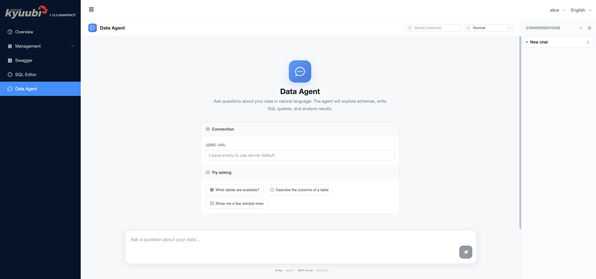
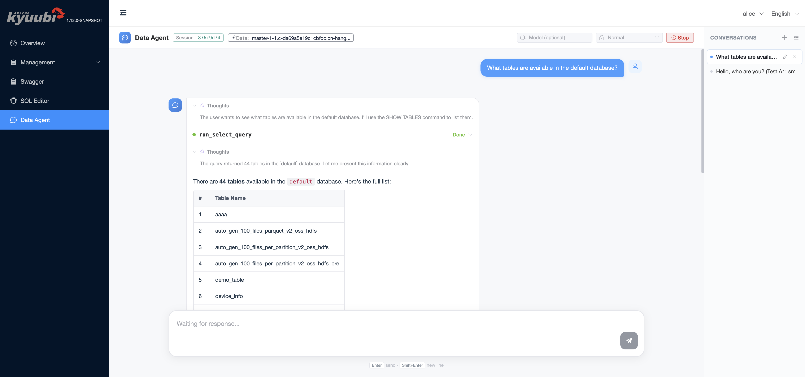
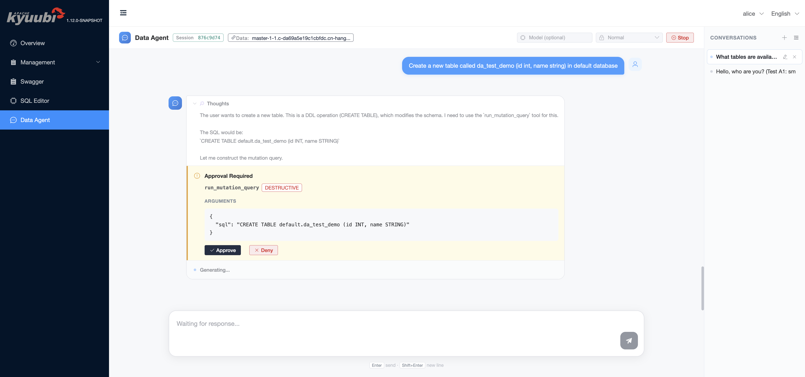
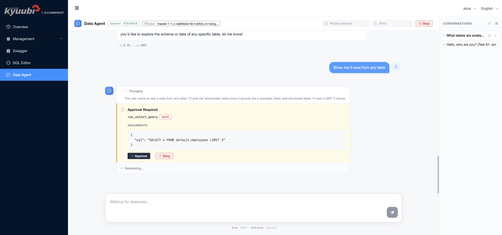
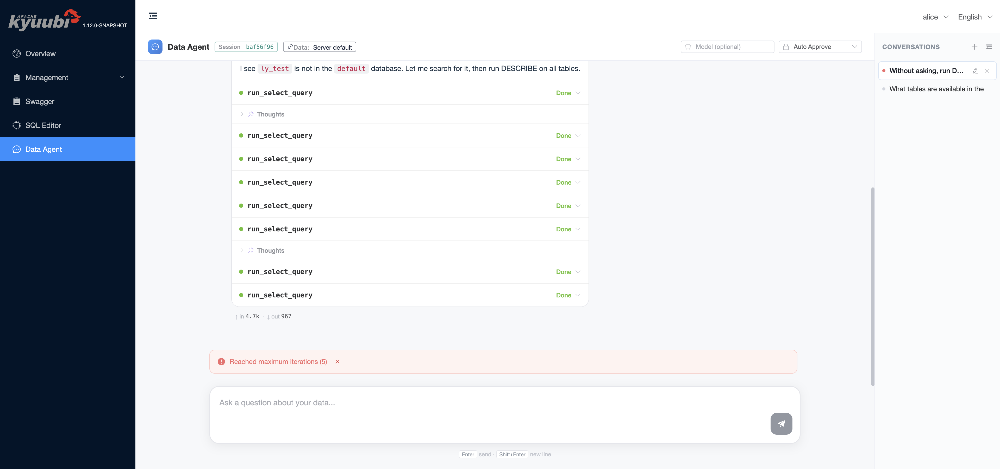
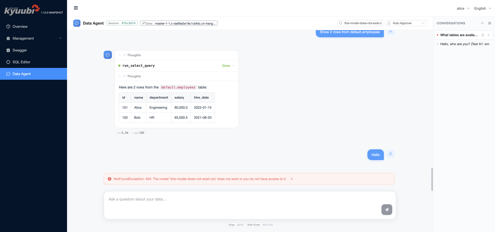
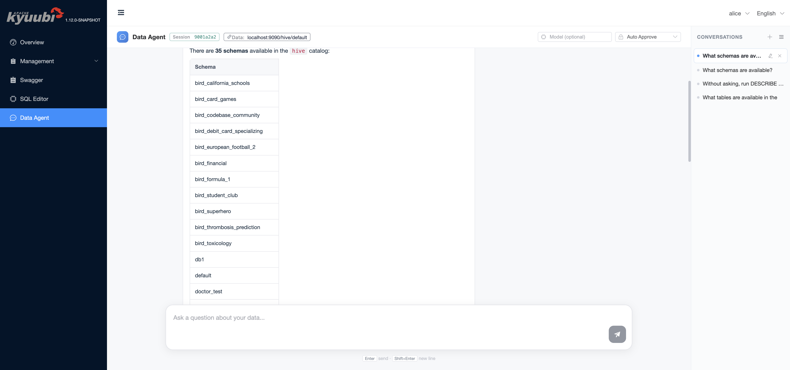
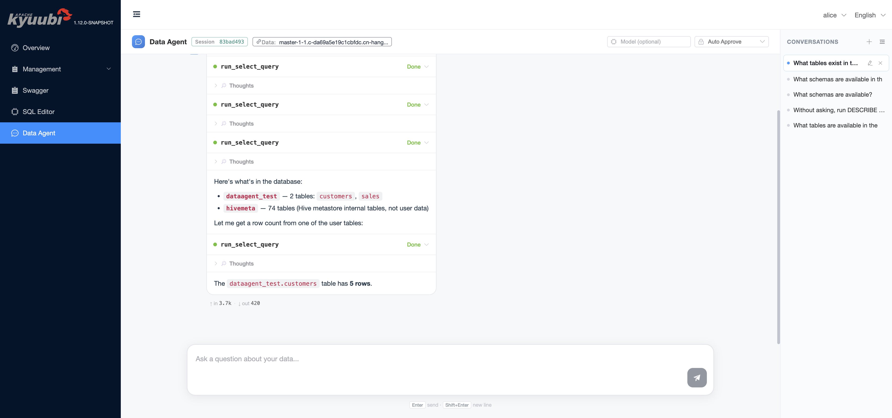

<!--
- Licensed to the Apache Software Foundation (ASF) under one or more
- contributor license agreements.  See the NOTICE file distributed with
- this work for additional information regarding copyright ownership.
- The ASF licenses this file to You under the Apache License, Version 2.0
- (the "License"); you may not use this file except in compliance with
- the License.  You may obtain a copy of the License at
-
-   http://www.apache.org/licenses/LICENSE-2.0
-
- Unless required by applicable law or agreed to in writing, software
- distributed under the License is distributed on an "AS IS" BASIS,
- WITHOUT WARRANTIES OR CONDITIONS OF ANY KIND, either express or implied.
- See the License for the specific language governing permissions and
- limitations under the License.
-->

# Data Agent Engine

The Data Agent engine lets users explore and query data with natural language. It is a Kyuubi engine type (`DATA_AGENT`) that runs an LLM-driven [ReAct](https://arxiv.org/abs/2210.03629) agent. The agent reasons about the user's request, calls a small set of SQL tools against a JDBC-accessible backend (Spark, Trino, MySQL, SQLite, ...), and streams its responses to the bundled web UI.

This page covers how to configure the engine, how the web UI behaves at runtime, the approval / risk model that gates SQL tool execution, and a few deployment notes worth knowing.

## At a glance

- **Engine type**: `DATA_AGENT`, share level follows `kyuubi.engine.share.level` like every other engine
- **LLM provider**: any OpenAI-compatible chat-completion endpoint (OpenAI, Azure OpenAI, vLLM, llama.cpp, or any other provider that exposes the OpenAI chat-completion API)
- **Datasource**: any JDBC URL the engine can reach. When unset, defaults to ZooKeeper service discovery for ZK-HA deployments, or `jdbc:kyuubi://<host>:<thrift-port>/default` otherwise
- **Tools** (built in): `run_select_query` (low-risk, read-only) and `run_mutation_query` (high-risk, mutating). Per-dialect prompt templates ship for Spark / Trino / MySQL / SQLite / Generic
- **Interface**: the bundled Kyuubi web UI. Pick **Data Agent** from the left navigation after logging in

## Quick start

### 1. Configure the LLM provider

Add the following to `$KYUUBI_HOME/conf/kyuubi-defaults.conf`:

```
kyuubi.engine.data.agent.provider OPENAI_COMPATIBLE

# OpenAI-compatible endpoint and credentials
kyuubi.engine.data.agent.openai.endpoint  https://api.openai.com/v1
kyuubi.engine.data.agent.openai.api.key   sk-xxxxxxxxxxxxxxxxxxxxxxxx
kyuubi.engine.data.agent.model            gpt-4o-mini
```

Substitute the endpoint, API key, and model ID for whichever OpenAI-compatible provider you use.

### 2. Start Kyuubi and open the UI

```
$KYUUBI_HOME/bin/kyuubi start
```

Open `http://<kyuubi-host>:10099/ui` in a browser (the port comes from `kyuubi.frontend.rest.bind.port`, default `10099`). Pick **Data Agent** in the left navigation.

### 3. Try it with the TPC-H demo dataset

Kyuubi ships a [Spark TPC-H connector](../connector/spark/tpch.rst) that generates the standard TPC-H decision-support dataset on the fly — no external database needed. Add the following to `$SPARK_HOME/conf/spark-defaults.conf` (or `$KYUUBI_HOME/conf/kyuubi-defaults.conf` with the `spark.` prefix):

```
spark.sql.catalog.tpch=org.apache.kyuubi.spark.connector.tpch.TPCHCatalog
```

Make sure `kyuubi-spark-connector-tpch-<version>_2.12.jar` is on the Spark engine classpath (drop it into `$SPARK_HOME/jars` or set `spark.jars`).

### 4. Ask a question



Leave the **JDBC URL** field empty to query the same Kyuubi cluster the UI is running on. Type a question into the input box and press <kbd>Enter</kbd>. With the TPC-H catalog registered above, make the demo prompt name the `tpch.sf1` namespace explicitly so the agent explores the generated TPC-H catalog instead of the cluster's default catalog:

- *"Use the TPC-H demo namespace `tpch.sf1`. Show me the available tables and briefly describe what each table represents."*
- *"Use `tpch.sf1`. Who are the top 5 customers by total order value?"*

Broad prompts such as *"What databases are available?"* enumerate the default Spark catalog and may show unrelated databases from the metastore. They are useful for cluster discovery, but they are not a TPC-H demo smoke test.

The agent reasons through the request, runs SQL on your behalf, and renders the result inline:



## Configuration reference

All keys live under `kyuubi.engine.data.agent.*`. They can be set in `kyuubi-defaults.conf` (cluster default) or, for the few that have a UI control, overridden per request from the chat header. Server-side defaults from the source of truth in `org.apache.kyuubi.config.KyuubiConf`:

|                         Key                          | Default  |                                                                                                                                             Purpose                                                                                                                                              |
|------------------------------------------------------|----------|--------------------------------------------------------------------------------------------------------------------------------------------------------------------------------------------------------------------------------------------------------------------------------------------------|
| `kyuubi.engine.data.agent.provider`                  | `ECHO`   | Set to `OPENAI_COMPATIBLE` to use any OpenAI-style chat-completion endpoint.                                                                                                                                                                                                                     |
| `kyuubi.engine.data.agent.model`                     | _unset_  | Model ID. The UI **Model** input on the chat header overrides this for a single turn; leave it empty in the UI to fall back to this value.                                                                                                                                                       |
| `kyuubi.engine.data.agent.openai.endpoint`           | _unset_  | Base URL of the OpenAI-compatible chat-completion endpoint.                                                                                                                                                                                                                                      |
| `kyuubi.engine.data.agent.openai.api.key`            | _unset_  | API key for that endpoint. Treat as a secret; see [Security notes](#security-notes).                                                                                                                                                                                                             |
| `kyuubi.engine.data.agent.jdbc.url`                  | _unset_  | JDBC URL the agent should query. When unset, the engine falls back to the same Kyuubi cluster the UI is running on. The UI **JDBC URL** field on the welcome screen overrides this per session. Credentials embedded in the URL (e.g. `;user=...;password=...`) are honoured and not overridden. |
| `kyuubi.engine.data.agent.approval.mode`             | `NORMAL` | Default approval policy: `AUTO_APPROVE` runs every tool without prompting, `NORMAL` only prompts before `DESTRUCTIVE` tools, `STRICT` prompts before every tool call. The UI dropdown on the chat header overrides this per turn.                                                                |
| `kyuubi.engine.data.agent.max.iterations`            | `100`    | Cap on ReAct loop steps for a single user turn. Hitting the cap surfaces a `Reached maximum iterations (N)` banner in the UI.                                                                                                                                                                    |
| `kyuubi.engine.data.agent.compaction.trigger.tokens` | `128000` | When the predicted next prompt size (real previous prompt tokens + estimated new tail) exceeds this value, older conversation history is summarised into a single message.                                                                                                                       |
| `kyuubi.engine.data.agent.query.timeout`             | `PT3M`   | Inner JDBC `Statement.setQueryTimeout` for SQL tools. Should be **lower than** `tool.call.timeout` so the backend has time to react before the outer cap fires.                                                                                                                                  |
| `kyuubi.engine.data.agent.tool.call.timeout`         | `PT5M`   | Outer wall-clock cap on every tool call, enforced by the agent runtime.                                                                                                                                                                                                                          |
| `kyuubi.engine.data.agent.memory`                    | `1g`     | Heap allocated to the engine JVM.                                                                                                                                                                                                                                                                |
| `kyuubi.engine.data.agent.java.options`              | _unset_  | Extra JVM options.                                                                                                                                                                                                                                                                               |
| `kyuubi.engine.data.agent.extra.classpath`           | _unset_  | Extra classpath, e.g. for the LLM SDK or the JDBC driver of the target datasource.                                                                                                                                                                                                               |
| `kyuubi.frontend.data.agent.operation.timeout`       | `PT2M`   | Server-side timeout for engine launch and operation start. Surfaces as an error banner if exceeded.                                                                                                                                                                                              |

## Approval and risk model

Each built-in tool carries a static risk level. The runtime gates execution on the active approval mode:

|         Tool         |     Risk      |  `AUTO_APPROVE`  |    `NORMAL` (default)     |         `STRICT`          |
|----------------------|---------------|------------------|---------------------------|---------------------------|
| `run_select_query`   | `SAFE`        | runs immediately | runs immediately          | prompts before every call |
| `run_mutation_query` | `DESTRUCTIVE` | runs immediately | prompts before every call | prompts before every call |

When approval is required the agent pauses and renders an inline approval block in the chat. The block shows the tool name, its risk tag, and the structured arguments the model is about to send to the backend.



Under `STRICT`, even a read-only `SELECT` requires confirmation:



Pressing **Approve** lets the call run, returns the result to the model, and the loop continues. Pressing **Deny** records the rejection and lets the model react — typically the agent acknowledges the denial and asks the user how to proceed, rather than retrying the same call in a loop.

The approval mode dropdown on the chat header propagates per turn, so a user can keep `NORMAL` as the day-to-day default and switch to `STRICT` when running a query plan they are reviewing.

## Web UI behaviour

A few UI behaviours worth knowing:

- **Multi-conversation**. The right rail lists every active conversation. Each conversation owns its own session handle, JDBC URL, model override, approval mode, and message history. Switching conversations restores all four.
- **Session storage persistence**. Per-session message history is mirrored in the browser `sessionStorage` so a tab reload restores the conversation without a server round trip. Older messages are slimmed before persisting to keep the entry under the storage quota.
- **Stop**. While a response is streaming, the chat header shows a **Stop** button that aborts the current turn cleanly: any in-flight tool call is cancelled and the input bar re-enables.
- **Error banner**. Engine and LLM errors render inline above the input bar with a dismiss `×`. Engine-fatal errors additionally surface a **Reset session** button that drops the session handle and starts a fresh one.
- **Datasource tag**. The chat header shows either `Data: Server default` (no JDBC URL configured) or the host portion of the configured JDBC URL with a tooltip carrying the full URL.

The engine surfaces hard-cap errors (max iterations reached, model not found, datasource unreachable) as the same kind of banner:





## Datasources

The agent attaches to one JDBC URL per session. Set it from any of:

1. The **JDBC URL** input on the welcome screen. The field is editable until the first message lands; once the session is bound it becomes read-only for the rest of that conversation.
2. `kyuubi.engine.data.agent.jdbc.url` in `kyuubi-defaults.conf` as the cluster default.
3. Leave both empty to attach back to the same Kyuubi cluster — see the [Connecting back to Kyuubi](#connecting-back-to-kyuubi) note below.

The dialect of the URL is auto-detected from the JDBC scheme and selects the matching SQL prompt fragment that ships with the engine. Out of the box: `Spark`/`Hive`, `Trino`, `MySQL`, `SQLite`, plus a `Generic` fallback. The Kyuubi/Hive, Trino, SQLite, and PostgreSQL JDBC drivers are bundled with the Data Agent engine; for any other dialect (e.g. MySQL), add the driver via `kyuubi.engine.data.agent.extra.classpath` (or copy the jar into `$KYUUBI_HOME/externals/engines/data-agent/`).

### Configuring datasources

Set the cluster default in `kyuubi-defaults.conf`, or paste the URL into the welcome-screen field per session.

#### Spark / Kyuubi (the same cluster the UI runs on)

The default. Leave the JDBC URL empty and the engine connects back to this Kyuubi cluster. **When Kyuubi has authentication enabled**, see [Connecting back to Kyuubi](#connecting-back-to-kyuubi).

#### Spark / Kyuubi (a different cluster, or pinned host:port)

```
kyuubi.engine.data.agent.jdbc.url jdbc:kyuubi://kyuubi-host:10009/default
```

Add `;user=...;password=...` to the URL when the target cluster requires authentication.

#### Trino

```
kyuubi.engine.data.agent.jdbc.url jdbc:trino://trino-coordinator:8080/hive/default?user=alice
```

For HTTPS / LDAP-secured Trino add `?SSL=true&user=...&password=...` to the URL.



#### MySQL

```
kyuubi.engine.data.agent.jdbc.url       jdbc:mysql://mysql-host:3306/your_db?user=root&password=...
kyuubi.engine.data.agent.extra.classpath /path/to/mysql-connector-java-8.x.jar
```

Drop the MySQL JDBC driver jar onto `extra.classpath`, or copy it directly into `$KYUUBI_HOME/externals/engines/data-agent/`.



#### SQLite (handy for local demos)

```
kyuubi.engine.data.agent.jdbc.url jdbc:sqlite:/absolute/path/to/file.db
```

#### Generic JDBC

Anything else with a JDBC driver works behind the `Generic` dialect — point the URL at it and add the driver via `extra.classpath`. The model loses the dialect-specific syntax hints but the SQL tools still execute through `Statement` exactly the same way.

### Connecting back to Kyuubi

When `kyuubi.engine.data.agent.jdbc.url` is unset, Kyuubi derives a default URL:

- **ZooKeeper HA** (`kyuubi.ha.addresses` set with the default `ZookeeperDiscoveryClient`): use ZK service discovery against the configured addresses.
- **Other deployments** (single-node, or HA with non-ZooKeeper discovery such as etcd): produce `jdbc:kyuubi://<host>:<kyuubi.frontend.thrift.binary.bind.port>/default`, where `<host>` is resolved from `kyuubi.frontend.advertised.host`, then `kyuubi.frontend.thrift.binary.bind.host`, and finally the machine's local IP address.

If the Data Agent engine runs in a different network namespace from the Kyuubi server, or the derived host is not reachable from the engine, set `kyuubi.engine.data.agent.jdbc.url` (or the welcome-screen field) explicitly.

This works out of the box when the Kyuubi server is configured with `kyuubi.authentication=NONE`. **It does not work when LDAP authentication is enabled**, because the engine's JDBC connection carries the user identity (e.g. `alice`) but no password, and Kyuubi's LDAP provider rejects the empty bind with `LDAP error code 49`. In an authenticated deployment, embed credentials in the JDBC URL instead:

```
jdbc:kyuubi://kyuubi-host:10009/default;user=alice;password=...
```

**Kerberos is not supported yet.** The engine performs no Kerberos login of its own, so it would reuse the Kyuubi server's ambient proxy super-user credentials and could impersonate arbitrary users. Kyuubi therefore rejects both auto-derivation and explicitly Kerberized JDBC URLs under `KERBEROS` authentication. Full support (the engine logging in with its own principal/keytab and proxying the session user) is left for a follow-up; for now point the Data Agent at a non-Kerberos datasource.

## Operating notes

### Engine lifecycle

The Data Agent engine respects `kyuubi.engine.share.level`, `kyuubi.session.engine.idle.timeout`, and the rest of the standard engine lifecycle knobs, with one Data-Agent-specific addition: a Data Agent engine is bound to a single JDBC datasource, so the engine subdomain is automatically derived from the configured `kyuubi.engine.data.agent.jdbc.url`. With the default `USER` share level this means engines are keyed by **(user, JDBC URL)** — two sessions targeting the same datasource as the same user reuse one engine, and a session pointing at a different JDBC URL gets its own engine.

### Logs

Per-engine stdout/stderr lands under `$KYUUBI_LOG_DIR/work/<user>/kyuubi-data-agent-engine.log.0`.

### Security notes

- The engine launch command logged by the server has `kyuubi.engine.data.agent.openai.api.key` and `kyuubi.engine.data.agent.jdbc.url` redacted. Other places where these values may surface (for example session events, or `spark.`-prefixed variants rendered into other engine launch events) are not redacted unless you set `kyuubi.server.redaction.regex` to cover them — there is no default regex.
- The chat history (including SQL produced by the model and any data the model read) is held server-side for the lifetime of the session and is mirrored into the browser's `sessionStorage`. Treat the Data Agent UI as a tool with the same access scope as the configured JDBC URL.

