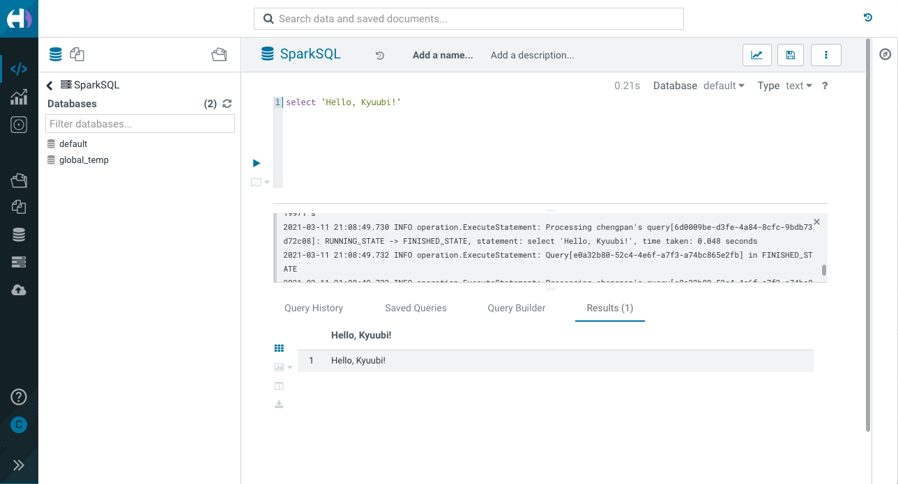
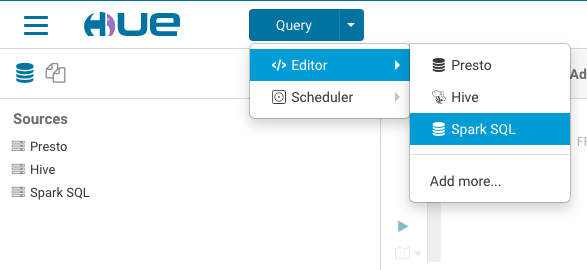
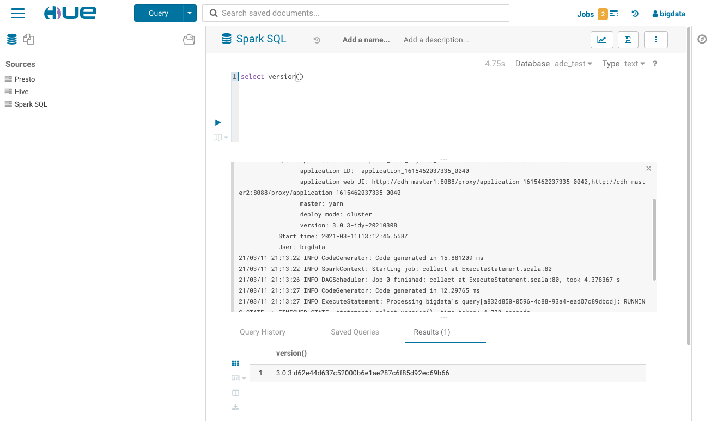

<div align=center>


</div>

# Getting Started with Kyuubi and Cloudera Hue

## What is Hue

[Hue](https://gethue.com/) is an open source SQL Assistant for Databases & Data Warehouses.

## Preparation

### Get Kyuubi Started

[Get the server Started](quick_start.md) first before your try Hue with Kyuubi.

```bash
Welcome to
  __  __                           __
 /\ \/\ \                         /\ \      __
 \ \ \/'/'  __  __  __  __  __  __\ \ \____/\_\
  \ \ , <  /\ \/\ \/\ \/\ \/\ \/\ \\ \ '__`\/\ \
   \ \ \\`\\ \ \_\ \ \ \_\ \ \ \_\ \\ \ \L\ \ \ \
    \ \_\ \_\/`____ \ \____/\ \____/ \ \_,__/\ \_\
     \/_/\/_/`/___/> \/___/  \/___/   \/___/  \/_/
                /\___/
                \/__/
```

## Run Hue in Docker

Here we demo running Kyuubi on macOS and Hue on [Docker for Mac](https://docs.docker.com/docker-for-mac/), 
there are several known limitations of network, and you can find 
[workarounds from here](https://docs.docker.com/docker-for-mac/networking/#known-limitations-use-cases-and-workarounds).

### Configuration

1. Copy a configuration template from Hue Docker image.

```
docker run --rm gethue/hue:latest cat /usr/share/hue/desktop/conf/hue.ini > hue.ini
```

2. Modify the `hue.ini`

```ini
[beeswax]
  # Kyuubi 1.1.x support thrift version from 1 to 9
  thrift_version=7
  # change to your username to avoid permissions issue for local test
  auth_username=chengpan

[notebook]
  [[interpreters]]
    [[[sql]]]
      name=SparkSQL
      interface=hiveserver2
      
[spark]
  # Host of the Spark Thrift Server
  # For macOS users, use docker.for.mac.host.internal to access host network
  sql_server_host=docker.for.mac.host.internal

  # Port of the Spark Thrift Server
  sql_server_port=10009
  
# other configurations
...
```

### Start Hue in Docker

```
docker run -p 8888:8888 -v $PWD/hue.ini:/usr/share/hue/desktop/conf/hue.ini gethue/hue:latest
```

Go http://localhost:8888/ and follow the guide to create an account.


Having fun with Hue and Kyuubi!



### For CDH 6.x Users

If you are using CDH 6.x, there is a trick that CDH 6.x blocks Spark in default, you need to modify the configuration to 
overwrite the `desktop.app_blacklist` to remove this restriction.

Config Hue in Cloudera Manager.


Refer following configuration and tune it to fit your environment.
```
[desktop]
 app_blacklist=zookeeper,hbase,impala,search,sqoop,security
 use_new_editor=true
[[interpreters]]
[[[sparksql]]]
  name=Spark SQL
  interface=hiveserver2
  # other interpreters
  ...
[spark]
sql_server_host=kyuubi-server-host
sql_server_port=10009
```

You need to restart the Hue Service to activate the configuration changes, and then Spark SQL will available in editor list.



Having fun with Hue and Kyuubi!


