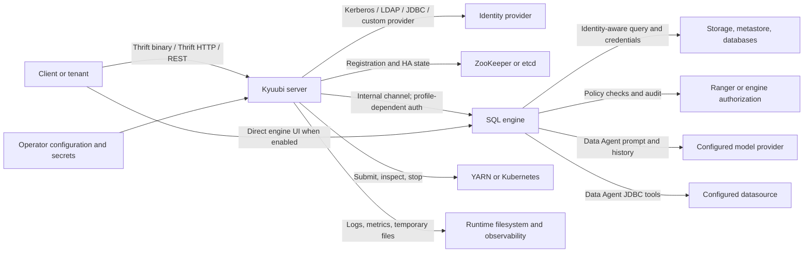

<!--
- Licensed to the Apache Software Foundation (ASF) under one or more
- contributor license agreements.  See the NOTICE file distributed with
- this work for additional information regarding copyright ownership.
- The ASF licenses this file to You under the Apache License, Version 2.0
- (the "License"); you may not use this file except in compliance with
- the License.  You may obtain a copy of the License at
-
-   http://www.apache.org/licenses/LICENSE-2.0
-
- Unless required by applicable law or agreed to in writing, software
- distributed under the License is distributed on an "AS IS" BASIS,
- WITHOUT WARRANTIES OR CONDITIONS OF ANY KIND, either express or implied.
- See the License for the specific language governing permissions and
- limitations under the License.
-->

# Kyuubi Security Threat Model

This document describes the security boundaries Kyuubi is expected to preserve
and provides a first-pass rubric for assessing incoming security reports. It is
not a deployment hardening guide and does not replace a maintainer's security
decision.

## Purpose

Apache Kyuubi is a multi-tenant SQL gateway. It authenticates clients,
creates sessions and operations, starts or reuses SQL engines, and connects
those engines to cluster managers, metadata services, storage systems, and
external data sources. A security report is therefore meaningful only when it
is evaluated against the deployment profile and the identity boundary involved.

This document has two goals:

1. Give maintainers a shared model of Kyuubi's assets, trust boundaries, and
   security invariants.
2. Make the first assessment of a report consistent and evidence-based.

## Security Goals

The following goals are the invariants used by the triage rubric.

| ID | Goal | Meaning |
| --- | --- | --- |
| G1 | Authentication integrity | A client cannot impersonate another principal or bypass the configured authentication mechanism. |
| G2 | Proxy identity integrity | A real user cannot select an unauthorized session user or proxy user. Administrator-authorized impersonation remains an explicit deployment capability. |
| G3 | Tenant isolation | One tenant cannot read or alter another tenant's sessions, operations, results, logs, engines, credentials, or data unless the deployment explicitly grants that access. |
| G4 | Authorization preservation | Kyuubi passes the authenticated identity to the engine and data platform without weakening the configured authorization policy. |
| G5 | Secret confidentiality | Passwords, tokens, keytabs, ticket caches, keystores, internal secrets, and data-source credentials are not exposed to unauthorized tenants, logs, responses, or uploaded resources. |
| G6 | Control-plane authorization | Administrator-only actions require an administrator; tenant-owned sessions, operations, and batches require the owner or an administrator; engine lifecycle actions follow the configured owner/admin policy. |
| G7 | Data integrity | A tenant cannot cause another tenant's query, engine, metadata, or result to be altered without authorization. |
| G8 | Availability and fairness | An unauthenticated attacker or low-privilege tenant cannot crash Kyuubi, consume shared resources without effective limits, starve other tenants, or disable their work through a bounded application request. |
| G9 | Audit usefulness | Security-relevant actions retain enough identity and event context for an operator to investigate them without recording secrets. |

Kyuubi does not replace the authorization system of Hadoop, Spark, Ranger,
the metastore, a database, or an object store. A report must distinguish a
Kyuubi violation of G4 from a policy that the external system deliberately
allows.

## Scope

### In scope

- Kyuubi server frontends and protocol handling, including Thrift binary,
  Thrift HTTP, REST, the REST web UI, direct and proxied engine UIs, the Trino
  HTTP frontend, and every configured metrics reporter.
- Authentication and identity propagation for Kerberos, LDAP, JDBC, custom
  basic or bearer providers, and unauthenticated development modes.
- Session, operation, batch, result, log, and engine lifecycle handling.
- Proxy-user and impersonation checks, engine sharing, service discovery, and
  server-to-engine communication.
- Kyuubi interactions with YARN, Kubernetes, ZooKeeper, etcd, Hadoop
  delegation-token services, Hive Metastore, Ranger, JDBC data sources, and
  storage systems when Kyuubi makes or transforms a security decision.
- Credentials and sensitive configuration handled by Kyuubi, including
  Kerberos keytabs and ticket caches, delegation tokens, LDAP and JDBC
  credentials, TLS material, internal engine secrets, object-store
  credentials, and Kubernetes service-account credentials.
- The Data Agent engine, including its model provider, prompts and conversation
  history, JDBC datasource, SQL tools, approval mode, and web UI integration.
- Official Helm templates, container configuration, CI workflows, release
  artifacts, and dependencies when they change Kyuubi's security posture.

### Out of scope

- A vulnerability in an external service that Kyuubi does not cause, amplify,
  or incorrectly integrate. Such a report should be routed to the relevant
  upstream project or platform owner.
- Compromise of a Kyuubi administrator, Kubernetes cluster administrator,
  Hadoop administrator, KDC, LDAP directory, Ranger administrator, or storage
  administrator. Kyuubi must still avoid exposing their credentials to a
  tenant or logging them accidentally.
- Volumetric network DDoS, link saturation, or an availability failure of an
  external service. Application-level exhaustion caused by a Kyuubi request is
  in scope under G8.
- Data access, SQL execution, UDFs, extensions, or uploaded application code
  that the deployment deliberately authorizes for that tenant. Escape from the
  assigned identity, container, engine, or data policy remains in scope.
- An operator's choice to expose an intentionally insecure development mode,
  such as `NONE`, `NOSASL`, or plaintext HTTP, when the product clearly
  documents the consequence. An insecure default, unsafe chart default, or
  misleading security documentation is still a potential product issue.

## Deployment Profiles

The report assessor must identify which profile the report uses. A conclusion
without this context is incomplete.

### Shared secure deployment

This is the primary security profile for multi-tenant use:

- Client authentication is enabled. Transport confidentiality and integrity
  are configured separately; authentication alone does not imply encryption.
  The assessor must record TLS settings and the SASL quality of protection.
  Native TLS settings cover the Thrift binary and Thrift HTTP frontends; REST
  and Trino require an external TLS terminator or an isolated trusted network.
- The effective identity is preserved through session creation and engine
  submission, or the deployment explicitly documents the engine principal,
  such as a server or group principal, and applies authorization for it.
- Authorization is configured in the engine and data platform, for example
  through Hadoop permissions or the Kyuubi Spark authorization plugin.
- Engine, log, temporary-file, service-discovery, and cluster-manager access
  is isolated according to the deployment's tenant model.
- Kubernetes or YARN privileges are limited to what Kyuubi and its engines
  require.
- Internal server-engine and server-server authentication is enabled when
  those channels cross an untrusted boundary. ZooKeeper or etcd authentication,
  transport protection, and ACLs are configured independently.

### Isolated development or trusted-user deployment

Kyuubi supports modes with no client authentication and without transport
encryption. These modes can be appropriate on an isolated development
network, but they do not provide a shared-tenant security boundary. A report
that succeeds only because an operator selected `NONE`, `NOSASL`, or plaintext
HTTP is not proof of an authentication bypass, but it must not be closed solely
as configuration hardening until the project resolves that policy boundary.
The report becomes a product issue when the insecure mode is enabled
unexpectedly, advertised as secure, or used by an official deployment artifact
without a clear warning.

### Kubernetes or YARN deployment

The cluster manager, its API, service accounts, network policy, image registry,
and storage permissions are part of the deployment boundary. Kyuubi remains
responsible for the identity and privilege values it submits and for not
requesting or exposing more access than its documented behavior requires.

## System Context

Important flows are:

1. A client authenticates to a Kyuubi frontend. Kyuubi records a real user and
   creates a session user, which may be a permitted proxy user.
2. A session submits SQL or a batch request. Kyuubi selects, creates, or
   reuses an engine according to the configured sharing level.
3. Kyuubi submits an engine to a cluster manager and passes the identity,
   session configuration, and required credentials.
4. The engine queries storage and metadata services and returns results,
   operation logs, and status through Kyuubi.
5. A Data Agent engine may send conversation context to its configured model
   provider and execute approved SQL tools against its configured datasource.
6. Kyuubi instances use service discovery and metadata storage to share
   reachability and recover sessions or batches in high-availability mode.

The architecture description is in
[`docs/overview/architecture.md`](../overview/architecture.md). The REST
surface is documented in [`docs/client/rest/rest_api.md`](../client/rest/rest_api.md).

## Trust Boundaries

| ID | Boundary | Trust change | Main question for a report |
| --- | --- | --- | --- |
| TB1 | Client to frontend | Network input becomes a Kyuubi request | Can an attacker reach a frontend and authenticate or submit a request they should not be able to submit? |
| TB2 | Frontend to identity provider | A claimed identity becomes an authenticated principal | Can the request bypass, confuse, or downgrade the configured authentication mechanism? |
| TB3 | Real user to session/proxy user | One principal is mapped to the identity used by the engine | Can a tenant select another user or bypass the proxy-user policy? |
| TB4 | Kyuubi server to engine | Server-controlled state and credentials enter an engine process | Can an engine or tenant alter the identity, obtain another tenant's state, or use internal credentials outside its grant? |
| TB5 | Kyuubi to cluster manager and HA store | Kyuubi obtains control-plane capabilities | Can a request create, inspect, delete, or reconfigure resources outside its tenant and administrator scope? |
| TB6 | Engine to data platform | Query identity reaches data and metadata services | Does Kyuubi preserve the configured authorization decision and tenant identity? |
| TB7 | Operator configuration and artifacts to runtime | Files, images, dependencies, and secrets become executable behavior | Does an official artifact or Kyuubi code expose secrets, grant excess privilege, or change the security profile unexpectedly? |
| TB8 | Data Agent and model or datasource provider | Prompts, query results, credentials, and tool calls leave the engine process | Can model or datasource interaction disclose data, change a datasource, or execute a tool outside the tenant's approved scope? |

The client IP value from a proxy header is useful for logging and authorization
policy checks, but it must not be treated as proof of identity. Kyuubi's
configuration documentation explicitly distinguishes the remote address from
the forwarded header.

## Assets

| Asset | Confidentiality | Integrity | Availability |
| --- | --- | --- | --- |
| Query results and source data | High | High | High |
| Session, operation, batch, and engine metadata | Medium to high | High | High |
| Query and engine logs | Medium to high | Medium | Medium |
| User, real-user, and proxy-user identity | High | High | High |
| Kerberos keytabs, TGTs, ticket caches, and delegation tokens | Critical | High | High |
| LDAP bind passwords, JDBC authentication credentials, bearer tokens, TLS keys, and internal security secrets | Critical | High | High |
| Kubernetes service-account tokens, kubeconfig files, YARN credentials, and object-store keys | Critical | High | High |
| Data Agent model API keys, JDBC URLs, conversation history, prompts, tool calls, and tool results | Critical | High | High |
| Service-discovery registrations and HA metadata | Medium | High | High |
| Cluster-manager applications, pods, and resource queues | Medium | High | High |
| Metrics and diagnostic endpoint data | Medium | Medium | Medium |
| Configuration and official release artifacts | Medium | Critical | High |
| Worker threads, engine slots, cluster resources, and storage capacity | Low to medium | Medium | High |

## Adversaries

| ID | Adversary | Capabilities | Typical goal |
| --- | --- | --- | --- |
| A1 | Unauthenticated network attacker | Can send requests to an exposed frontend but has no valid identity | Bypass authentication, invoke an administrative action, read data, or exhaust Kyuubi. |
| A2 | Malicious authenticated tenant | Has a valid low-privilege Kyuubi identity and can submit SQL, session configuration, and permitted batch requests | Read or alter another tenant's data, impersonate a user, reach another engine, or starve shared resources. |
| A3 | Malicious tenant artifact or engine | Can supply an authorized UDF, JAR, batch resource, connector, or data-source configuration | Escape the intended engine or tenant boundary, steal server credentials, or affect another tenant. |
| A4 | Compromised dependency, image, plugin, or CI action | Can execute code in a build or runtime process at that process's privilege | Steal credentials, alter release artifacts, or add a backdoor to a distributed image or package. |
| A5 | Network or integration attacker | Can tamper with an unprotected or incorrectly verified connection to an identity, HA, cluster, or data service | Feed false identity, policy, engine, or metadata information to Kyuubi. |
| A6 | Curious or negligent privileged operator | Has legitimate access to configuration, secrets, logs, or cluster controls | Accidentally expose secrets or create a deployment that violates the stated tenant boundary. |
| A7 | Malicious data, prompt, or model provider | Can influence data returned to a Data Agent, the model endpoint, or a model-generated tool request | Cause unauthorized SQL, datasource access, data disclosure, or cross-session history exposure. |

A6 is not a claim that an administrator is an external attacker. It identifies
where Kyuubi must provide safe failure, redaction, and least-privilege defaults
even though the operator controls the deployment.

## STRIDE Threat Register

The register is a triage aid, not proof that a particular implementation is
vulnerable. The assessor must connect a report to a row and verify the actual
code path and deployment profile.

| ID | STRIDE | Threat | Boundary | Reportable when |
| --- | --- | --- | --- | --- |
| T01 | Spoofing | A client can authenticate as another user, or a frontend accepts a caller-supplied identity such as a Trino request-user header without an independent authentication boundary. | TB1, TB2 | The behavior occurs with authentication enabled, or the frontend is exposed in a profile that treats the caller as authenticated without verifying the identity. |
| T02 | Spoofing / Elevation | A tenant can set `hive.server2.proxy.user` or `kyuubi.session.proxy.user` to an unauthorized user. | TB3 | The Hadoop proxy-user or equivalent authorization check is bypassed, confused, or applied to the wrong real user or address. |
| T03 | Tampering | Session configuration changes a server-only security setting or changes the identity, engine share level, or authorization context after the server has validated it. | TB3, TB4 | A tenant can override a setting that should be immutable or server-audience-only and thereby cross a security boundary. |
| T04 | Spoofing / Tampering | A forged engine registration, internal token, service-discovery record, or HA message is accepted as a trusted engine or server. | TB4, TB5 | An attacker can register, impersonate, redirect, replay, or tamper with a peer because internal-token integrity, token scope, replay handling, HA-store authentication, transport, or ACLs are missing or bypassed. |
| T05 | Information disclosure | A tenant can read another tenant's result, operation log, session event, engine endpoint, engine metadata, or batch resource. | TB3, TB4, TB6 | The access is possible without an explicit policy that grants the particular artifact. Sharing an engine does not by itself authorize access to another session's results or logs. |
| T06 | Information disclosure | A keytab, ticket cache, delegation token, password, bearer token, TLS private key, internal secret, object-store credential, or Data Agent credential is returned, logged, mounted, or left in a tenant-readable path. | TB4, TB7, TB8 | The secret is exposed beyond the principal or process that needs it. Check local-path allow lists, redaction patterns, configuration response mode, logs, and browser or session history. |
| T07 | Information disclosure | A REST, Thrift, Trino, UI, metrics, error, or diagnostic response reveals confidential data, credentials, or security-sensitive configuration to an unauthorized caller. | TB1, TB3, TB7, TB8 | The response is reachable in the relevant profile and the data is not intentionally public operational metadata. |
| T08 | Tampering / Elevation | A caller performs an administrator-only action or reads, deletes, refreshes, stops, or reconfigures a resource it does not own. | TB1, TB3, TB5 | The authorization check is absent, uses the wrong identity, treats a bearer handle as sufficient, or can be bypassed. An owner-scoped engine action is not a violation by itself. |
| T09 | Elevation | Kyuubi requests or uses excessive YARN, Kubernetes, ZooKeeper, etcd, filesystem, or data-source privileges beyond its documented function. | TB5, TB6, TB7 | The excessive privilege is in an official default, unavoidable code path, or official deployment guidance, rather than only an operator-selected override. |
| T10 | Tampering / Information disclosure | Kyuubi passes a user-controlled configuration, URL, path, class, connector, resource, or Data Agent datasource to a backend in a way that changes the target or bypasses the intended authorization policy. | TB3, TB5, TB6, TB8 | The input permits SSRF, path traversal, credential substitution, unauthorized data-source access, or policy bypass under a supported profile. |
| T11 | Elevation | An engine, plugin, uploaded batch resource, connector, or Data Agent tool can escape its intended tenant or process boundary through Kyuubi-owned behavior. | TB4, TB5, TB7, TB8 | The escape depends on a Kyuubi flaw, unsafe official artifact, or Kyuubi-granted privilege, not merely on code the operator intentionally trusts. |
| T12 | Denial of service | A bounded unauthenticated or low-privilege request crashes Kyuubi, exhausts frontend workers, creates unbounded engines, uploads unbounded resources, bypasses resource limits, or starves another tenant. | TB1, TB3, TB5, TB8 | The impact crosses tenants or privilege levels and is not simply the expected cost of a query within an operator-defined quota. |
| T13 | Denial of service | Credential renewal, engine recovery, service discovery, or failover can be driven into an unsafe loop or can disable unrelated tenants. | TB4, TB5, TB7 | A tenant or network attacker can trigger the condition through a supported request or protocol path. |
| T14 | Repudiation | Security-relevant actions lose the identity or event information needed to determine who submitted, stopped, or altered a request. | TB1, TB3, TB5 | The loss prevents meaningful investigation and is caused by Kyuubi's handling, not by an operator choosing not to retain logs. |
| T15 | Supply-chain tampering | A dependency, plugin, image, release artifact, or CI workflow can be substituted or altered without the expected verification boundary. | TB7 | The weakness is in Kyuubi-owned build, release, chart, or dependency handling and can affect distributed users. |
| T16 | Tampering / Information disclosure / Elevation | Data Agent prompt or datasource content influences a model-generated tool call, or model/provider output exposes another tenant's history, data, credentials, or tool result. | TB4, TB6, TB8 | The behavior crosses the configured datasource, session, approval, or tenant boundary; prompt injection alone is not enough without a security impact. |

## First-Pass Vulnerability Triage

### Required report facts

Before deciding that a report is invalid, extract or request these facts:

- Kyuubi version, deployment mode, engine type, and relevant commit or image
  digest.
- Whether the frontend is Thrift binary, Thrift HTTP, REST, Trino, metrics, or
  the web UI.
- Authentication method, SASL quality of protection, TLS, and transport
  protection actually enabled.
- For Thrift HTTP: cookie authentication, `doAs` proxy identity, and XSRF
  filter settings.
- Whether an engine UI is opened directly or through the REST engine-UI proxy,
  and the independent access controls on the target engine UI.
- Every enabled metrics reporter: Prometheus, JMX, JSON, console, or SLF4J.
- Attacker identity: unauthenticated, tenant, administrator, engine process,
  cluster principal, or network attacker.
- Exact preconditions, request, SQL, session configuration, uploaded resource,
  or network position.
- Real user and target session/proxy user, if impersonation is involved.
- Target asset and impact: data, identity, secret, integrity, control-plane
  privilege, or availability.
- Reproduction steps, expected result, observed result, and whether a second
  tenant or administrator is affected.
- Relevant Hadoop, Kubernetes, Ranger, LDAP, Kerberos, storage, or database
  policy configuration.
- Internal security settings and ZooKeeper or etcd authentication, transport,
  namespace, and ACL configuration.
- Resource limits, engine-startup limits, upload limits, temporary-directory
  policy, redaction settings, and configuration response mode.
- For Data Agent reports: model endpoint, API-key handling, datasource URL and
  credentials, share level, approval mode, session history, and tool call.

Reporter-provided severity or CVSS values are evidence about the reporter's
claim only. They are not a Kyuubi severity decision.

### Decision procedure

Apply the following order. Do not skip to a disposition from a keyword such as
"unauthenticated", "SQL", "Kubernetes", or "DoS".

1. **Normalize the claim.** Rewrite the report as: "An attacker with [principal]
   can use [entry point and input] under [preconditions] to affect [asset],
   crossing [boundary]."
2. **Confirm the product path.** Identify the Kyuubi code, chart, image,
   dependency, runtime LLM path, or documented integration responsible. If the
   behavior is entirely in an external platform and Kyuubi is using it as
   documented, route it as an external dependency report.
3. **Identify the deployment profile.** Record authentication, TLS/SASL,
   engine sharing, authorization plugin, cluster manager, internal security,
   HA-store auth/ACL, and relevant RBAC or proxy-user settings. Missing profile
   information produces `NEEDS-EVIDENCE`, not `INVALID`.
4. **Identify the attacker and required privilege.** A report that requires a
   cluster administrator or Kyuubi administrator is not an ordinary
   tenant-boundary report. A tenant-supplied engine artifact, plugin, JAR, or
   datasource is attacker-controlled input unless the deployment explicitly
   trusts it; do not dismiss a report merely because it uses an artifact.
5. **Test a security goal.** Map the observed behavior to G1-G9 and a threat
   row T01-T16. If no goal or boundary is implicated, it is likely expected
   behavior or a normal bug rather than a security report.
6. **Check for an authorized behavior.** Executing SQL that the tenant is
   allowed to execute, reading its own results and logs, using an explicitly
   shared engine, or receiving data allowed by the backend policy is not a
   vulnerability by itself. Engine sharing does not automatically authorize
   access to another session's artifacts. A model-generated Data Agent query
   is still subject to the datasource and tenant policy.
7. **Assess impact.** Treat cross-tenant data access, authentication bypass,
   unauthorized impersonation, credential exposure, control-plane elevation,
   and tenant-crossing application-level denial of service as potential valid
   candidates. Treat volumetric DDoS and an expensive but authorized query as
   outside this model unless Kyuubi bypasses a documented limit or fairness
   control.
8. **Check reproducibility and reachability.** Confirm that the path is
   reachable in a supported version and profile. A theoretical concern can
   remain `NEEDS-EVIDENCE`; it should not be declared fixed or invalid from
   static intuition alone. `INVALID-OR-UNREPRODUCIBLE` requires complete
   relevant facts and a reasonable reproduction attempt, not merely a missing
   deployment detail.
9. **Record the assessment.** Document the disposition, confidence, reasoning,
   and evidence requests. A maintainer decides whether to open, close, merge,
   or escalate the report.

### Dispositions

| Disposition | Use when | Next action |
| --- | --- | --- |
| `VALID-CANDIDATE` | There is a plausible, reachable violation of G1-G9 under a supported secure profile. | Preserve the report, reproduce, and begin maintainer security triage. |
| `NEEDS-EVIDENCE` | The claim could cross a boundary, but version, profile, identity, or reproduction facts are missing. | Ask focused questions; do not reject the report. |
| `NEEDS-HUMAN-REVIEW` | The report requires maintainer judgment before a disposition or action. | Route it to a maintainer for review. |
| `EXPECTED-BEHAVIOR` | The behavior is an explicitly authorized tenant or administrator capability and no security goal is violated. | Explain the boundary and link the relevant documentation. |
| `CONFIGURATION-HARDENING` | The behavior requires an operator-selected insecure mode or excessive external privilege, without a Kyuubi defect in the supported secure profile. | Recommend configuration or documentation improvement; reassess if the default or official chart is unsafe. |
| `DEPENDENCY-OR-PLATFORM` | The root cause is entirely in an external dependency or platform and Kyuubi neither introduces nor worsens the security impact. | Route to the dependency or platform owner and record the Kyuubi integration context. |
| `INVALID-OR-UNREPRODUCIBLE` | Complete relevant facts and a reasonable reproduction attempt show that the claim has no reachable path or plausible security impact. Missing facts alone do not qualify. | Keep the evidence and provide a concise technical explanation. |

`NEEDS-EVIDENCE` is a safe default when the report involves data access,
impersonation, credential exposure, or tenant-crossing availability. The model
must not use low confidence as a reason to close a report.

## Common Report Patterns

| Report pattern | Initial assessment |
| --- | --- |
| "Kyuubi accepts a connection without a password." | Inspect the configured authentication method and transport. `NONE`, `NOSASL`, and plaintext HTTP are intentionally supported modes; exposure in a shared secure profile or an unsafe official default is a candidate. Until the project resolves the policy for these modes, do not close the report solely as configuration hardening. |
| "A user can run arbitrary SQL." | Expected for a SQL gateway unless the SQL escapes the tenant's configured data and engine authorization. Ask which principal the backend sees and whether another tenant's data is reachable. |
| "A user can set `hive.server2.proxy.user` to another user." | Potentially valid. Verify the real user, source address, Hadoop proxy-user policy, administrator status, and whether Kyuubi's check is bypassed. |
| "A user can read another user's operation log, result, session, or engine." | `VALID-CANDIDATE` unless an explicit shared-engine or data policy grants the access. This directly tests G3 and usually requires preservation of the original report. |
| "A Trino client sets `X-Trino-User`." | Treat the header as an identity claim, not authentication. Verify the independent authentication and network boundary of the Trino frontend before accepting the claimed user. |
| "A query consumes a lot of resources." | A candidate only when an unauthenticated or low-privilege tenant can bypass a documented limit, crash the service, or starve another tenant. A costly query within the configured resource policy is normally availability governance. |
| "The Kubernetes service account can create pods." | Compare the official chart's documented role with the action Kyuubi performs. A deliberately supplied broad role is configuration hardening; an official Kyuubi recommendation for broad roles or an official default that permits unrelated namespace or secret access is an in-scope unsafe-guidance or product candidate. |
| "A keytab or token appears in a local directory or log." | Potentially valid if a tenant, engine, diagnostic endpoint, or log reader can obtain it. The operator's private keytab storage is not itself a Kyuubi vulnerability, but Kyuubi must not make it tenant-readable. |
| "The Data Agent sends query data to a model or allows a mutation." | Verify the provider endpoint, datasource identity, conversation/session boundary, approval mode, and tool risk. Model or datasource content is untrusted input; a prompt injection is reportable when it causes unauthorized data access, mutation, credential disclosure, or tenant escape. |
| "Metrics expose user or session information." | Treat the metrics listener as a separate operational endpoint. Verify bind address, network reachability, labels, and whether the deployment provides authentication or network isolation. |
| "A vulnerability exists in Spark, Hadoop, Kubernetes, LDAP, or a database." | Determine whether Kyuubi introduces an unsafe integration, passes attacker-controlled input into the vulnerable path, or distributes the affected component. Otherwise classify it as `DEPENDENCY-OR-PLATFORM`. |

## Existing Controls and Evidence

The following controls are documented or visible in the current source tree and
must be verified when a report touches them:

- Authentication methods and their defaults are registered in
  `kyuubi-common/.../config/KyuubiConf.scala`. The current default is
  `kyuubi.authentication=NONE`; a deployment using that default must not be
  described as a secure shared-tenant deployment.
- REST `/v1/*` requests pass through `AuthenticationFilter`; administrator
  resources check `isAdministrator`. The REST web UI and engine-UI proxy are
  separate handlers, and the Trino frontend has a separate HTTP service. See
  `kyuubi-server/.../http/authentication/AuthenticationFilter.scala`,
  `kyuubi-server/.../api/v1/AdminResource.scala`, and
  `kyuubi-server/.../KyuubiTrinoFrontendService.scala`.
- The REST service distinguishes the authenticated real user from the session
  or proxy user and verifies proxy access. Authentication is not by itself
  object ownership, and the authentication layer does not establish uniform
  owner checks for every handle-based route. The assessor must verify the
  specific session, operation, batch, result, or log route instead of assuming
  that authentication proves authorization. See
  `kyuubi-server/.../KyuubiRestFrontendService.scala` and
  [`docs/client/rest/rest_api.md`](../client/rest/rest_api.md).
- Thrift session creation applies the same real-user/session-user distinction
  and proxy check in `kyuubi-common/.../service/TFrontendService.scala`.
- Thrift HTTP also supports a signed authentication cookie and a `doAs` query
  parameter that enters proxy-user validation. Cookie authentication defaults
  to enabled; its XSRF filter defaults to disabled. Include all three settings
  when assessing G1 or G2.
- The Trino frontend reads a request-user header into its request context and
  does not share the REST authentication filter. Treat that header as an
  untrusted identity claim until the deployment supplies an independent
  authentication boundary.
- Native frontend TLS is configurable for Thrift binary and Thrift HTTP but is
  not enabled by default. REST and Trino use plain Jetty HTTP and depend on an
  external TLS terminator or network isolation. SASL authentication, integrity,
  and confidentiality are separate quality-of-protection choices. See
  `kyuubi-common/.../config/KyuubiConf.scala` and the transport guidance in
  [`docs/security/ldap.md`](ldap.md) and
  [`docs/client/advanced/kerberos.md`](../client/advanced/kerberos.md).
- Internal server-engine and server-server communication can use an internal
  security secret and short-lived token, but the feature is disabled by
  default. The current token identifier contains issue and expiry times; the
  threat assessment must verify cryptographic integrity, peer or audience
  binding, replay behavior, and downgrade behavior rather than treating
  encryption alone as authentication. See
  [`docs/security/internal_secure_access.md`](internal_secure_access.md).
- ZooKeeper authentication and engine authentication default to `NONE`, and
  etcd TLS defaults to false. HA-store authentication, transport, namespace,
  and ACLs are separate controls from Kyuubi's internal engine token. See
  `kyuubi-ha/.../HighAvailabilityConf.scala`.
- Kerberos keytabs, ticket caches, and Hadoop delegation tokens are security
  sensitive. The Kinit guide warns that credential paths must be excluded from
  user-accessible local directories; see
  [`docs/security/kinit.md`](kinit.md) and
  [`docs/security/hadoop_credentials_manager.md`](hadoop_credentials_manager.md).
- The local-directory allow list defaults to empty, the redaction regex is
  optional, and REST configuration responses support `ORIGINAL`, `REDACTED`,
  and `NONE` modes. These settings must be included when assessing secret
  exposure; documentation warnings are not enforcement by themselves.
- Batch resource uploads are enabled by default and their maximum file sizes
  default to unlimited. Connection, engine-startup, upload, temporary-file,
  and query limits are therefore part of availability triage.
- Kubernetes deployment uses a service account and a namespaced role for
  engine pod operations in the Helm chart. The deployment guides also contain
  broader `edit` and `clusterrolebinding` examples; treat those examples as
  official security guidance when assessing privilege exposure. See
  [the Helm values file](https://github.com/apache/kyuubi/blob/master/charts/kyuubi/values.yaml),
  [`docs/deployment/kyuubi_on_kubernetes.md`](../deployment/kyuubi_on_kubernetes.md),
  and [`docs/deployment/engine_on_kubernetes.md`](../deployment/engine_on_kubernetes.md).
- Prometheus metrics use a separate HTTP listener without the frontend
  authentication filter. JMX, JSON, console, and SLF4J are additional supported
  reporters. Assess every enabled reporter's destination, permissions, labels,
  and exposure rather than treating Prometheus as the only metrics surface.
- The engine UI proxy is disabled by default, so the web UI normally opens an
  engine's native URL directly. Direct and proxied engine UIs have independent
  authentication, network, and action boundaries that must be assessed.
- The Spark authorization extension delegates policy decisions to Ranger and
  supports policy auditing. See
  [`docs/security/authorization/spark/install.md`](authorization/spark/install.md).
- The Data Agent defaults to the local `ECHO` provider. When an
  OpenAI-compatible or custom external provider and a JDBC datasource are
  configured, it may send conversation context to that provider and execute
  SQL against the datasource. It supports `AUTO_APPROVE`, `NORMAL`, and
  `STRICT` tool approval modes. Its documentation warns that chat history and
  datasource data are retained in the session and browser storage. See
  [`docs/quick_start/quick_start_with_data_agent.md`](../quick_start/quick_start_with_data_agent.md).

These references establish expected behavior; they do not prove that every
version or deployment satisfies it. A triage proposal must inspect the
affected version and configuration.

## Residual Risks

- The default authentication method is `NONE`, and transport encryption is
  configurable rather than universally enabled. Secure shared deployments
  depend on operator configuration and deployment isolation.
- The Trino frontend, REST web UI, engine-UI proxy, and Prometheus listener do
  not all share the REST `/v1/*` authentication path. Each endpoint needs an
  explicit deployment boundary and authorization review.
- Kyuubi delegates substantial authorization to Hadoop, Spark, Ranger,
  Kubernetes, YARN, storage, metadata, and identity services. A complete
  assessment requires the deployment profile, not just Kyuubi source code.
- Internal engine tokens and HA-store authentication are separate controls.
  Internal security being enabled does not by itself establish ZooKeeper or
  etcd authentication, ACLs, peer binding, or replay resistance.
- Engine sharing and proxy-user behavior are security-sensitive and vary by
  share level and cluster policy. Reports must not be assessed from a single
  default without checking the configured profile.
- The Data Agent adds a model-provider, prompt, datasource, browser-history,
  and tool-approval boundary.
- An application-level availability boundary is difficult to establish for
  arbitrary SQL workloads. The report must demonstrate service crash, quota or
  fairness bypass, or impact on another tenant rather than only high resource
  consumption.
## Open Policy Decisions

The following items require explicit Kyuubi project policy:

1. Which Kyuubi versions and release branches are covered by security fixes?
2. Is `NONE`/`NOSASL` considered supported only for isolated or trusted-user
   deployments, and where is that limitation stated normatively?
3. What application-level availability threshold qualifies for security
   handling, including cross-tenant resource starvation and engine-creation
   floods?
4. Which engine, connector, UDF, JAR, and batch-resource capabilities are
   trusted deployment inputs, and which must be treated as tenant-controlled?
5. What are the authentication and ownership rules for the Trino frontend,
   REST web UI, engine-UI proxy, metrics listener, and every REST resource?
6. What cryptographic and ACL properties are required for internal engine
   tokens and ZooKeeper or etcd service discovery?
7. What security-reporting channel should be linked from this document?

## Review Cadence

Review this document when any of the following changes:

- A frontend, authentication method, proxy-user rule, REST authorization rule,
  engine-sharing mode, or internal security protocol changes.
- Kyuubi adds a cluster-manager integration, engine type, credential provider,
  data-source integration, or official deployment artifact.
- Helm RBAC, container privileges, CI release workflow, dependency policy, or
  secret handling changes.
- A security report reveals a missing threat row, incorrect trust assumption,
  or a false-positive triage rule.

Every material change should include a maintainer review of the affected
security goals, trust boundaries, threat rows, and LLM triage examples.
